# 李阳阳

> 2016-10-17~2016-10-21

## 二手车

* 背景:
	* 针对二手车，用户有买车和卖车两方面的需求。而各商家的车源分散，中小型城市的车源不足，且市场上暂无巨头出现，目前呈现三足鼎立之势（优信、人人、瓜子）
	* 百度可通过聚合车源、搭建入口、提供额外优惠等方式，进一步满足用户需求，稳住二手车的流量入口。
* 完成情况:
	* 进度：
	    已提测，由于qa的排期和模板较复杂~所以qa10月21号测试完成~同时pm在走ubs评估~预计下周3~10月25号上线~
	* 预览环境地址：[二手车](http://cp01-ala-fe-6.epc.baidu.com:8003/s?word=%E4%BA%8C%E6%89%8B%E8%BD%A6&wiseus=10.40.23.46&sid=102162)
	[大众二手车](http://cp01-ala-fe-6.epc.baidu.com:8003/s?word=%E5%A4%A7%E4%BC%97%E4%BA%8C%E6%89%8B%E8%BD%A6&wiseus=10.40.23.46&sid=102162)
* 收益：暂无
* 效果图

泛需求的效果图：

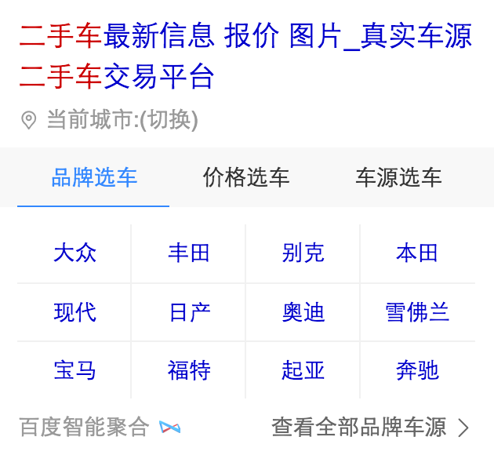

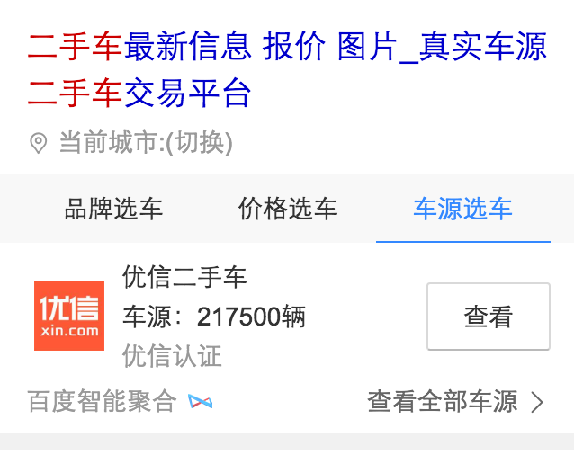

精确需求的效果图：

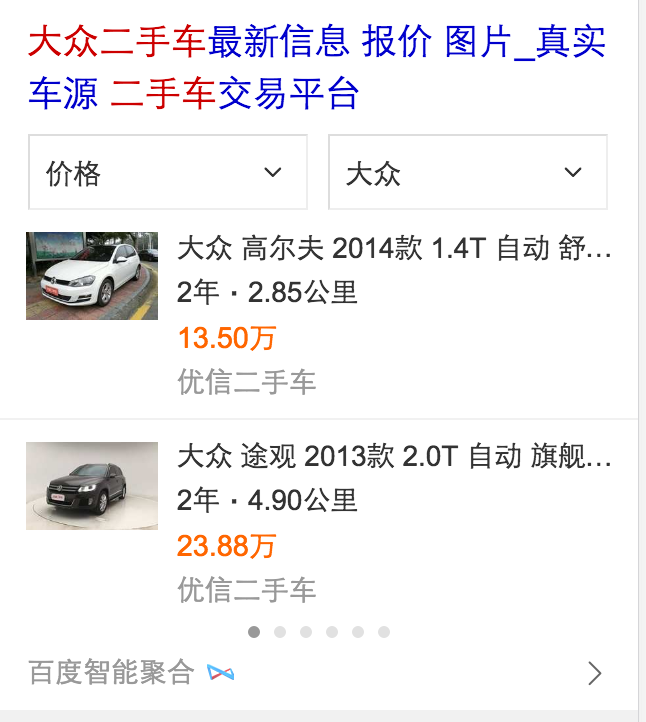

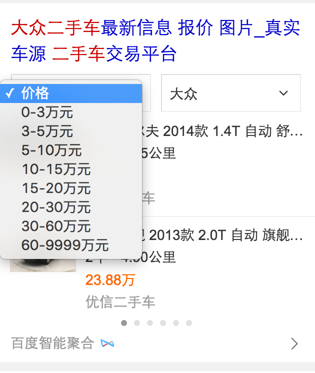

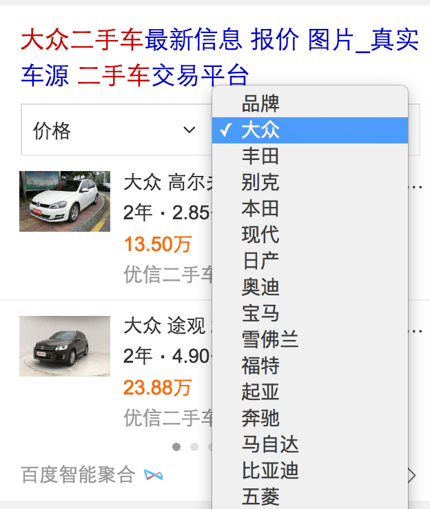

情景页的效果图：

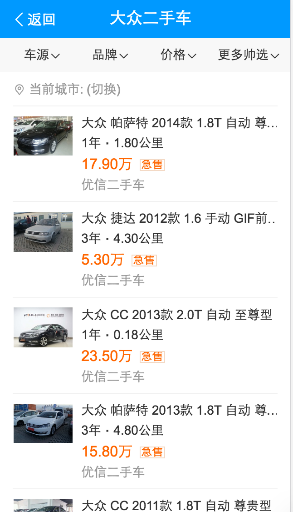

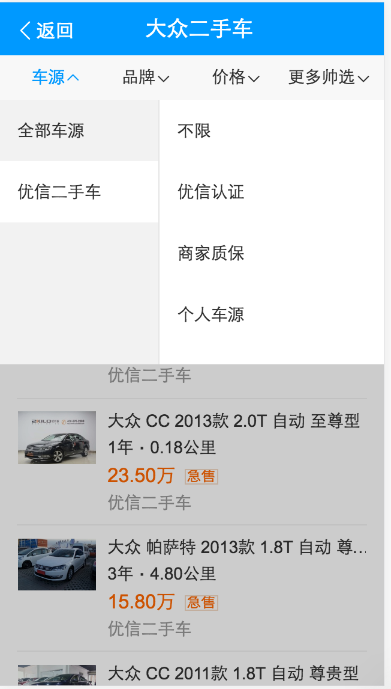

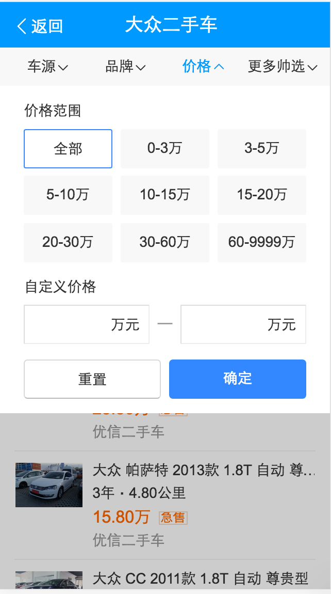

## 百度糯米模板样式修改~nm_nuomi~

* 背景:
	百度糯米的模板~文字链的样式收益不好~改为图文的样式~
* 完成情况:
	10月19号已上线~线上query:[百度糯米](https://m.baidu.com/#|src_%E7%99%BE%E5%BA%A6%E7%B3%AF%E7%B1%B3|sa_ib)
* 效果图

修改前：

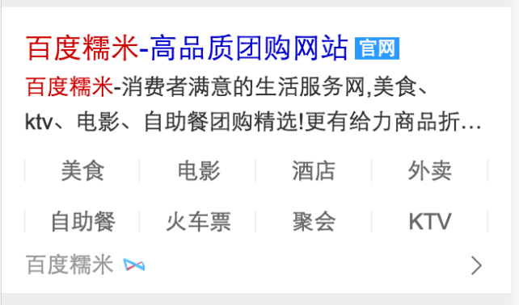

	

修改后：

## 足球类模板tab去掉吸顶效果~sg_lasar_football~

* 背景:
	足球类模板tab去掉吸顶效果~跟线上的nba保持一致~~
* 完成情况:
	10月19号已上线~线上query:[欧洲杯](https://m.baidu.com/#|src_%E6%AC%A7%E6%B4%B2%E6%9D%AF|sa_tb)

## 模板栅格化迁移~

* 背景:
	老模板栅格化~我这边设计的模板：weiyidanan_general、shenfenzheng、sport_avsb_wise
* 完成情况:
	weiyidanan_general、shenfenzheng已迁移完成~10月21号给pm确认效果~sport_avsb_wise预计10月24号开始开发~排期大概3天~10月27号迁移完成~
* 效果图

weiyidanan_general修改前：

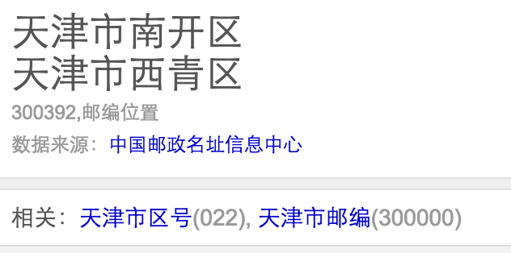

	

修改后：

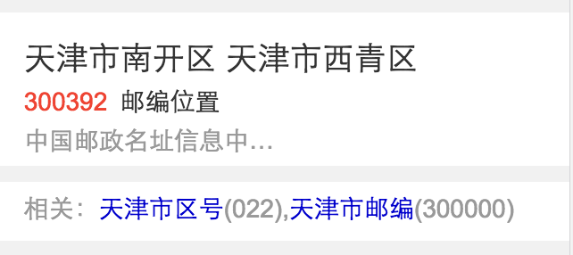

shenfenzheng修改前：

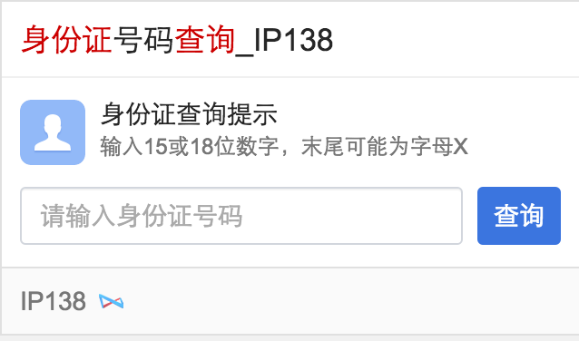

修改后：

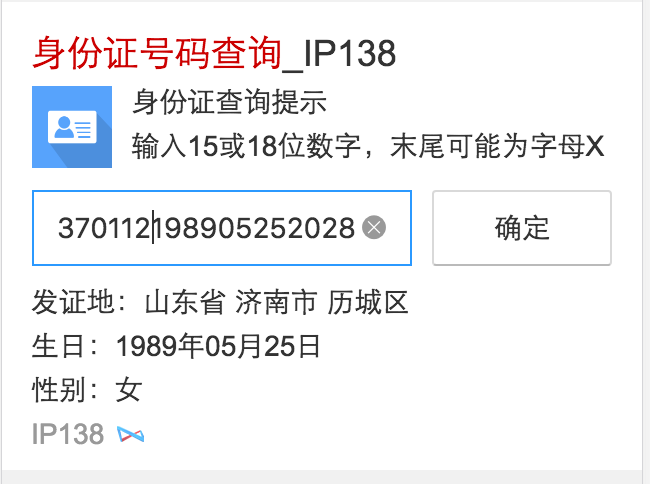

## 摘要表格资源迁移（pc端）(无更新)
* 背景:将线上已有的很多table表格的资源整成一个数据格式，pc同步wise一套数据结构~
* 完成情况:正在进行~
* 收益：暂无
* 效果图

