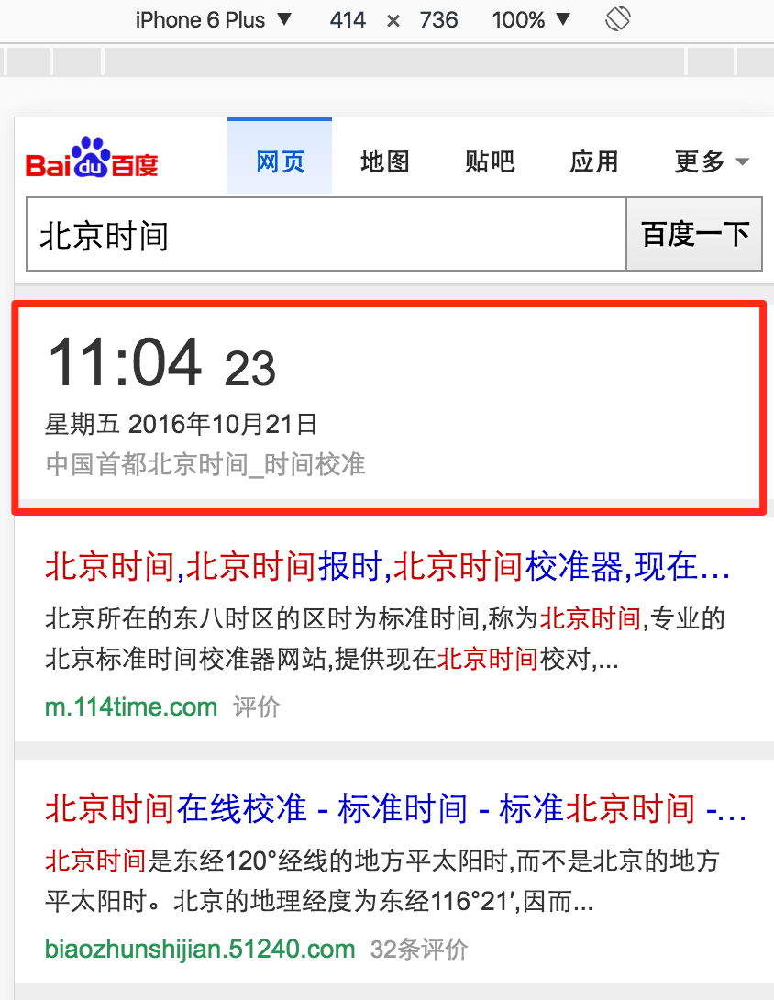
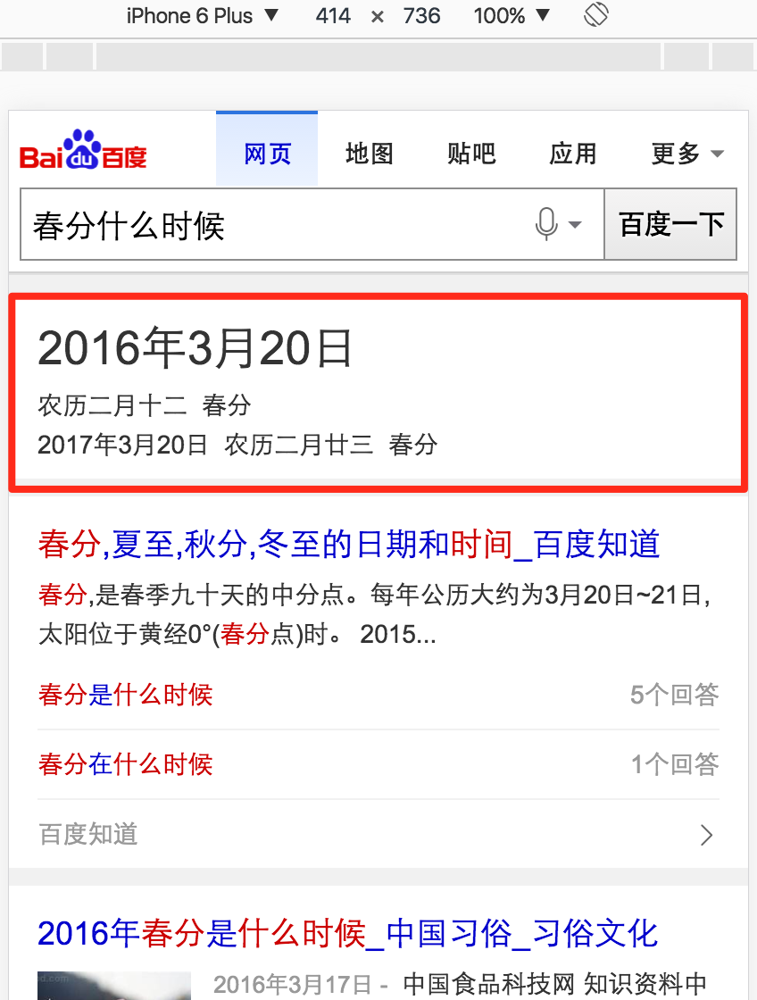

# 肖学林
> 2016-10-21

## worldtime栅格化

### 完成情况

对已有模板进行栅格化,优化视觉效果;已经上线;上线时间(2016-10-19)

query:北京时间、悉尼时间（世界(xx)时间）
 

### 效果

##  calendar栅格化

### 完成情况

对已有模板进行栅格化，优化样式;已经上线;上线时间(2016-10-20)

query:今天星期几、今天干支、冬至(xx节气)是哪天

### 效果

