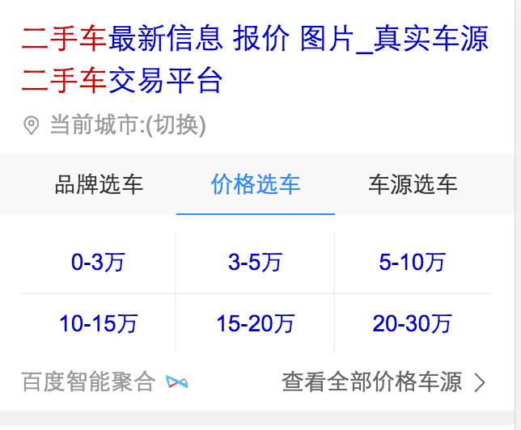
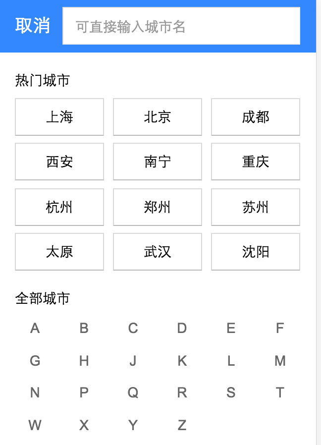
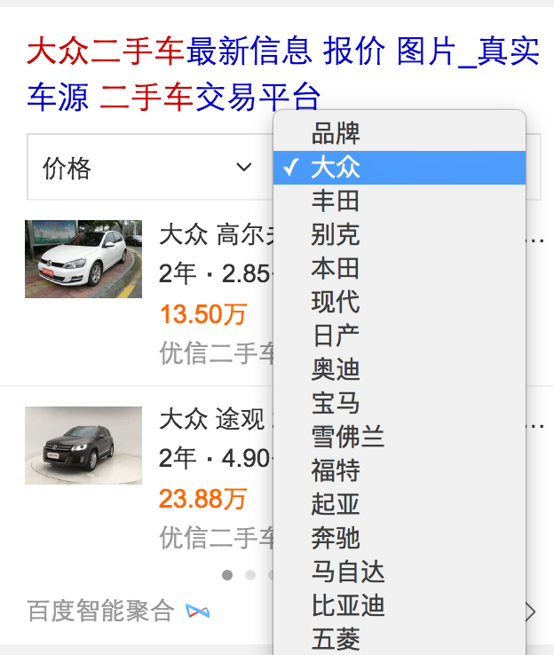
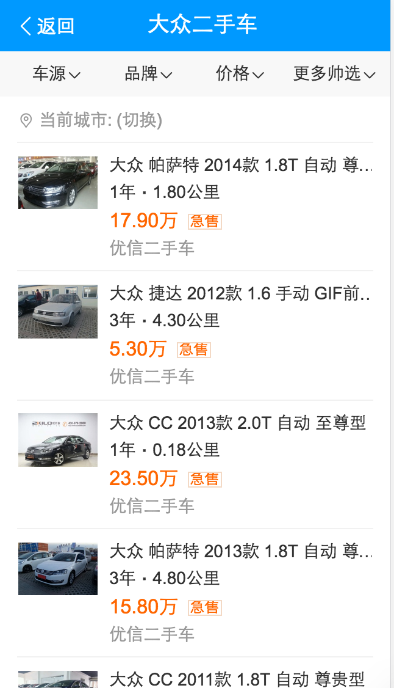
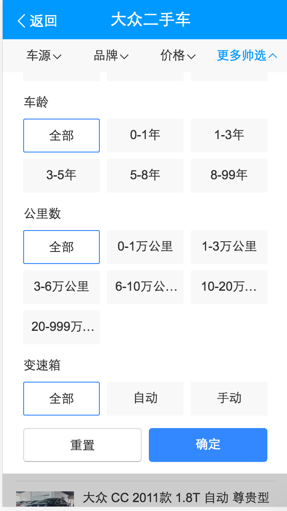
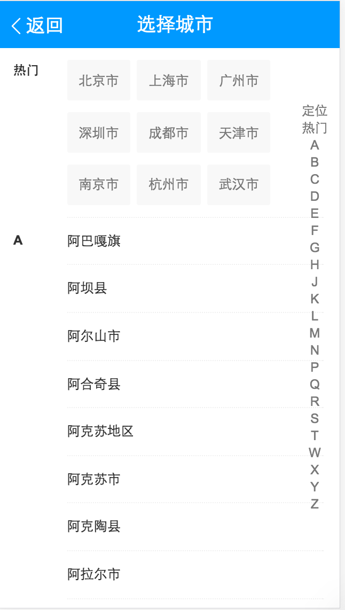
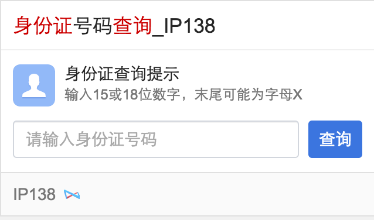
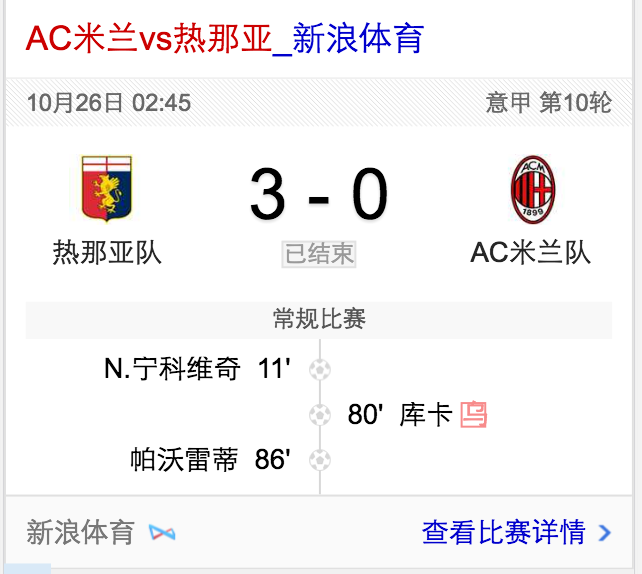

# 李阳阳

> 2016-10-24~2016-10-28

## 二手车

* 背景:
	* 针对二手车，用户有买车和卖车两方面的需求。而各商家的车源分散，中小型城市的车源不足，且市场上暂无巨头出现，目前呈现三足鼎立之势（优信、人人、瓜子）
	* 百度可通过聚合车源、搭建入口、提供额外优惠等方式，进一步满足用户需求，稳住二手车的流量入口。
* 完成情况:
	* 进度：
	    10月25号模板已上线~0流量中~目前进度~数据返回顺序上不固定~rd需要处理下~之后就上线模板~预计是10月28号或者10月31号开流量(看rd那边是不是可以上好数据)~开30%的流量~15w日pv~
	* 预览环境地址：[二手车](https://m.baidu.com/s?word=%E4%BA%8C%E6%89%8B%E8%BD%A6&sid=102162)
	[大众二手车](https://m.baidu.com/s?word=%E5%A4%A7%E4%BC%97%E4%BA%8C%E6%89%8B%E8%BD%A6&sid=102162)
* 收益：开30%的流量~15w日pv~
* 效果图

泛需求的效果图：

精确需求的效果图：

情景页的效果图：

## 模板栅格化迁移~

* 背景:
	老模板栅格化~我这边设计的模板：weiyidanan_general、shenfenzheng、sport_avsb_wise
* 完成情况:
	weiyidanan_general、shenfenzheng已迁移完成~10月26号已上线~sport_avsb_wise预计10月28号（今天）上线~
* 效果图

weiyidanan_general修改前：

	

修改后：

shenfenzheng修改前：

修改后：

sport_avsb_wise修改前：

修改后：

## 摘要表格资源迁移（pc端）(无更新)
* 背景:将线上已有的很多table表格的资源整成一个数据格式，pc同步wise一套数据结构~
* 完成情况:正在进行~
* 收益：暂无
* 效果图

