# 产品月报

> 从 2016-10-31 到2016-11-04


### 人员

```
- FE: 李晓,晓卉,健驰,阳阳,鹏远

```

### 需求安排

	* 体育(1)：阳阳
	* 游戏(1)：鹏远
	* 医疗(1)：健驰
	* 自有产品
	* 车系
	* 房产
	* 飞鸽民生(1-2)：李晓
	* 教育(1)：晓卉


<style>
    ul > li > em {
        font-style: italic;
        color: #999;
    }
    p > img {
        width: 400px;
    }
    img {
        margin-left: 40px;
    }
</style>


### 产品业务线本月模板上线统计

* 新增模板（共12个模板，其中aladdin模板8个，情景页card模板4个）
    * 游戏主播kv卡 新增aladdin模板game_live；（鹏远）
    * 民生 - 菜谱 - 食材菜谱MRD-V2.0 新增aladdin模板recipe_role、recipe_screen，升级一个card模板recipe_screen；（鹏远）
    * 民生 - 快递 - 快递泛需求文案优化 新增aladdin模板express_utility；（山莉）
    * 教育 - 院校问答讨论卡片及情景页  新增aladdin模板college_qa,新增cardcollege_qa_card；（晓卉）
    * 教育 - 考研基本信息 新增aladdin模板pg_basic； (晓卉) 
    * 车系 - 二手车 新增aladdin模板brands，新增card模板brands；（阳阳）
    * 房产 - 新增aladdin模板housing，新增card模板housing；(健驰)

* 升级aladdin模板（共10个）：
    * 客服模板优化 升级aladdin模板sg_kefu、nkefu；（健驰）
    * 民生 - 快递 - 快递泛需求文案优化 ，升级aladdin模板express_delivery （李晓）
    * 民生 - 天气 - 哥伦布民生天气项目，升级aladdin模板sg_weather、sam_sg_weather; （李晓）
    * 招聘 - 优质文章新需求  升级aladdin模版sp_eval；(刘玲玲)
    * 招聘 - 招聘公司名大卡，升级aladdin模板 zhp_firm_name；(刘玲玲)
    * 糯米 - 百度糯米模板样式修改 升级aladdin模板nm_nuomi；(阳阳)
    * 糯米 - 团购pc 升级pc模板ala_catg_opt；（晓卉)
    * 糯米 - 团购pc 升级pc模板ala_merchant_opt；（郑铎）
    
* 栅格化相关
    * 共升级14个aladdin模板


### 详细进展

#### 游戏主播kv卡（鹏远） 

* 背景：以直播和视频为载体的多媒体平台快速发展，导致一批主播和网络红人成为用户关注的热点。而这些游戏主播本身有很强的粉丝效应，故希望在原有的搜索结果下，整合主播的内容，以更好的满足用户。 主播的相关需求较为简单，卡片提供直播间、图集、视频等入口，通过与资源方配合建立主播落地页，聚合卡片内各个入口资源。

* 涉及模板：新增aladdin模板game_live

* 进度：9月28日模板已上线；10.8号小流量（50%）上线，影响面5k-1w左右；卡片覆盖9个主播词作为实验；转全后扩大覆盖，覆盖top50个主播，pv16-20w左右，预计11.04号全量；query:[若风](https://m.baidu.com/s?word=%E8%8B%A5%E9%A3%8E&sid=109919)]

* 效果


#### 民生 - 菜谱 - 食材菜谱MRD-V2.0 （鹏远）

* 背景：食材菜谱V1.0于8月5日全流量上线，食材名类query：总pv7600。都有后续换query行为，其中35%为”食材功效、选购&储存、热量、食物宜搭相克、价格”；食材做法类query：总pv1.5W，后续换query比例为60%，其中大部分为该食材其他精准菜谱做法，说明用户有进一步菜谱做法需求。针对实验效果做进一步优化。

* 涉及模板： 新增aladdin模板recipe_role、recipe_screen，升级一个card模板recipe_screen；

* 进度：10.31号模板上线

* 效果图
<p></p>
<p></p>
<p></p>

#### 民生 - 快递 - 快递泛需求文案优化 （山莉、李晓）

* 背景：快递泛需求换query比例较高，分析为用户不太理解文案对应功能，进行文案优化，已减少换query比例

* 涉及模板：新增aladdin模板express_utility，升级aladdin模板express_delivery

* 完成情况：10月17日抽取30%小流量上线，小流量实验影响面约20w/day；实验结论正向，11月3日全流量上线，全量影响面约120w/day；query:[快递查询](https://m.baidu.com/s?word=%E5%BF%AB%E9%80%92%E6%9F%A5%E8%AF%A2)


* 效果

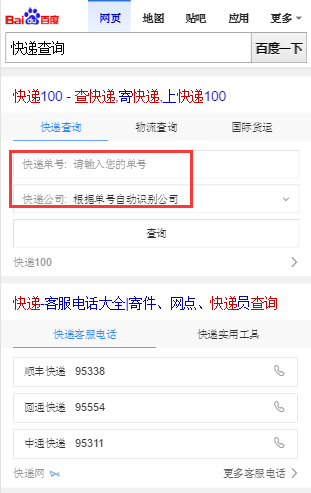


#### 民生 - 天气 - 哥伦布民生天气项目 （李晓）

* 背景：本次优化之前，在国内三四线城市以及区县类query天气下为sigma1.0样式，结合5月全流量上线的天气结果页优化实验数据标明：用户有获取未来天气详情的需求（5天预报整体区域点击率约为6%），为了更直接地满足用户查询未来详细天气预报的需求，本次优化点1：哥伦布样式扩大召回；2：未来5天预报区域按天级分块可点击，点击后当前页展开当天详细天气情况数据（今天：温度、天气情况、风力、紫外线、湿度、日出日落时间；其他日期：温度、天气情况、风力、日出日落时间、限行）；
此外，在国内三四线城市下，为了验证与今天天气相关的指数次需求，本次优化点3：今日生活指数，默认展现与天气情况直接相关的『穿衣指数』及复用4图推荐样式，其他与天气相关的『感冒指数』、『洗车指数』、『运动指数』等采用弱样式验证。

* 涉及模板：升级aladdin模板sg_weather、sam_sg_weather;

* 完成情况：10月27日晚上19:40完成全流量上线。本次全流量上线覆盖国内205个三四线城市天气，影响面约为100万/天;10月31日晚上20:30完成全流量上线。本次全流量上线覆盖国内2235个区县类query天气，影响面约为400万/天。国内一二线城市（5天预报详情+生活指数推荐左滑样式优化）小流量实验已于10月27日20:30上线实验组，对照组各取5%的流量，全量影响PV约为600W。query:[丽江天气](https://www.baidu.com/ssid=c301b4f3c9b5b9cfd2bbbac57107/from=844b/s?word=%E4%B8%BD%E6%B1%9F%E5%A4%A9%E6%B0%94&ts=5026776&t_kt=0&ie=utf-8&rsv_iqid=1556657927557960703&rsv_t=eab2CwZqEdtApjcPE%252B2yP%252FizYBxFePYeeBqqXHgUGOhmBGruV0g9%252FU9XLQ&sa=is_1&ms=1&rsv_pq=1556657927557960703&rsv_sug4=4571&ss=101&inputT=3056&rq=lijiang)


* 效果


#### 车系 - 二手车 （阳阳）

* 背景： 针对二手车，用户有买车和卖车两方面的需求。而各商家的车源分散，中小型城市的车源不足，且市场上暂无巨头出现，目前呈现三足鼎立之势（优信、人人、瓜子）；百度可通过聚合车源、搭建入口、提供额外优惠等方式，进一步满足用户需求，稳住二手车的流量入口。

* 涉及模板：新增aladdin模板brands，新增card模板brands；

* 完成情况：10月25号模板已上线，10.31号小流量上线，30%的流量，15w日pv，预览环境地址：[二手车](https://m.baidu.com/s?word=%E4%BA%8C%E6%89%8B%E8%BD%A6&sid=102162)
    [大众二手车](https://m.baidu.com/s?word=%E5%A4%A7%E4%BC%97%E4%BA%8C%E6%89%8B%E8%BD%A6&sid=102162)

* 效果图


</p>
<p>

</p>
<p>

</p>
<p>

</p>
<p>

</p>
<p>

</p>
<p>

</p>


#### 糯米 - 百度糯米模板样式修改 (阳阳)

* 背景：百度糯米的模板~文字链的样式收益不好~改为图文的样式；

* 涉及模板：升级aladdin模板nm_nuomi；

* 完成情况：10月19号已上线，影响面：7w/day；线上query:[百度糯米](https://m.baidu.com/#|src_%E7%99%BE%E5%BA%A6%E7%B3%AF%E7%B1%B3|sa_ib)；

* 效果图
<p>
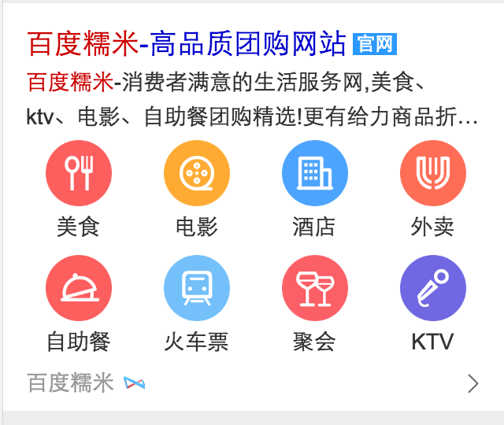
</p>


#### 客服模板优化 （健驰）

* 背景：现在线上客服相关的模板太多，为了以后方便管理，样式统一，需要吧线上的模板整合成一个主模板和一个退化模板。

* 涉及模板：升级aladdin模板sg_kefu、nkefu

* 完成情况：模板`10月21日`已上线，影响面预估pv430w/day， [百度客服电话](https://m.baidu.com/#|src_%E7%99%BE%E5%BA%A6%E5%AE%A2%E6%9C%8D%E7%94%B5%E8%AF%9D|sa_ib)

* 效果截图


#### 房产 (健驰)

* 完成情况：模板10月27日上线，11.03号开30%小流量上线，小流量影响面约40w/day； query:[后现代城](https://m.baidu.com/s?word=%E5%90%8E%E7%8E%B0%E4%BB%A3%E5%9F%8E&sid=110710)

* 涉及模板：新增aladdin模板housing，新增card模板housing

* 效果截图

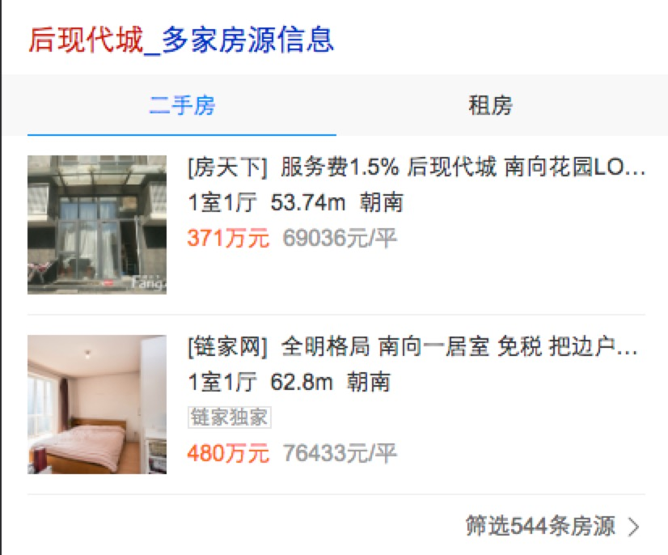

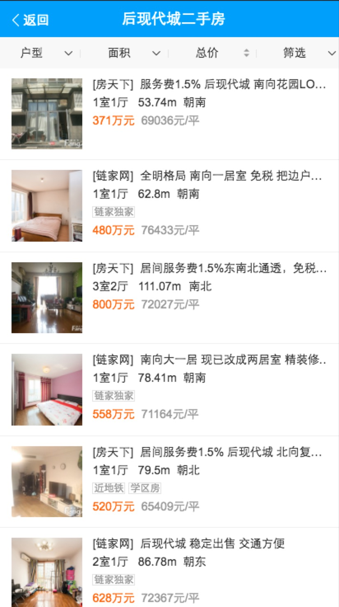


#### 教育 - 院校问答讨论卡片及情景页 （晓卉）

* 背景：提供院校相关问答讨论内容聚合，并增加情景页。

* 涉及模板：新增aladdin模板college_qa,新增cardcollege_qa_card

* 完成情况：9.28上线模板。预计9.29上线card配置。影响面110w/day；query:[南京大学](https://m.baidu.com/s?word=南京大学)

* 效果

<table>
    <tr>
        <td>
            
        </td>
        <td>
            
        </td>
    </tr>
</table>

#### 教育 - 考研基本信息 (晓卉)

* 背景：满足用户查询报考基本信息、考试科目安排、成绩等基础信息获取需求。

* 涉及模板：新增aladdin模板pg_basic

* 完成情况：10.13已上线；影响面暂无；query:[考研](https://m.baidu.com/s?word=考研)

* 效果

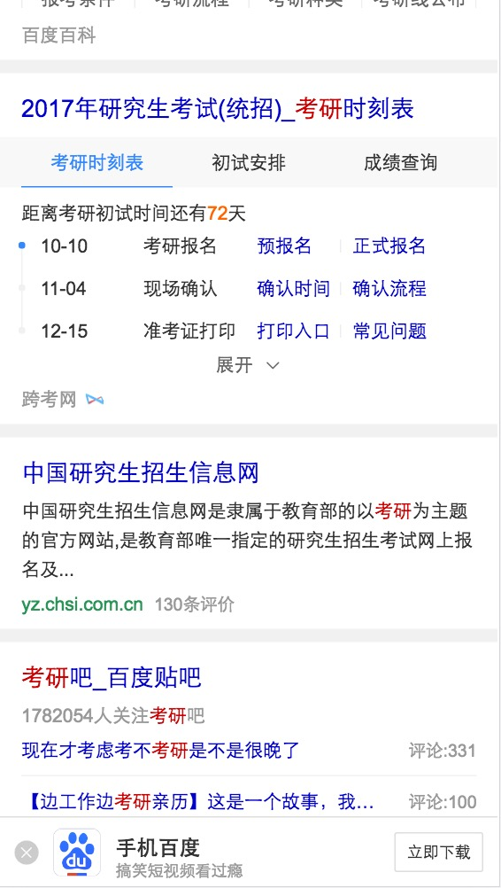

#### 糯米 - 团购pc （晓卉)

* 背景：配合后端更换接口,前端样式调整，线上bug修复。

* 涉及模板：升级pc模板ala_catg_opt

* 完成情况：10.09已上线；影响面约4w/day；query:[火锅团购](https://www.baidu.com/s?wd=%E7%81%AB%E9%94%85%E5%9B%A2%E8%B4%AD&rsv_spt=1&rsv_iqid=0x9fee0f5000003242&issp=1&f=8&rsv_bp=0&rsv_idx=2&ie=utf-8&tn=baiduhome_pg&rsv_enter=1&rsv_sug3=12&rsv_sug1=6&rsv_sug7=100) 

* 效果


#### 糯米 - 团购pc （郑铎）

* 背景：配合后端更换接口,前端样式调整，线上bug修复。

* 涉及模板：升级pc模板ala_merchant_opt

* 完成情况：11.01已上线；影响面暂无；query:[俏江南团购](https://www.baidu.com/s?ie=UTF-8&wd=%E4%BF%8F%E6%B1%9F%E5%8D%97%E5%9B%A2%E8%B4%AD) 

* 效果

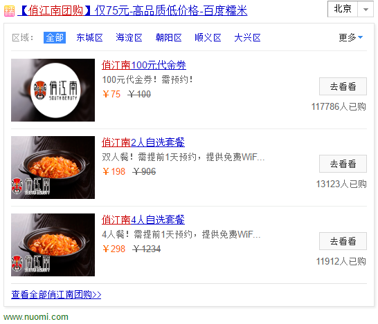


#### 招聘 - 优质文章新需求   (刘玲玲) 

*  涉及模板：升级aladdin模版sp_eval

*  完成情况： 10.17上线，影响面暂无，query:http://nj03-psdy-aladdin038.nj03.baidu.com:8003/s?word=%E5%A4%A9%E6%96%87%E6%9C%9B%E8%BF%9C%E9%95%9C

*  效果图


#### 招聘 - 招聘公司名大卡，（刘玲玲）

* 涉及模板：升级aladdin模板 zhp_firm_name

* 完成情况：2016-10-10~2016-10-14开发中，2016-10-17~2016-10-21开发完成、待测试；[测试地址](http://cp01-aladdin-product-06.epc.baidu.com:8003/s?word=%E6%AD%A6%E6%B1%89%E7%9B%88%E7%A7%91%E4%B8%96%E7%BA%AA%E5%95%86%E8%B4%B8%E6%9C%89%E9%99%90%E5%85%AC%E5%8F%B8)

* 效果图：


#### 哥伦布-阿拉丁模板恶化排查（晓卉）

* 背景：近期因为后端速度上涨，首屏破秒。除了后端推动优化外，前端近期也有必要进行模板梳理优化，附了一份阿拉丁模板影响面较大模板的速度统计。1、明确每个模板的owner。无人认领的老旧模板由负责人代为确认；2、确认模板恶化原因，改进空间、优化方案和优化期限；3、优化后恶化仍超过100ms且影响面大于千分之一的模板，和PM商议考虑下线

* 完成情况：跟进中。对影响面>0.2%的模板确认owner。其中视频垂类占了四个。已和思成、小琴、视频垂类讨论，首先进行了优化，主要是将图片懒加载，模板已上线。后续思成将会分析这四个模板的优化效果，并对前三条结果进行试验，对模板影响进行细分，再继续联系其他垂类进行优化。目前将图片优化相关的指标优化了，这周结束有摸底的数据。应该下周重新再review下上次几个模板。


#### 模板栅格化升级

##### 完成情况：总共升级完14个模板栅格化

* jinzhi，10月26日已上线，@鹏远
* kefu3合并到areacode，10月27日已上线 @鹏远
* answer4合并到areacode，10月27日已上线 @鹏远
* wise_table05合并到game_gift,预计11月2号迁移完成 @鹏远
* weiyidanan_general 10.26已上线 @阳阳
* shenfenzheng 10.26已上线 @阳阳
* sport_avsb_wise 10.28已上线 @阳阳
* worldtime 10.19已上线 @肖学林
* localtime合并到worldtime 10.19已上线 @肖学林
* calendar 10.20已上线 @肖学林
* ip 10.25号已上线 @胡晓卉
* wise_shixin 10.24已上线 @玲玲
* wise_subway @玲玲
* trainnumber @玲玲


##### 效果图

* <p>模板名：jinzhi； query=0.68875的二进制； 鹏远</p>
<p>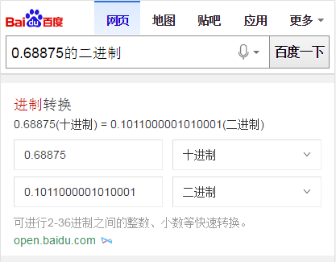</p>

* <p>模板名：game_gift； query=全民斗战神礼包； 鹏远</p>
<p>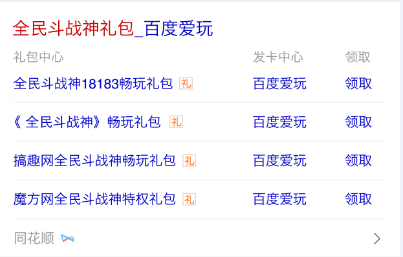</p>

* <p>模板名： areacode； query=南京区号； 鹏远</p>
<p></p>


* <p>模板名： weiyidanan_general；  query=300392；  阳阳</p>
<p>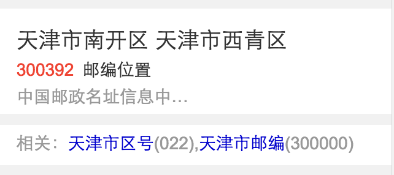</p>

* <p>模板名： shenfenzheng； query=身份证查询； 阳阳</p>
<p>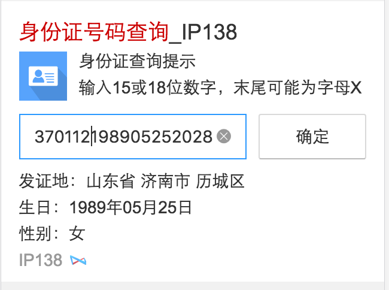</p>

* <p>模板名： sport_avsb_wise；  query=阿尔贾希vs阿尔艾因； 阳阳</p>
<p>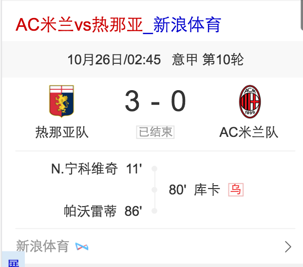</p>


* <p>模板名： worldtime；  query=北京时间； 肖学林</p>
<p></p>

* <p>模板名： calendar；  query=今天是星期几；  肖学林</p>
<p></p>

<p>模板名： ip；  query=206.148.16.55；  胡晓卉</p>
<p>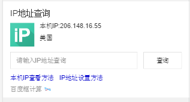</p>

<p>模板名： wise_shixin；  query=全国失信人查询；  刘玲玲</p>
<p></p>

<p>模板名： wise_subway；  query=北京地铁查询；  刘玲玲</p>
<p>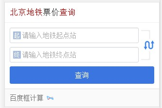</p>

<p>模板名： trainnumber；  query=G5；  刘玲玲</p>
<p>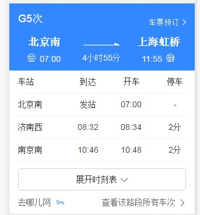</p>


