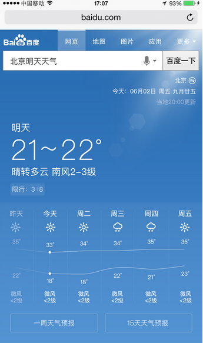
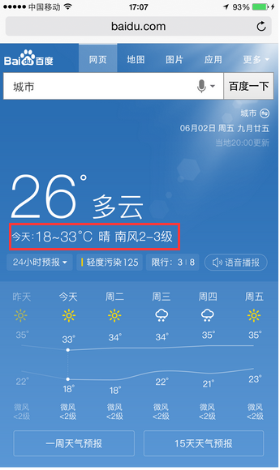
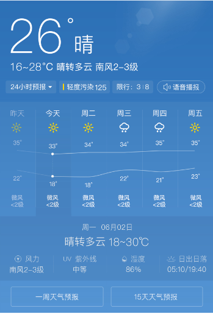
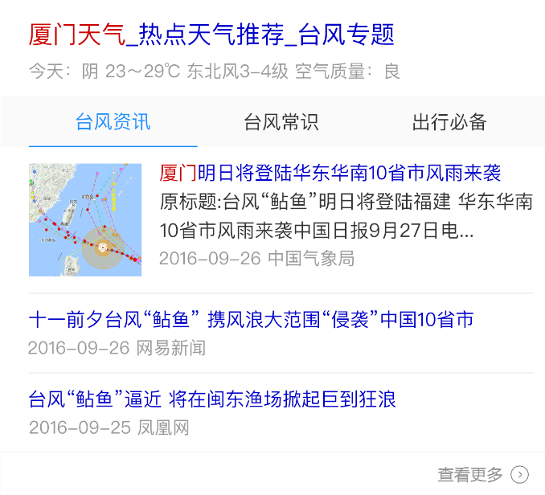
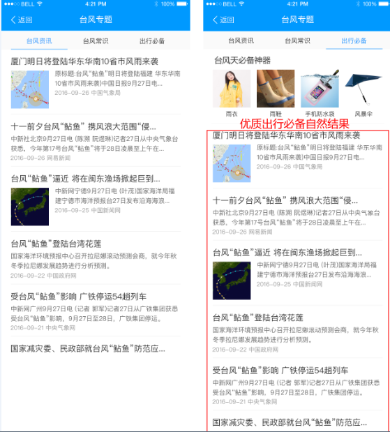

# 李晓

> 从2016-09-12到2016-09-14

### 民生子垂类

    * 天气：pm周里成+杨宇 rd赵元浩 fe李晓
    * 菜谱：pm周里成+杨宇 rd赵元浩 fe李晓
    * 快递：pm徐海漠 rd楚振江
    * 日历：pm林馨怡 rd郑杰
    * 通用推荐：pm徐海漠 rd殷瑞娜

### 进度

## 哥伦布-民生-哥伦布天气现存问题用户体验优化方案、场景化天气优化方案

### 背景

针对query明天天气、明天天气怎么样、后天天气、周*天气，以及实时预报天气等进行优化

### 完成情况

* 开发联调 10.19~10.21
* 测试 10.24号
* 评估 10.25号
* 上线 10.16号模板上线、10.27号数据上开流量
* 扩大召回区县天气pm25相关数据，天气模板加兼容，pm25模板加区县天气兼容，10.27号模板已上线
* 五天详情展开加日期，开发完，10.27号跟ue联调，10.31号已上线
* 模拟数据模板开发完，rd有delay，26号开始联调，11.02号送测，测试完毕，资源方落地有点为题待解决后上线。

### 效果

## 哥伦布-民生-极端天气优化方案

### 背景

用户在搜索『XX天气』及其相关query的需求，根据不同的场景，又有不同侧重的需求，为了更好的精细化满足用户在不同搜索场景下的需求，现提出天气场景化系列优化方案-对比本地天气优化、历史天气优化、极端天气优化、节日节气优化等。

### 完成情况

已评审，ue已定稿，11.04号开始介入开发，开发5天，联调1天，ue联调1天

### 效果

## 哥伦布-民生-天气泛需求（全国天气和全省天气）

### 背景

用户不仅对于某个城市/景点有天气查询需求（当前天气覆盖卡片），用户还有搜索类似q=”全国天气”以及各省天气的需求(PV每天约8W)，而当前搜索结果页未有特型结果覆盖，用户对天气泛需求查询并未得到很好的满足。

### 完成情况

优先级较低，待开展

## 民生项目其他需求

* 【菜谱】菜谱样式优化v1.0，已评审，开发中，模板开发完待走单，数据有delay,10.31号模板上线，@祁鹏远；
* 【菜谱】食材菜谱优化2.0，开发完，联调中，联调完毕后上线，@肖学林
* 【推荐】星河推荐情景页小说&人物类迭代需求，已评审，10.24联调，10.28号模板上线，@肖学林；
* 【菜谱】泛需求优化方案，10.13号已评审，暂时hold住；
* 【推荐】星河新产品样式迭代实验，11.03号介入，预计11.07号联调，@肖学林；
* 【推荐】食材菜谱优化方案，强样式加情景页跳转兼容，弱样式复用通用横滑模板，预计11.04号上线，@肖学林；
* 【pc团购】PC团购模板修改，数据迁移，10.27号介入，pm期望31号修改完，模板11.01号已上线@郑铎。

