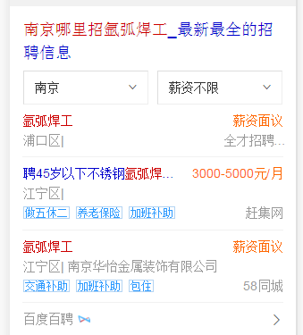
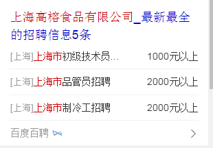
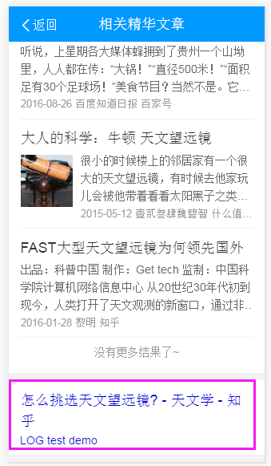

# 刘玲玲

> 从2016-10-31 到 2016-11-04

### 本周进展如下： 

###  阿拉丁卡片部分
* 1、招聘社招强需求白卡 （开发中）
* 背景： 因后端策略及接口变动，且原老模板（wz_zhaopinexactnew）逻辑较复杂并被多个哥伦布复用，so 新开发强需求模板，弱需求仍复用原老模板
* 强需求: zhaopin_exact (新增)
* 弱需求：复用老模版 （we_wz_zhaopinexactnew）
* 效果图
*   
* 2、老模板栅格化
*   wise_subway (预估今天上线 )
*   trainnumber （待开发）
* 3、 优质文章，线上零流量card召回有问题 （解决中）
*   原因： 与odp 沟通，sf召回默认有兜底模板召回，原www_normal 解决线上后，又报出新h5_mobile 兜底模板
*   效果图：
*    

