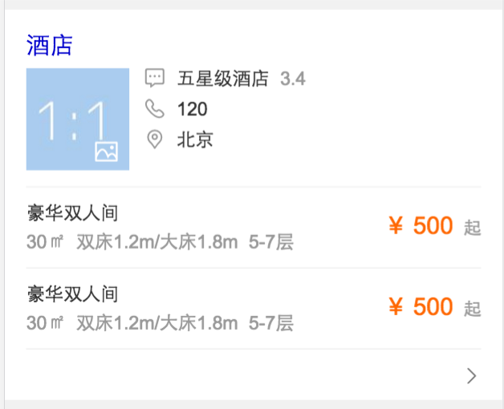
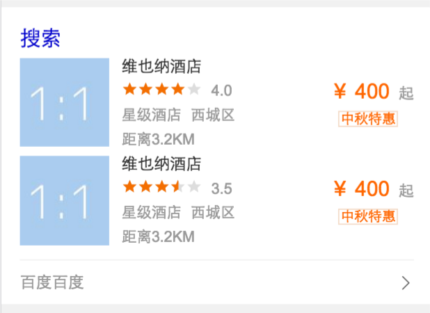
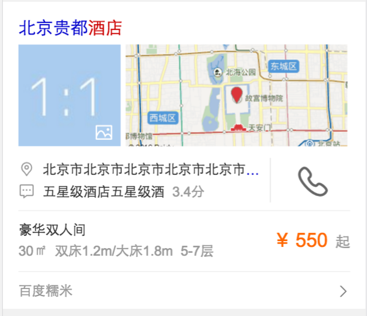

# 薛睿娇

> 2016-10-29 ~ 2016-11-04

## 国内酒店单点阿拉丁_优化(开发完成)

### 项目背景

* 针对连锁品牌名（例如，锦江之星，7天，汉庭，格林豪泰等）或某一地区的酒店（例如，北京酒店预订，上海酒店预订等），对酒店的分布信息突出展现，并优化整体预订流程的体验。

### 收益（总体目标）

* 待补充

### 完成情况（时间点达到的里程碑）

* 开发完成，等待数据联调。
    
### 本周进展

* 酒店单点需求10-31（周一介入），11-02开发完成，等待数据联调。
* 酒店情景页BUG修复上线。
    
### 效果预览 

     
     

### 计划

* 11月中旬完成上线.

### 总结

* 对于开发流程及标准不太了解，现已基本掌握
* 开发过程中存在规范性问题，已改正

## 接下来的排期项目
* 城市行程规划
* 开发4天，11-04 ~ 11-09
