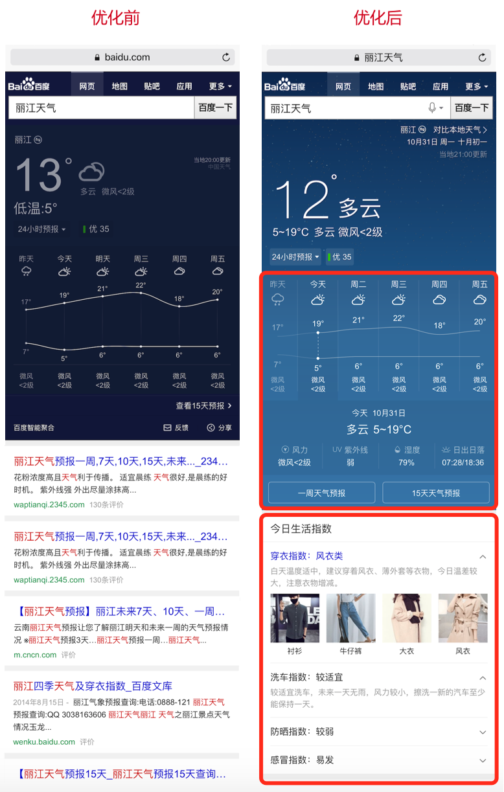

# 民生周报

> 从2016-11-07到2016-11-11

## 项目成员

    * 天气：pm周里成+杨宇 rd赵元浩 fe李晓
    * 菜谱：pm周里成+杨宇 rd赵元浩 fe李晓
    * 快递：pm徐海漠 rd楚振江 fe肖学林
    * 日历：pm林馨怡 rd郑杰 fe肖学林
    * 通用推荐：pm徐海漠 rd殷瑞娜 fe李晓

## 进度

### 哥伦布-民生-1500W天气优化方案

* 背景：为了深度优化用户搜索天气类query需求，对天气主需求，5天预报及今日生活指数进行
* 预期收益：pv1500w/day
* 预览：[丽江天气](https://www.baidu.com/#|src_%E4%B8%BD%E6%B1%9F%E5%A4%A9%E6%B0%94|sa_tb)
* 完成情况：10.31号前已完成三四线城市天气、区县类天气、景点天气共500wpv全量，剩余一二线城市约1000wpv实验结论正向，1.18前完成转全。
* 效果图

  

### 哥伦布-民生-哥伦布天气现存问题用户体验优化方案、场景化天气优化方案

* 背景：针对query明天天气、明天天气怎么样、后天天气、周*天气，以及实时预报天气等进行优化
* 完成情况：测试完毕，待上线，资源方落地有点为题待解决后上线。
* 效果图

### 哥伦布-民生-极端天气优化方案

* 背景：用户在搜索『XX天气』及其相关query的需求，根据不同的场景，又有不同侧重的需求，为了更好的精细化满足用户在不同搜索场景下的需求，现提出天气场景化系列优化方案-对比本地天气优化、历史天气优化、极端天气优化、节日节气优化等。
* 完成情况：已评审，ue已定稿，11.04号开始介入开发，开发5天，联调1天，ue联调1天
* 效果图

### 民生 - 计算器模板性能优化

* 背景：多人反馈手百下计算器模板反应迟钝，需要进行优化。

* 完成情况：优化中，预计14号开始测试，16号模板上线

### 星河新产品样式迭代项目

* 背景：为满足用户更好的体验和检索，进行新产品样式迭代
* 完成情况：联调中，预计11.16号上线
* 线下环境：<a href="http://cp01-ala-fe-6.epc.baidu.com:8003/sf?openapi=1&dspName=iphone&from_sf=1&pd=xinghe_recommend_new&resource_id=4193&word=%E6%9D%A8%E5%B9%82%E6%80%A7%E6%84%9Ftest&tn=tangram">线下环境</a>
* 效果图

### 民生项目其他需求
* 【菜谱】泛需求优化方案，10.13号已评审，郑铎开发其中的结果页卡片中，@郑铎；
* 【推荐】食材菜谱优化方案，强样式加情景页跳转兼容，弱样式复用通用横滑模板，11.10号pm走单中，@肖学林；
* 【栅格化】ua_general模板，query如：10月10日是什么星座，复用百科模板ks_general
* 【栅格化】pm25模板，query如：北京市雾霾，预计11.17号开始介入，@李晓

