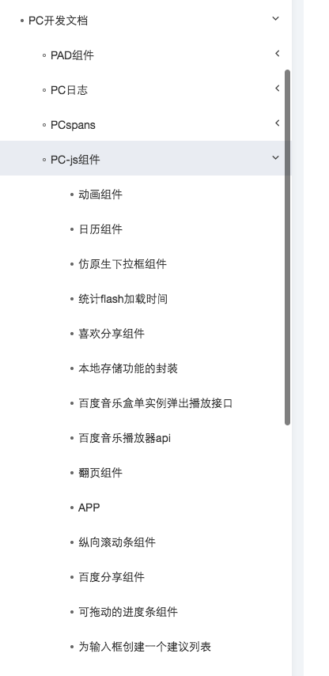

# 司文宇

> 2016年10月17日~2016年10月21日

## 政务大厅  wo xiugaile 

### 项目背景
在五险一金的query下，集合多家资源，设计中间页和搜索结果页，打造百度政务大厅。并让用户对于百度搜索政务有整体品牌感知。影响面：50w/day

### 相关信息
	fe：司文宇    pm：王舒平    
	中文名：政务大厅
	模板名：government_aff
	schemaId：5707
	模板id：10433
	wiseus：   10.92.79.47：3210
	q=北京公积金     上海公积金
	srcid=32382

### 本周进展

线下环境：<a href="http://cp01-ala-fe-col-2.epc.baidu.com:8003/s?word=%E6%9C%88%E7%90%83%E5%85%AC%E7%A7%AF%E9%87%91&wiseus=10.92.79.47&bd_ck=0">传送门</a>

中间页解决方案确定，已由其他同学开发。数据delay，UE走查提测

### UE稿

## 点到点出行项目 

### 【需求背景】
当前线上的市内出行卡片，仅支持公交以及自驾两种出行方式，且每个出行方式只为用户提供一条线路，不能满足用户直接筛选线路的需求。
现有卡片除添加步行方式外，公交线路详情支持在搜索结果页直接展开，降低用户筛选成本；
后期驾车和步行方式将在搜索结果页提供线路图，更加直观清晰；
最后市内出行作为大交通的一环，该项目是出行需求全流程闭环的项目之一。

个人开发记录：<a href="http://wiki.baidu.com/pages/viewpage.action?pageId=218071759">wiki入口</a>

###【实验配置】
	市内出行卡，资源ID 46678，模版名 pp_route。
	全量上线后留10%做反转实验。
	实验组：sid= 110780，10%，约13w/天；
	对照组：sid= 110781，10%，约13w/天；

### 本周进展

1. 可点区域迭代
2. 修复组件展现bug

##### 线下环境：<a href="http://cp01-ala-fe-col-2.epc.baidu.com:8003/s?word=%E5%8C%97%E4%BA%AC%E8%A5%BF%E7%AB%99%E5%88%B0%E5%8C%97%E4%BA%AC%E5%8D%97%E7%AB%99&wiseus=10.99.28.16">线下环境</a>

### 项目效果图

## 公积金提取－小度机器人
### 开发相关
	fe：司文宇    pm：王舒平    rd：许天涵 
	中文名：公积金提取－小度机器人
	模板名：rota_life_guide
	schemaId：5343
	模板id：9561
### 本周进展

线下环境：<a href="http://cp01-ala-fe-col-2.epc.baidu.com:8003/s?word=%E5%85%AC%E7%A7%AF%E9%87%91%E6%8F%90%E5%8F%96&wiseus=10.40.23.48&ip=47.153.191.255&bd_ck=0">传送门</a>

待上线

### 效果图

个人开发记录：<a href="http://wiki.baidu.com/pages/viewpage.action?pageId=235583071">wiki入口</a>

## 文档平台

#### 背景和计划

<a href="http://wiki.baidu.com/pages/viewpage.action?pageId=210385547">SFE文档平台&计划</a>

部分文档更新内容。

#### 本周进展

PC文档迁移，部分修改。

## 签证开发

帮助签证开发的同学做阿拉丁开发，对提供的文档列表完善，指导开发。

### 本周进展
1. QA测试环境搭建
2. 日志问题解决
3. 隐形bug修复，a标签嵌套华为测试机bug

