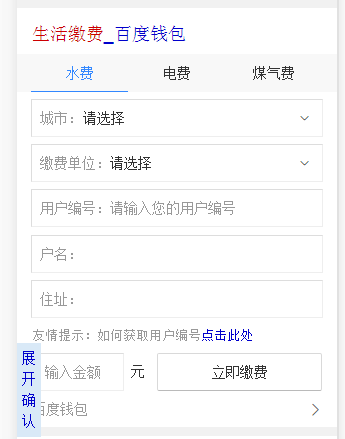

# 刘玲玲

> 从2016-11-07 到 2016-11-11

### 本周进展如下： 

###  阿拉丁卡片部分
* 1、招聘公司名卡片（今天上线）
* 模板名：zhp_firm_name  query= 公司名称（上海欧迪芬内衣精品股份有限公司） sid=111123
* 测试地址： http://cp01-aladdin-product-06.epc.baidu.com:8003/s?word=%E4%B8%8A%E6%B5%B7%E6%AC%A7%E8%BF%AA%E8%8A%AC%E5%86%85%E8%A1%A3%E7%B2%BE%E5%93%81%E8%82%A1%E4%BB%BD%E6%9C%89%E9%99%90%E5%85%AC%E5%8F%B8&sid=111123

* 2、招聘社招白卡因后端改策略，在原基础上兼容 （数据联调中、待测试）
* 模板名：
*  wz_zhaopinexactnew （数据联调中、待测试）
*  we_wz_zhaopinexactnew （测试完成）
* 测试地址： http://10.92.80.14:8003/s?word=%E9%83%91%E5%B7%9E%E9%87%91%E7%A7%8B%E5%BD%A9%E8%89%B2%E5%8D%B0%E5%8A%A1%E6%9C%89%E9%99%90%E5%85%AC%E5%8F%B8&sa=tb&ts=4279739&t_kt=0&ie=utf-8&rsv_t=a2d1GsGhh0ZzrvpWwthXx%252FTv%252BpSAqWuBxsMz8u%252FFyMgOvjX8i4ya&rsv_pq=968066208636223196&ss=101&t_it=1&rqlang=zh&rsv_sug4=8701&inputT=5080&oq=%E5%8D%97%E4%BA%AC%E5%93%AA%E9%87%8C%E6%8B%9B%E6%B0%A9%E5%BC%A7%E7%84%8A%E5%B7%A5

* 3、出行（高铁、火车）栅格化改迁移sigma (开发完成细节调整中，待测试) 
*  模板名： sg_train    query=2602  
* 测试地址：http://cp01-ps-fe-9.epc.baidu.com:8003/s?word=2602

* 4、生活服务方向 生活缴费——水电煤气费 （样式开发完、因需求与钱包的接口有差异对接中）
* 模板名：life_pay
* 效果图：  

* 5、招聘哥伦布迭代（下周三开始）

