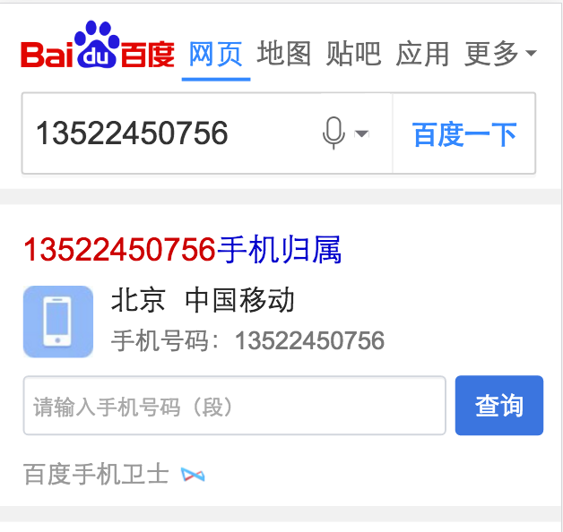
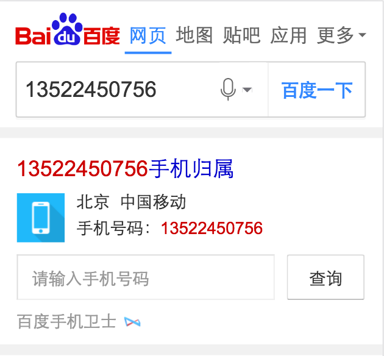
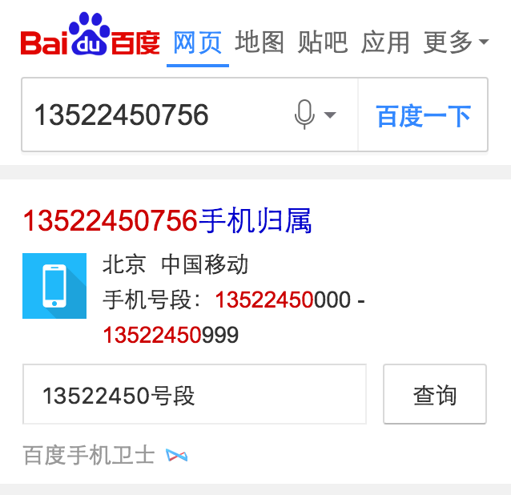
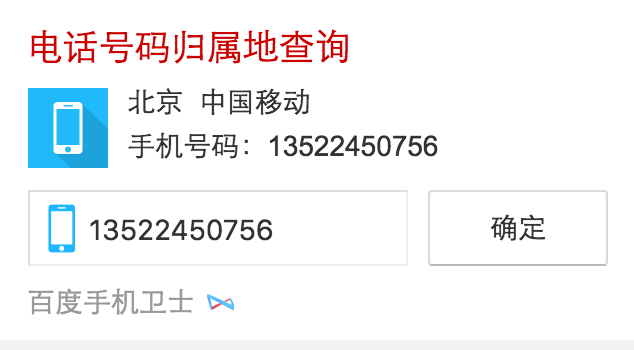
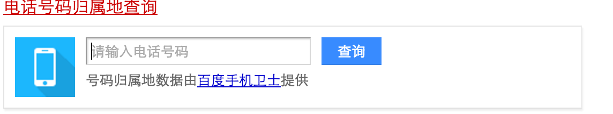
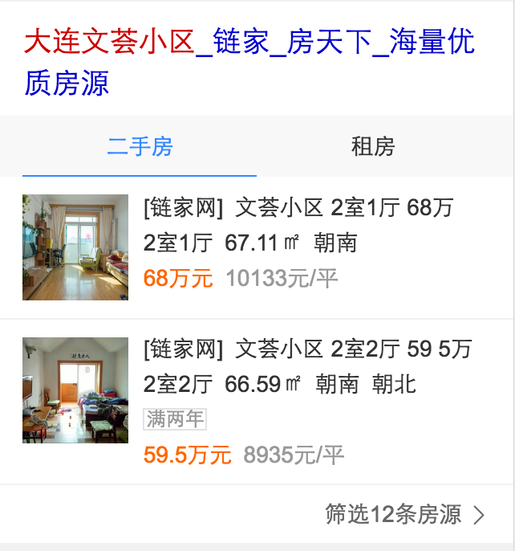
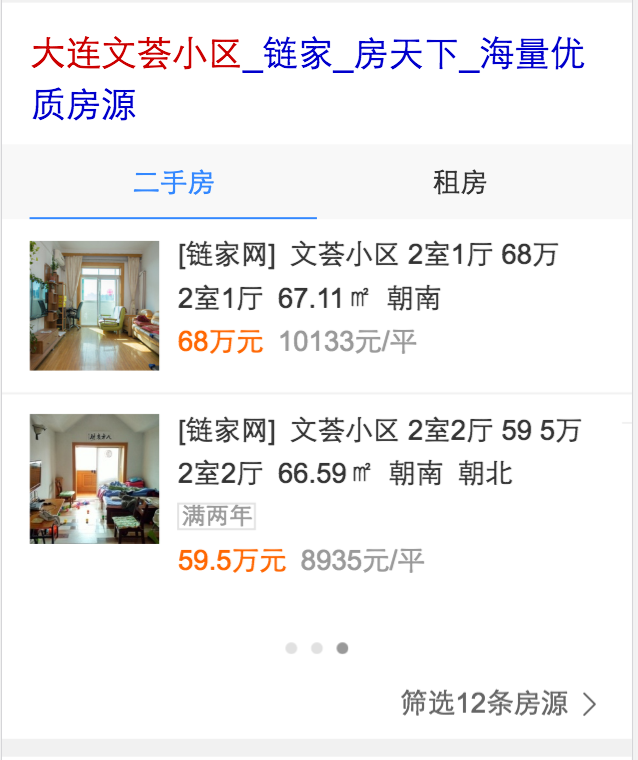

# 李阳阳

> 2016-11-07~2016-11-11

## 模板栅格化迁移~

* 背景:老模板栅格化~mobilephone
* 预期收益：pv：33w
* 完成情况:11-09已上线
* 线上地址：[13522450768](https://m.baidu.com/s?word=13522450768)
* 效果图
	
栅格前：

	

	
	

	
栅格后：

	

	
	

	

	
	

## 电话号码查询的模板功能升级（pc和wise）

* 背景:phoneajax的电话号码查询的模板~wise端和pc端优化升级~原先的逻辑是点击查询跳转到第三方页面~优化成：查询结果在结果页显示的~支持搜索区段查询~
* 预期收益：wise的模板pv：3w~，pc的模板pv:0.5w
* 完成情况:wise的模板11-08已上线,pc的模板11-10上线
* 线上地址：wise端的预览地址：[电话号码归属地查询](https://m.baidu.com/s?word=%E7%94%B5%E8%AF%9D%E5%8F%B7%E7%A0%81%E5%BD%92%E5%B1%9E%E5%9C%B0%E6%9F%A5%E8%AF%A2) pc端的预览地址： [电话号码归属地查询](https://www.baidu.com/s?ie=utf-8&f=8&rsv_bp=1&rsv_idx=1&tn=baidu&wd=%E7%94%B5%E8%AF%9D%E5%8F%B7%E7%A0%81%E5%BD%92%E5%B1%9E%E5%9C%B0%E6%9F%A5%E8%AF%A2)
* 效果图
	
wise端的效果图

	

	
	

	

	
	

	

	
	

	
pc端的效果图

	

	
	

	

	
	

	

	
	

## 二手房的精确需求~（新增模板：house_detail）

* 背景:提高覆盖率，优化线上卡片~
* 预期收益：暂无
* 完成情况: 提测完成~pm正在走人工评估~预计11-11号或者11-14上线~
* 线下地址：[大连文荟小区](http://cp01-ala-fe-5.epc.baidu.com:8003/s?word=%E5%A4%A7%E8%BF%9E%E6%96%87%E8%8D%9F%E5%B0%8F%E5%8C%BA)
* 效果图
	

	
	

## 二手房的泛需求卡片升级~（新增名：housing）

* 背景:优化线上卡片~新增横滑~提高点击率~
* 预期收益：10W/天
* 完成情况:修改完成~预计11-11上线~
* 线下地址：[大连文荟小区](http://cp01-ala-fe-5.epc.baidu.com:8003/s?word=%E5%A4%A7%E8%BF%9E%E6%96%87%E8%8D%9F%E5%B0%8F%E5%8C%BA)
* 效果图
	
修改前：

	

	
	

	
修改后：

	

	
	

## 家装效果产品

* 背景:效果图是家装需求中核心内容，在家装规划中需求检索量大，入口级产品，医疗行业新的发展方向，有利于解决中国医疗资源不平衡和人们日益增加的健
* 完成情况:11-14号介入~待续~
* 效果图：暂无~

