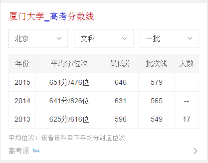
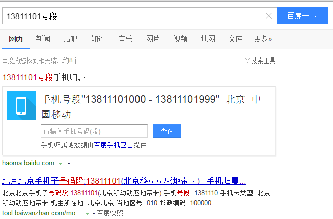
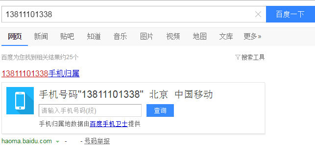

# 祁鹏远

> 2016年11月7日~2016年11月11日

## 院校分数线迭代需求

* 背景:经UBS反馈院校分数线卡片4180召回率相对于神马竞品待优化。目前线上卡片为基础mini卡片，仅对地区默认文理及批次进行匹配。
* 预估收益：pv100w
* 完成情况：11月14日提测，11月17号上线
* 效果图

## PC归属地样式优化

* 背景:手机归属和固化归属样式统一，增加title和号码举报入口。
* 完成情况：今日11月11号上线
* 效果图

## 影院样式优化
* 背景:样式升级及优化。
* 完成情况：周一11月14号上线
* 效果图

## wise手机号码功能优化

* 背景:在原有手机号码的功能下增加固定号码的搜索。
* 完成情况：11月15号开始介入，11月18号上线

