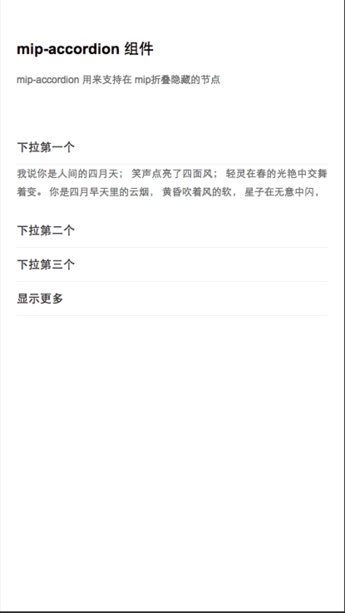

# 王培

> 从2016-11-07 到 2016-11-11

## 本周跟进

- MIP 组件开发

- MIP 文档更新

- TOP 站改造支持

- MIP 支付调研

## MIP 支付

### 背景与目标

    对『付钱啦』提供技术支持，并已此封装一套 MIP 自己的支付接口

#### 完成情况

- 进度：主要支持站长开发，依赖站长进度，目前hold

#### 效果图

- 暂无

## 组件

### 1. mip-sidebar

#### 背景与目标
    
    通用侧边栏组件，支持左边侧边栏和右边侧边栏

#### 完成情况

- 进度：已上线(11.10)
- 预览地址：http://fedev.baidu.com/~wangpei07/mip/sidebar/mip-sidebar.html

#### 效果图

<table>
    <tr>
        <td></td>
    </tr>
</table>

### 2. mip-lightbox

#### 背景与目标
    
    修复浮层中 a 标签不可点击的bug

#### 完成情况

- 进度：已上线(11.10)
- 预览地址：http://fedev.baidu.com/~wangpei07/mip/sidebar/mip-sidebar.html

#### 效果图

<table>
    <tr>
        <td></td>
        <td></td>
    </tr>
</table>

### 3. mip-accordion

#### 背景与目标
    
    折叠节点组件，功能升级支持手动配置默认展开节点

#### 完成情况

- 进度：已上线(11.08)
- 预览地址：暂无

#### 效果图

<table>
    <tr>
        <td></td>
    </tr>
</table>

### 4. 图加广告组件

#### 背景与目标
    
    支持图加广告组件的卡法i啊

#### 完成情况

- 进度：依赖图加需求文档，预计下周进入开发
- 预览地址：暂无

#### 效果图

暂无

### 5. mip-mustache

#### 背景与目标
    
    模板组件，引入并封装第三方模板引擎

#### 完成情况

- 进度：开发中
- 预览地址：暂无

#### 效果图

- 暂无

### 6. mip-list

#### 背景与目标
    
    列表组件，依赖mip-mustache

#### 完成情况

- 进度：开发中
- 预览地址：暂无

#### 效果图

- 暂无

### 7. 第三方组件

#### 背景与目标

    - 支持第三方组件开发
    - 审核起开发代码
    - 上线第三方组件
    - 迁移第三方组件

#### 完成情况

##### 组件审核

> TTJJ_PZ

    - 审核：暂未通过
    - 进度：hold
    - 原因：组件文档未按照规范书写，组件代码存在质量问题

> mip-hnr-rem（无更新）

    - 审核：暂未通过
    - 进度：hold
    - 原因：因为组件都是JS加载的，所以JS加载之前html标签是没有font-size的，页面上使用rem单位的样式都会有问题

> mip-hk-call

    - 好看调起客户端
    - 审核通过
    - 11.08 上线完成

> mip-hk-fcvideo

    - 好看视频组件
    - 审核通过
    - 11.08 上线完成

> mip-hk-showarticle

    - 显示文章更多详情
    - 审核通过
    - 11.08 上线完成

> mip-hk-feed

    - 好看feed流
    - 审核通过
    - 11.08 上线完成

> mip-hk-keep

    - 好看详情页下载app安装打开对应详情页接口
    - 审核通过
    - 11.08 上线完成

> mip-hk-share

    - 好看分享插件
    - 审核通过
    - 11.08 上线完成

> mip-html-tabs

    - TAB滑动、显示、隐藏、元素跳转等操作
    - 审核通过
    - 11.08 上线完成

> mip-filter

    
    - 筛选组件，在mip官网有引用

    - 审核通过
    - 11.10 上线完成

> mip-nav-slidedown


    - 实现响应式的菜单，在mip官网有引用

    - 审核通过
    - 11.10 上线完成

> mip-wkad-config

    
    - 寻医问药广告配置组件

    - 审核通过
    - 11.10 上线完成

> mip-wkad

    
    - 寻医问药广告组件
    - 审核通过
    - 11.10 上线完成

> mip-wkfun
    
    - 寻医问药页面功能组件
    - 审核通过
    - 11.10 上线完成

> mip-stats-ajk
    
    - 安居客统计组件
    - 审核通过
    - 11.10 上线完成

> mip-360doc-script

    - 360doc网业务逻辑组件
    - 审核通过
    - 11.10 上线完成

##### 组件迁移

- 升级|迁移完 mip-39ad
- 升级|迁移完 mip-39appgad
- 升级|迁移完 mip-vd-popup
- 升级|迁移完 mip-vdtabs
- 升级|迁移完 mip-ck-ad
- 新增|迁移完 mip-ck-script
- 新增|迁移完 mip-down-comment
- 新增|迁移完 mip-down-hideshow
- 新增|迁移中 mip-ck-basecss
- 新增|迁移中 mip-ck-course-detail
- 新增|迁移中 mip-ifeng-ppt
- 新增|迁移中 mip-ifeng-pptdetail

### 5. MIP 文档

#### 背景与目标
    
    完善文档，随时更新
    
#### 完成情况

- 进度：

    - 内网文档同步官网脚本完成

- 预览地址：
    
    - 内网：http://mip.baidu.com/
    - 官网：https://www.mipengine.org

