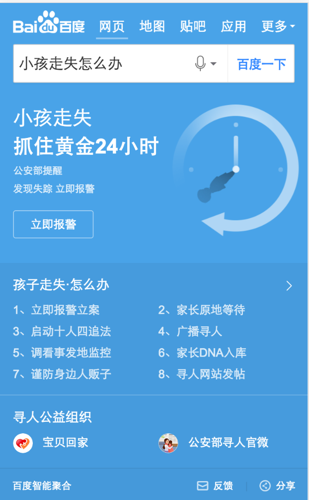

# 薛睿娇

> 从2016-10-06到2016-11-11

## 城市行程规划项目

### 背景

用户在搜索城市旅游相关query时，旨在获得一条完整且权威的旅游路线。

### 完成情况

页面开发完成。

## 寻人项目

### 背景

Query：孩子丢了怎么办、孩子走失怎么办、小孩走失怎么办。

用户在搜索相关query时，旨在获得处理办法和相关寻人信息，

如：“孩子走失怎么办”相关知识科普和打拐公益组织链接。

### 完成情况

页面开发完成。

效果图：
	

当前进度：

开发完成，申请提测中。

### 总结

了解了sigma开发的相关规范和平台的使用；了解了提测的流程及后续事项的处理。