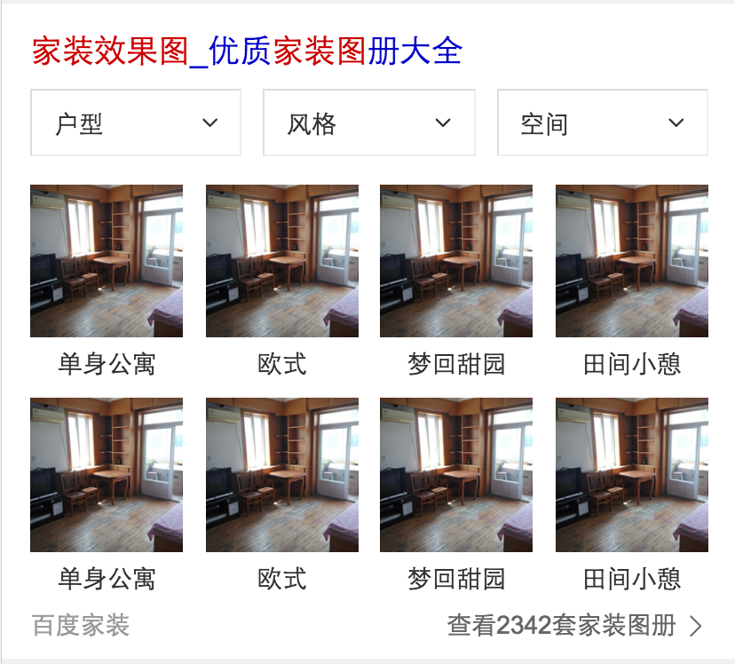
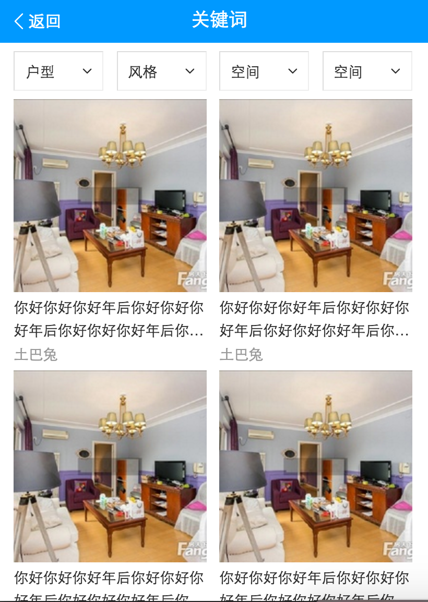

# 李阳阳

> 2016-11-13~2016-11-18

## 二手房的精确需求~（新增模板：house_detail）无进展

* 背景:提高覆盖率，优化线上卡片~
* 预期收益：暂无
* 完成情况: 提测完成~pm正在走人工评估~预计11-11号或者11-14上线~
* 线下地址：[大连文荟小区](http://cp01-ala-fe-5.epc.baidu.com:8003/s?word=%E5%A4%A7%E8%BF%9E%E6%96%87%E8%8D%9F%E5%B0%8F%E5%8C%BA)
* 效果图
	

	
	

## 家装效果产品（后续鹏远跟进）

* 背景:效果图是家装需求中核心内容，在家装规划中需求检索量大，入口级产品，医疗行业新的发展方向，有利于解决中国医疗资源不平衡和人们日益增加的健
* 完成情况:开发中~完成了一些静态页面~后续的鹏远跟进~
* 效果图：
	

	
	

	

	
	

	

	
	

## 美图

* 背景:调研线上图片搜索结果，发现存在以下问题大搜结果页有部分流量向百度域外分发且质量一般，封闭比例有待提升；大搜结果页与图搜落地页跳转交互不够流畅，且跳转速度有优化空间；图搜落地页广告多且相关性存在问题，影响用户的正常信息获取。
另外，针对部分热门垂类，图搜落地页仍用通用方式满足，对标竞品，结构化信息满足上有较大劣势。针对以上问题，我们希望从热门垂类切入（以装修图片举例）进行优化，打造全新的图片搜索，实现A-B-C三个页面的流畅读图体验。优化大搜结果页与情景页的交互和跳转速度；接入优质资源方，优化情景页数据质量；完善列表页的tag筛选，满足用户的深度需求。
* 完成情况:开发中~本周定了数据格式~完成了B类页面的些许功能~
* 效果图：
	

	
	

