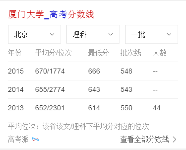
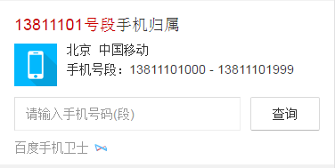
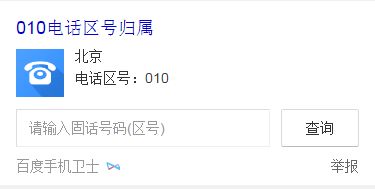
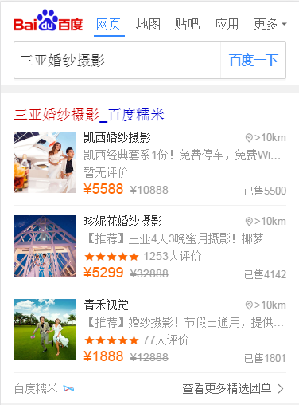
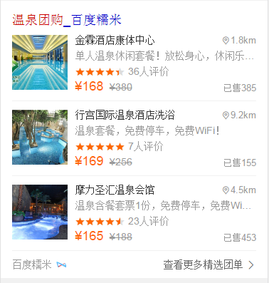

# 祁鹏远

> 2016年11月14日~2016年11月18日

## 院校分数线迭代需求

* 背景:经UBS反馈院校分数线卡片4180召回率相对于神马竞品待优化。目前线上卡片为基础mini卡片，仅对地区默认文理及批次进行匹配。
* 预估收益：pv100w

* 完成情况：11月17日提测，11月21号上线
* 效果图

* 完成情况：11月17日提测，预计11月21号上线
* 效果图

## 影院样式优化
* 背景:样式升级及优化。

* 完成情况：周一11月16号上线
=======
* 完成情况：周一11月16号已上线

* 效果图

## wise手机号码功能优化

* 背景:在原有手机号码的功能下增加固定号码的搜索。

* 完成情况：11月14号上线
=======
* 完成情况：11月14号已上线

* 效果图

## 糯米团购样式升级

* 背景:在原有的基础上样式升级及增加星星评分，修改模版wise_tuan和wise_tuan2。

* 完成情况：11月17号上线
=======
* 完成情况：11月17号已上线

* 效果图

## 家装效果图产品

* 背景:效果图是家装需求中核心内容，在家装规划中需求检索量大，入口级产品。通过家装效果打造家装KG，从而通过用户需求连接服务，提供家装知识
* 完成情况：11月21开始开发，数据完成后，开发5天

##后续
=======
## 后续

## 租房泛需求

* 背景:用户在进行租房泛需求搜索时，存在查看多家房源信息的需求。租房泛需求卡片进行链家、自如、房天下等优质房源聚合，在搜索结果页用以卡片形式进行房源的直接展示，并在情景页提供全量房源筛选查看功能。减少用户信息获取成本，更好满足用户需求，提升搜索满意度。
* 收益：日均pv:30W 
* 完成情况：待排期

