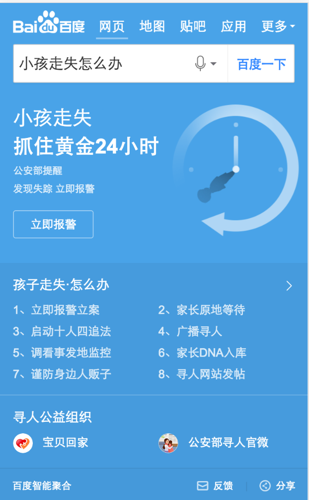

# 薛睿娇

> 2016-11-12～2016-11-18

## 寻人项目

### 背景与目标

    *  Query：孩子丢了怎么办、孩子走失怎么办、小孩走失怎么办。
    
    *  用户在搜索相关query时，旨在获得处理办法和相关寻人信息，如：“孩子走失怎么办”相关知识科普和打拐公益组织链接。

### 完成情况

    *  2016-11-16上线，召回query:小孩走失怎么办，全流量。

### 效果截图

### 总结

了解了项目上线的具体规范和流程，项目中遇到问题知道如何去跟相关负责人沟通，体会到了团队合作中沟通的重要性。

## 酒店项目

### 背景与目标

    *  Query：七天酒店。
    
    *  针对某一酒店名类型的搜索Query，优化阿拉丁样式及预订流程的体验，提供酒店基本信息、房型预定信息，满足客户需求。

### 完成情况

    *  开发完成，后端数据接口切换，联调中，预计下周二提测。

