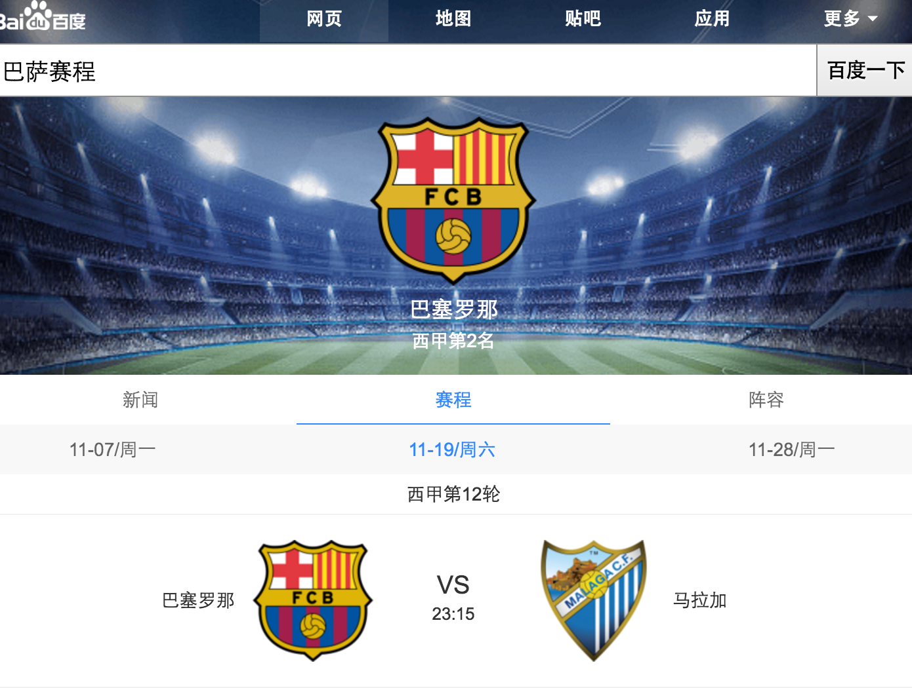
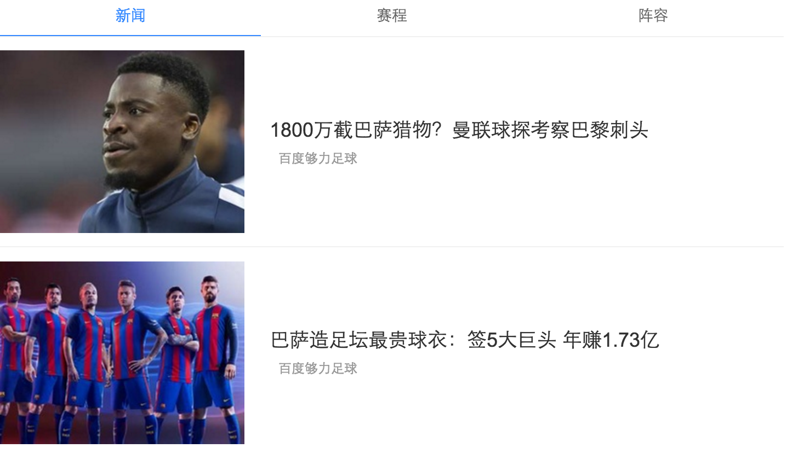
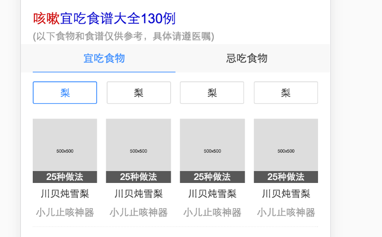

# 郑铎
> 从2016-11-14到2016-11-18

## 球队模板改进

### 背景

1.改进新闻图片的伸缩，参考sg_lasar_football

2.原本每增加一个tab，就要在字段中增加一种tab类型，模板改进需要前后台一起进行，现将tab部分进行改进，使以后新增tab后前端不需要参与开发。

### 完成情况
模板名：sg_lasar_team

改进已完成，正在提测

### 效果图

## 咳嗽宜吃食物模板开发

### 背景

咳嗽吃什么搜索后展现的卡片，包含宜吃和不宜吃两个tab，在宜吃食物下给出食物详细做法

### 完成情况

模板名：cough_food

前端开发完成，等待后台介入

### 效果图

