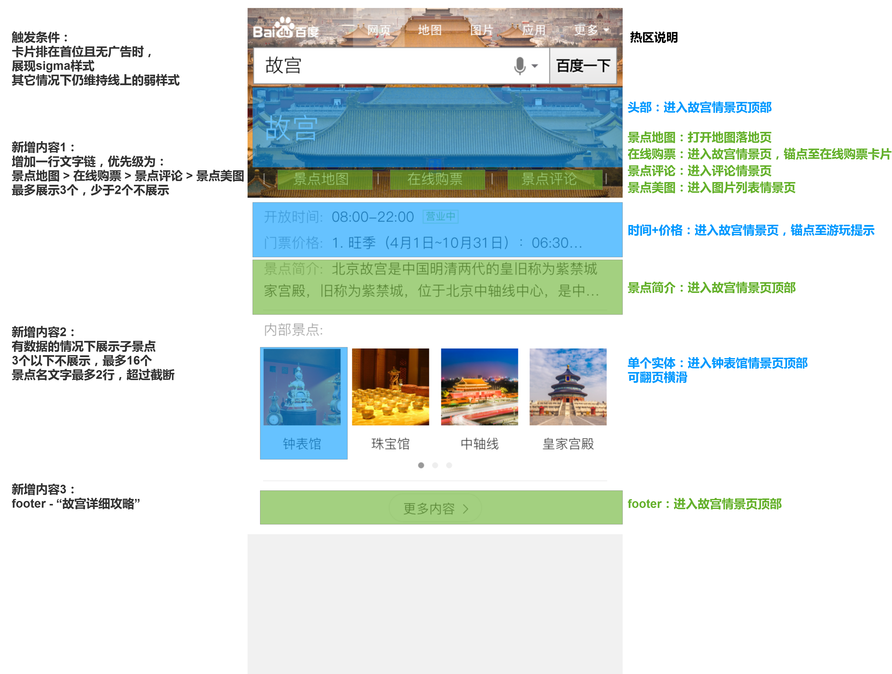
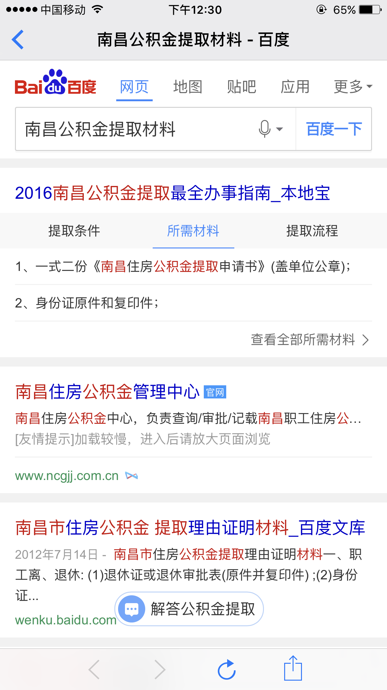

# 司文宇
 
 > 2016年10月21日~2016年10月25日
 
## poi消费类迭代

#### 项目背景
 由于对单点实验效果有异议，要求重新优化POI单点样式，重新产出实验数据
 
#### 完成情况
	wise：poi_single, poi_single_weak
 	
 	周四(11.24)上线 
 	
#### 本周进展
 
周四(11.24)上线 
 

#### 后续计划
 待定
 I
#### 效果图
 
 
 <a href="https://wwwhttps.baidu.com/s?dev=1&dev_workspace=platform&dev_module=aladdin-wise&dev_tpl=poi_single&dev_path=searchaladdin&dev_tpltype=default&sid=99999&dev_online=1&wd=%E6%B5%B7%E5%BA%95%E6%8D%9E%E8%A5%BF%E5%8D%95%E5%BA%97&word=%E6%B5%B7%E5%BA%95%E6%8D%9E%E8%A5%BF%E5%8D%95%E5%BA%97">线上demo</a>
  <a href="https://wwwhttps.baidu.com/s?dev=1&dev_workspace=platform&dev_module=aladdin-wise&dev_tpl=poi_single&dev_path=searchaladdin&dev_tpltype=default&sid=99999&dev_online=1&wd=%E8%A5%BF%E5%AE%89%E5%9B%9E%E6%B0%91%E8%A1%97&word=%E8%A5%BF%E5%AE%89%E5%9B%9E%E6%B0%91%E8%A1%97">线上demo</a>
 

## 景点强样式
 
#### 项目背景
 强样式展现sigma卡，弱样式展现普通卡。pv170w。
 
#### 完成情况
 sigma卡已于周二（11.22）提测
 normal卡开发中。
 
#### 本周进展
 
 线下环境：<a href="http://yq01-psdy-diaoyan1007.yq01.baidu.com:8003/s?word=%E5%8D%97%E5%B1%B1%E5%8D%97%E6%BB%91%E9%9B%AA%E5%9C%BA">传送门</a>
 sigma卡已于周二（11.22）提测
 normal卡开发中。
 

#### 后续计划
 待normal卡开发完成上线。
 
#### 效果图
 
 
 
 
 
## 政务大厅  
 
#### 项目背景
 在五险一金的query下，集合多家资源，设计中间页和搜索结果页，打造百度政务大厅。并让用户对于百度搜索政务有整体品牌感知。影响面：50w/day

#### 完成情况

 中间页开发中。结果页周二（11.22）ready，联调中
  
#### 本周进展
 
 线下环境：<a href="http://cp01-ala-fe-col-2.epc.baidu.com:8003/s?word=%E6%9C%88%E7%90%83%E5%85%AC%E7%A7%AF%E9%87%91&wiseus=10.92.79.47&bd_ck=0">传送门</a>
 
 中间页开发中。数据周四（11.17）ready，联调中
 
#### 后续计划
 待中间也联调完毕，提测（预计周五(11-25)）
 
#### UE稿

 
 
 
## 公积金提取－小度机器人
 

#### 本周进展
 
 
 更换三组展现，周四（11.17）确定最终样式，待后端上线，模板将于下周一上线。
 周一(11.21)上线
 
 
#### 效果图
 
 
 
<a href="https://m.baidu.com/ssid=074ccdf5b6a1c2fad4dacef7b0b2ef51/s?word=%E5%85%AC%E7%A7%AF%E9%87%91%E6%8F%90%E5%8F%96&sid=101457">线上预览</a>

#### 后续计划

由于跟部分广告等浮层冲突，待解决。
 
 
## 文档平台
 
#### 背景和计划
 
 <a href="http://wiki.baidu.com/pages/viewpage.action?pageId=210385547">SFE文档平台&计划</a>
 

#### 本周进展
 
 部分文档更新内容。
 
## 签证开发
 
 帮助签证开发的同学做阿拉丁开发，对提供的文档列表完善，指导开发。
 
#### 本周进展
 
 1. a标签嵌套华为测试机bug问题追踪，是由于c-blocka省略造成的问题
 已记录在wiki中：<a href="http://wiki.baidu.com/pages/viewpage.action?pageId=246191143">传送门</a>
 
 
