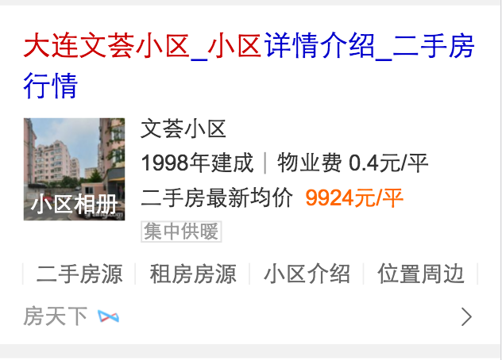

# 李阳阳

> 2016-11-13~2016-11-18

## 二手房的精确需求~（新增模板：house_detail）

* 背景:用户在搜索精准楼盘名称时，存在多维度需求。例如：房源信息、周边配套、房价走势等。线上的精准楼盘阿拉丁，只有楼盘基础摘要信息展现和房源入口。且覆盖城市量仅20余个。在资源覆盖量和用户体验上均存在提升空间。优化版精准楼盘信息卡，对精准楼盘摘要信息进行结构化升级，并对楼盘搜索用户的主要子需求进行link索引，减少用户信息获取成本。且引入其他资源方进行数据扩充，卡片覆盖城市由20余个增加到300余个。
* 预期收益：小流量影响面：12W/天，用户换query比例下降、有点增加、搜索满意度提升。 
* 完成情况: 已上线，抽取30%流量，sid=111939，精准盘信息卡
* 线上地址：线上忽然不展现了~pm正在追查~回头再加上链接~
* 效果图
	

	
	

## 美图

* 背景:调研线上图片搜索结果，发现存在以下问题大搜结果页有部分流量向百度域外分发且质量一般，封闭比例有待提升；大搜结果页与图搜落地页跳转交互不够流畅，且跳转速度有优化空间；图搜落地页广告多且相关性存在问题，影响用户的正常信息获取。
另外，针对部分热门垂类，图搜落地页仍用通用方式满足，对标竞品，结构化信息满足上有较大劣势。针对以上问题，我们希望从热门垂类切入（以装修图片举例）进行优化，打造全新的图片搜索，实现A-B-C三个页面的流畅读图体验。优化大搜结果页与情景页的交互和跳转速度；接入优质资源方，优化情景页数据质量；完善列表页的tag筛选，满足用户的深度需求。
* 完成情况:开发中~本周定了数据格式~完成了B类页面的些许功能~完成了c类面的基本功能~计划下周一联调~
* 效果图：
	

	
	

	

	
	

	

	
	

