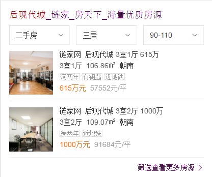

# 祁鹏远

> 2016年11月21日~2016年11月25日

## 院校分数线迭代需求

* 背景:经UBS反馈院校分数线卡片4180召回率相对于神马竞品待优化。目前线上卡片为基础mini卡片，仅对地区默认文理及批次进行匹配。
* 预估收益：pv100w

* 完成情况：11月17日提测，11月21号已上线
* 效果图

## 房源卡迭代--加筛选(hold,已提测完，pm说暂时不上，等通知)

* 背景:房源卡的tab改变为筛选。
* 完成情况：11月23日开始开发，预计11月25号上线
* 效果图

## 后续

## 家装效果图产品

* 背景:效果图是家装需求中核心内容，在家装规划中需求检索量大，入口级产品。通过家装效果打造家装KG，从而通过用户需求连接服务，提供家装知识
* 完成情况：11月28日开始开发，开发三天，和情景页一起上线
* 效果图：强样式和弱样式

## 黑白电话

* 背景:优化展现布局，突出重点；增加电话反馈投诉渠道，加强与资源方数据互通和深度合作。
* 收益：kv 15万
* 修改模版:wise: liarphone2   pc: liarphone2

## 租房泛需求

* 背景:用户在进行租房泛需求搜索时，存在查看多家房源信息的需求。租房泛需求卡片进行链家、自如、房天下等优质房源聚合，在搜索结果页用以卡片形式进行房源的直接展示，并在情景页提供全量房源筛选查看功能。减少用户信息获取成本，更好满足用户需求，提升搜索满意度。
* 收益：日均pv:30W 
* 完成情况：待排期

