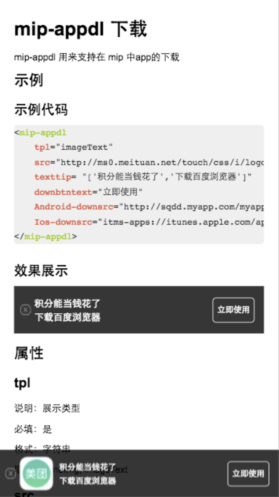
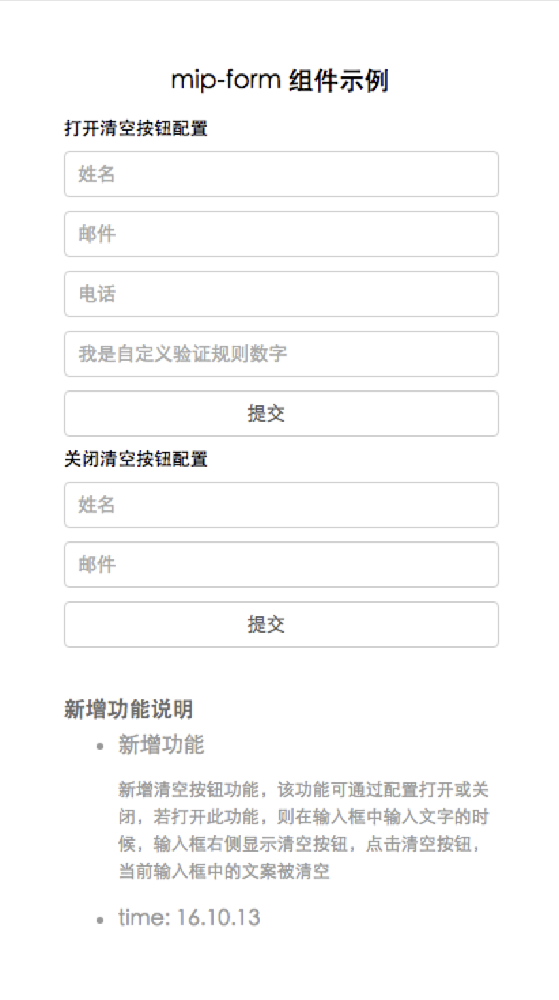

# 王培

> 从2016-11-21 到 2016-11-25

## 本周跟进

- MIP 组件开发

- MIP 文档更新

- TOP 站改造支持

- MIP 支付调研

## MIP 支付（无更新）

### 背景与目标

    对『付钱啦』提供技术支持，并已此封装一套 MIP 自己的支付接口

#### 完成情况

- 进度：主要支持站长开发，依赖站长进度，目前hold

#### 效果图

- 暂无

## 组件

### 1. mip-ad 广告组件

#### 背景与目标
    
    修复网盟广告，不支持fixed的bug

#### 完成情况

- 进度：已上线（11.22）
- 预览地址：暂无

#### 效果图

- 暂无

### 2. mip-appdl 下载组件

#### 背景与目标
    
    下载组件前期自定义fixed布局，现需要迁移由mip-fixed组件支持

#### 完成情况

- 进度：已上线（11.23）
- 预览地址：http://fedev.baidu.com/~wangpei07/mip/appdl/usefixed/

#### 效果图

<table>
    <tr>
        <td></td>
    </tr>
</table>

### 3. mip-form

#### 背景与目标
    
    功能升级，支持软键盘回车提交事件

#### 完成情况

- 进度：测试回归中
- 预览地址：http://fedev.baidu.com/~wangpei07/mip/form/enter/

#### 效果图

<table>
    <tr>
        <td></td>
    </tr>
</table>

### 4. mip-gototop 快速回顶

#### 背景与目标
    
    功能升级，支持非sf和sf下的快速回顶功能，去掉回顶时的页面动画

#### 完成情况

- 进度：测试中
- 预览地址：http://fedev.baidu.com/~wangpei07/mip/gototop/no-animation/

#### 效果图

<table>
    <tr>
        <td></td>
    </tr>
</table>

### 5. mip-mustache

#### 背景与目标
    
    模板组件，引入并封装第三方模板引擎

#### 完成情况

- 进度：开发中
- 预览地址：暂无

#### 效果图

- 暂无

### 6. mip-list

#### 背景与目标
    
    列表组件，依赖mip-mustache

#### 完成情况

- 进度：开发中
- 预览地址：暂无

#### 效果图

- 暂无

### 7. TOP 站 MIP 改造支持

#### 背景与目标

    对 TOP 站点迁移 MIP，做技术上的支持，对改造中遇到的问题及时反馈与跟进，推动其尽快完成改造并上线

#### 完成情况

> 360doc 存在的问题及解决进度

- mip cache 页面顶部多dom 元素导致顶部间距变大

    - 原因： mip cache 引起
    - 进度：@陈刚已经修复并上线，有一些遗留bug，11.25修复上线

- 反作弊广告在 https 下不展现

    - 原因：站长域名不支持https
    - 进度：站长与网盟同学支持，已解决

- mip组件

    - 原因：迁移mip依赖组件
    - 进度：11.24 已上线完成

### 8. 第三方组件

#### 背景与目标

    - 支持第三方组件开发
    - 审核起开发代码
    - 上线第三方组件
    - 迁移第三方组件

#### 完成情况

##### 组件审核中

> mip-ls-pagination

    - 审核：暂未通过
    - 进度：hold
    - 原因：缺少readme文件，点击事件未使用公共接口，less文件有无用的类

> mip-wkfun-club

    - 审核：暂未通过
    - 进度：hold
    - 原因：组件文档未按照规范书写，组件代码存在质量问题

> mip-recommend

    - 审核：暂未通过
    - 进度：hold
    - 原因：组件文档未按照规范书写，目前存在推荐组件，应确认是否与通用组件融合

> mip-ishowx

    - 审核：暂未通过
    - 进度：hold
    - 原因：快速回顶组件有通用组件并且支持SF和非SF，应该使用通用组件

> mip-xzw-article 星座屋mip改造插件

    - 审核：暂未通过
    - 进度：hold
    - 原因：组件文档未按照规范书写，存在调试信息，代码冗余

> mip-91jm-ckdevice

    - 审核：暂未通过
    - 进度：hold
    - 原因：push了zip文件

> mip-ad-random mip广告位置随机显示

    - 审核：暂未通过
    - 进度：hold
    - 原因：组件文档未按照规范书写，package信息不完善，less文件格式杂乱

> mip-huajun-fixdnav 点击切换组件

    - 审核：暂未通过
    - 进度：hold
    - 原因：代码冗余

##### 组件已上线

组件名|功能|上线时间
---|---|---
mip-youth-tb360|[新增] 青网移动适配页头部360广告|11.24
mip-youth-ttyd|[新增] 青网移动适配页精彩推荐广告|11.24
mip-global-script|[新增] 页面逻辑公共脚本|11.24
mip-down-dropload|[新增] 用来支持页面下拉加载|11.24
mip-down-script|[新增] 页面逻辑脚本集合|11.24
mip-down-comment|[升级] 用来支持文章详情页的评论|11.24
mip-360doc-script|[升级] 360doc网业务逻辑组件|11.24
mip-ck-ad|[升级] 康网的问答详情页面的直投广告组件|11.24
mip-ck-script|[升级] 是康网的问答详情页面的直投广告组件|11.24
mip-fh-ad|[升级] 用来支持m.fh21.com.cn问答详情页的直投广告显示|11.24
mip-ecms|[新增] 帝国cms,整合包主要包括ecms中调用的js如点赞,阅读量,评论等|11.23
mip-dp-script|[新增] 支持www.lz55.cn业务交互和广告显示|11.22
mip-jjpz|[新增] 天天基金自有业务详情页整体交互组件|11.22
mip-jx-ad|[新增] 青年网聚效广告扩展组件|11.22

##### 组件迁移

- 新增|迁移完 mip-ck-basecss
- 新增|迁移完 mip-ck-course-detail
- 新增|迁移完 mip-ifeng-ppt
- 新增|迁移完 mip-ifeng-pptdetail

### 9. MIP 文档

#### 背景与目标
    
    完善文档，随时更新
    
#### 完成情况

- 更新：

    - mip-img 组件文档更新
    - mip-appdl 组件文档更新，mip-fixed支持布局说明补充
    - mip-lightbox 组件文档示例完善
    - mip-vd-tabs 组件文档新增
    - mip-vd-popup 组件文档新增
    - github changelog 按时更新

- 进度：

    - 内网文档同步官网脚本完成

- 预览地址：
    
    - 内网：http://mip.baidu.com/
    - 官网：https://www.mipengine.org

