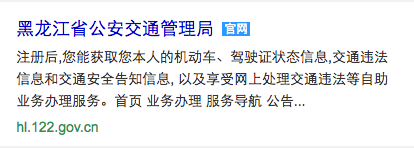

# 朱雷

> 从2016-11-21到2016-11-25

## Fusion组件（已上线）

### 项目背景

目前结果页卡片开发使用的组件还是景点的js ui组件，使用起来成本较高，开发思维也是常规的指定式开发。我们希望能够吸收目前业内流行的框架思路，改变原有的组件开发和使用方式，让组件开发思路更明朗，组件性能更高。

### 收益

引入组件生命周期，让组件更可控，简化了组件使用者的使用方式，提升开发效率。

### 完成情况

计划的10个组件全部上线

10个组件分别是：

- b-tabs: 标签页组件
- b-lightbox: 图片预览组件
- b-dialog: 对话框组件
- b-toast: 提示框组件
- b-scroll: 横向滑动组件
- b-popup: 浮层组件
- b-filter: 筛选框组件
- b-share: 分享组件
- b-infinitescroll: 无限下拉组件
- b-city: 城市选择组件

### 本周进度

- b-scroll组件在uc、qq浏览器下屏蔽默认前进后退手势

### 效果&预览

[http://sfe.baidu.com:8123/doc/](http://sfe.baidu.com:8123/doc/)

### 计划

1. 优化fusion官网
1. 监控组件覆盖模板、pv等数据
1. 持续集成机制探索（Travis CI or Jenkins）

## 栅格行高缩减实验（已产出结论）

### 项目背景

张瑶组UE希望调小栅格中文字的行高，通过实验来验证行高对用户体验和收入的影响。

上周实验上线后凤巢收入骤降3.5%，于是紧急下线了实验，本周重新上线实验，将流量改为200w，用于验证对用户体验的影响

### 预期收益

小流量影响面200w，预期能提升用户体验

### 完成情况

11.14完成了小流量上线

### 实验结论

点击下降0.5%，UBS认为可能是高度缩减过猛导致，目前暂无后续方案

### 效果&预览

所有query生效，sid=[111294](http://sample.baidu.com/index.php/sample/task/tasklist/find_type/sample_id/find_key/111294)

## 百度专家平台（无更新）

### 项目背景

百度专家是独立建站方向最早的一个项目，预期能建立一个覆盖医疗、法律和房产等领域专家的提问平台。

### 收益

吸引流量，建立搜索生态闭环。

### 完成情况

本周我参与了专家平台日志方案的制定，确定使用tc日志，另外引入百度统计用于uv停留时长的统计。tc日志规范由RD@卢田 给到@晓卉

## KG-体育NBA（开发中）

### 项目背景

在体育垂类上尝试创新的交互效果，预期能够提升pv、点击等指标。

### 收益

影响pv 10w，在交互体验上对标谷歌

### 完成情况

- 11月11日 match、team开发完成
- 11月16日 match_news、match_video开发完成
- 11月22日 完成新闻情景页、比赛情景页渐入效果开发
- 11月24日 完成视频模块的结果页到情景页切换、比赛情景页到球队情景页切换效果

### 本周进展

本周完成新闻情景页、比赛情景页渐入效果开发和视频模块的结果页到情景页切换、比赛情景页到球队情景页切换效果

### 计划

11月28日调通整个交互流程，11月30日完成效果调优，产出showcase

## 官网模板新增控制通路

### 背景

官网模板wise_official对于官网标的显示覆盖不够全面，新增一条控制通路，数据来源由诚信提供，增强官网的识别率

### 完成情况

11.24模板已上线

### 效果预览

query=[牡丹江扣分查询](https://m.baidu.com/s?word=%E7%89%A1%E4%B8%B9%E6%B1%9F%E6%89%A3%E5%88%86%E6%9F%A5%E8%AF%A2&sa=tb&ts=4270010&t_kt=0&ie=utf-8&rsv_t=d8ceEVIQtN1JexCMtX6zXKydIV0VgT5p4YVAuGu00GLHM2WNqvCc&rsv_pq=12637489698434984207&ss=101&t_it=1&rqlang=zh&rsv_sug4=4823&inputT=4515&oq=nba)

