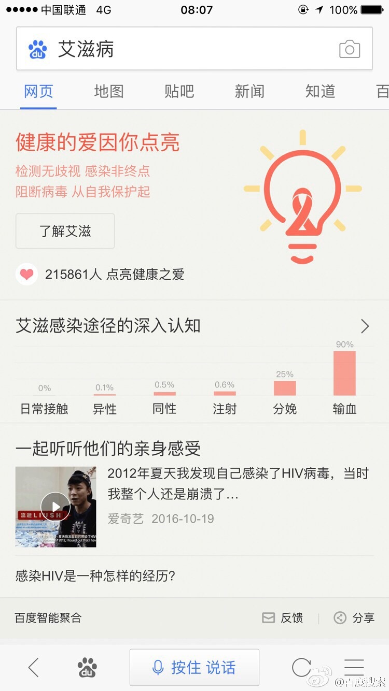

# 董仁广

> 从2016-11-28到2016-12-02

## 艾滋病公益

### 背景与目标

公益项目正在尝试以关怀为出发点的方向，希望通过搜索引擎向用户传达关爱，输出相关的科普知识，提供相对应的救助组织或机构。12.1日为世界艾滋病日，“艾滋病”不仅符合产品层面的“关怀”需求，联合百度贴吧直播共同向用户输入关怀项目的产品理念。

通过关怀、专业知识普及、救助等方式，让艾滋群体感受到百度搜索不是一个只提供信息的冰冷工具，还可以具有关爱情怀。在12.1日当天借助运营及PR宣传效果，可让用户了解百度公益。

### 完成情况

项目已经上线。

### 效果截图

    

### 后续

后续持续跟进、维护。

## 圣诞节Doodles互动小游戏

### 背景与目标

圣诞节时期要上线在首页的Doodles圣诞节互动趣味小游戏，以展示百度欢快的圣诞节。

### 完成情况

项目方案已经初步确定；完成游戏引擎CartoonJS的学习；正在进行Demo的编码工作。

### 后续

预计下周二完成Demo；之后逐步完成项目编码工作。
