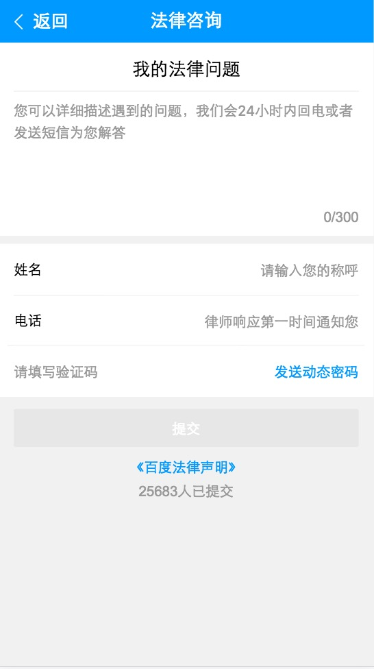
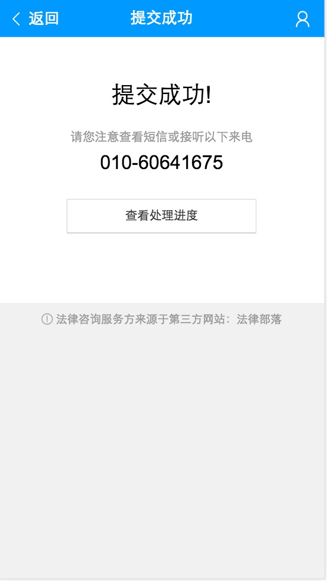
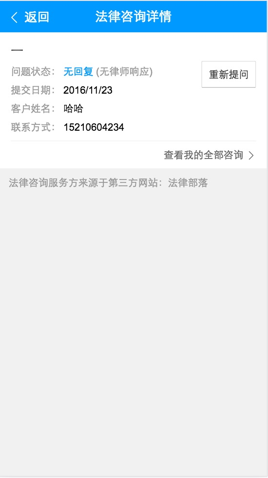
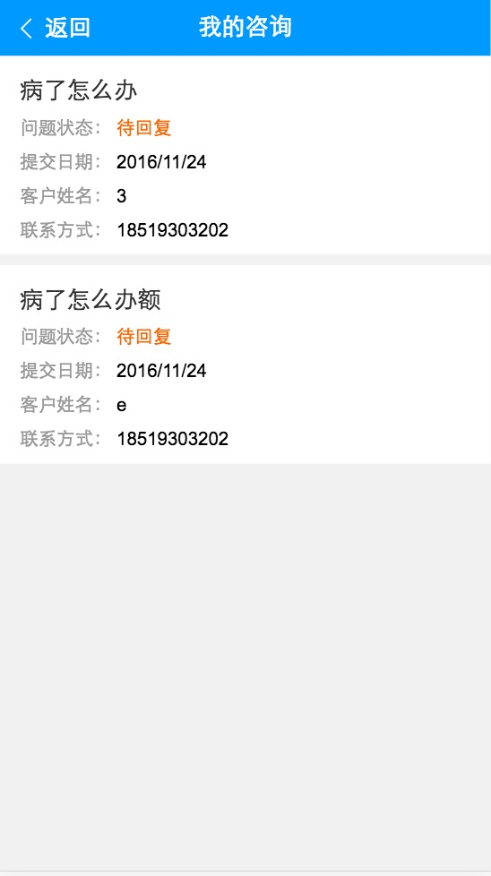
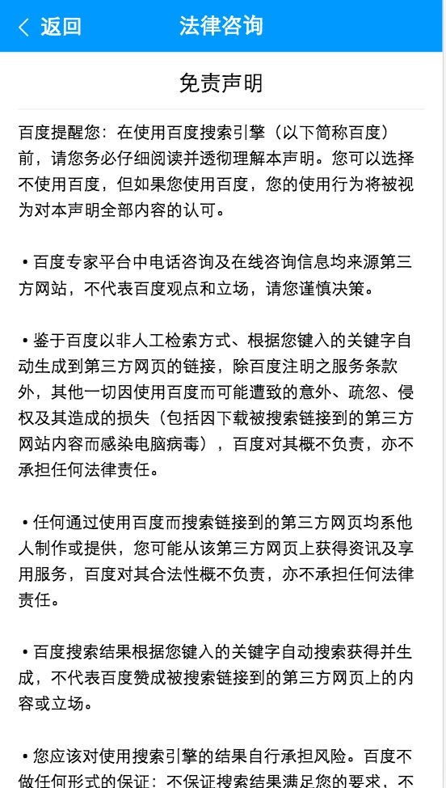

# 胡晓卉

> 从2016-11-28到2016-12-02

## 专家问答（医疗部分）

### 背景

医疗垂类的互联网存量资源无法深度解决用户个性化/刚需问题，为满足用户需求，引入专业医生为用户进行解答；同时沉淀医生解决方案，反哺搜索

### 完成情况

本周进度：

医生主页开发 基本开发完成   

提交成功页开发 基本开发完成

细化问题页面 开发中

（插入）hiphoto调研及沟通 0.7天  目前结论：和hiphoto同学沟通放开登陆限制。 

（插入）法律1.5期优化 目前占用约2天

预估排期：

开发：11月25号进开发，12月9号（2周）开发完成

联调测试：12月5号开始联调测试，12月19号（2周）完成上线    

## 专家问答（法律部分1.5期优化）

### 背景

1.5期优化

1、细化问题页面：右上角加个人中心按钮，点击跳转至 全部咨询列表页面。未登录，就先调起登录页面，如果登录之后，再进入咨询页面为空的时候可以展现『无专家咨询记录~』，默认短信登录方式，同步修改详情页登录

2、全部咨询列表页面：回复内容可点击，跳转至问题详情页

3、请在此处输入验证码

4、提交日期改成提交时间，格式是 2017-12-29 17:05

5、点提交在等接口返回的过程中，可以把提交按钮变成提交中，置灰。如果接口成功返回了，就跳转提交成功页面；接口返回失败，就弹出提示『网络开小差了，请重新提交~』，保留用户填写的内容。

6、跳转过程中带ref参数

### 完成情况

本周进度：

跟测中、需求补充中

插入医疗开发中，开发1天，跟测+准备分支版本0.5天

### 效果

<table>
    <tr>
        <td>
            
        </td>
        <td>
            
        </td>
        <td>
            
        </td>
        <td>
            
        </td>
        <td>
            
        </td>
    </tr>
</table>

[预览](https://m.baidu.com/zhuanjia/question#/submit?query=%E7%97%85%E4%BA%86%E6%80%8E%E4%B9%88%E5%8A%9E&ref=aladdin&vn=law)

