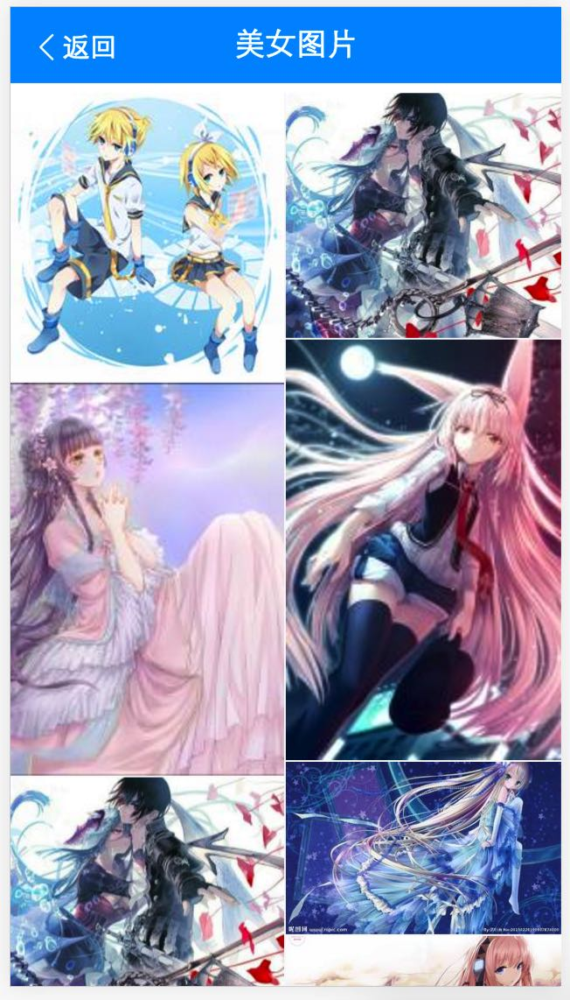

# 李阳阳

> 2016-11-28~2016-12-02

## 美图

* 背景:调研线上图片搜索结果，发现存在以下问题大搜结果页有部分流量向百度域外分发且质量一般，封闭比例有待提升；大搜结果页与图搜落地页跳转交互不够流畅，且跳转速度有优化空间；图搜落地页广告多且相关性存在问题，影响用户的正常信息获取。
另外，针对部分热门垂类，图搜落地页仍用通用方式满足，对标竞品，结构化信息满足上有较大劣势。针对以上问题，我们希望从热门垂类切入（以装修图片举例）进行优化，打造全新的图片搜索，实现A-B-C三个页面的流畅读图体验。优化大搜结果页与情景页的交互和跳转速度；接入优质资源方，优化情景页数据质量；完善列表页的tag筛选，满足用户的深度需求。
* 完成情况：
    11.15 已完成初步评审
* 本周工作
    整体联调中，预计12.6提测
*计划
    11.28 开始联调
* 效果图：
	

	
	

	

	
	

	

	
	

