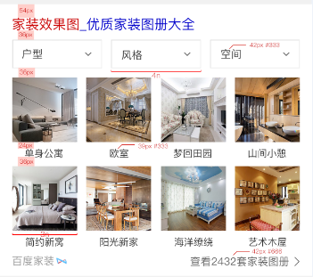

# 祁鹏远

> 2016年11月28日~2016年12月02日

## 房源卡迭代--加筛选(已上线，后续迭代增加城市，待排期)

* 背景:房源卡的tab改变为筛选。
* 完成情况：11月23日开始开发，预计11月25号上线，11月30日已上线
* 效果图

## 家装效果图产品

* 背景:效果图是家装需求中核心内容，在家装规划中需求检索量大，入口级产品。通过家装效果打造家装KG，从而通过用户需求连接服务，提供家装知识
* 完成情况：11月28日开始开发，开发三天，和情景页一起上线，数据delay，周一(12月5日)开始提测
* 效果图：强样式

## 黑白电话

* 背景:优化展现布局，突出重点；增加电话反馈投诉渠道，加强与资源方数据互通和深度合作。
* 收益：kv 15万
* 修改模版:wise: liarphone2   pc: liarphone2
* 完成情况:预计12月5日上线

## 租房泛需求

* 背景:用户在进行租房泛需求搜索时，存在查看多家房源信息的需求。租房泛需求卡片进行链家、自如、房天下等优质房源聚合，在搜索结果页用以卡片形式进行房源的直接展示，并在情景页提供全量房源筛选查看功能。减少用户信息获取成本，更好满足用户需求，提升搜索满意度。
* 收益：日均pv:30W 
* 完成情况：待排期

## 值周

