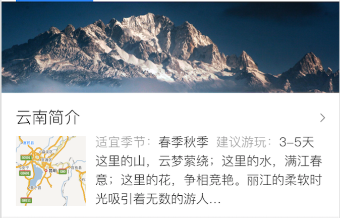

# 薛睿娇

> 2016-11-28 ~ 2016-12-02

### 省旅游项目
- 项目背景

在用户搜索省有关的旅游 Query 时,比如云南旅游,四川哪里好玩等词时,在 结果页上展示省旅游信息卡片,
并根据 Query 对应的旅游强度,当前页面有无广告等 因素,判断以何种形式展现

- 完成情况（时间点达到的里程碑） 
    * 省旅游结果页头卡开发完成
    * 省旅游情景页头卡开发完成

- 本周进展
	* 省旅游结果页头卡联调完成
	* 省旅游情景页头卡联调完成
	* 省旅游的如何到达卡开发中
	
- 效果预览
  
  

### 其他

##新人学习地图
- 本周进展
    sigma卡片开发流程文档已完成，新人学习计划已完成。
 
 