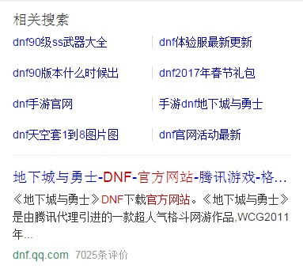
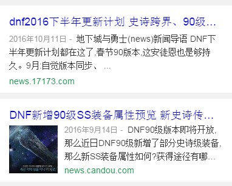
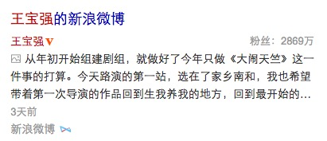
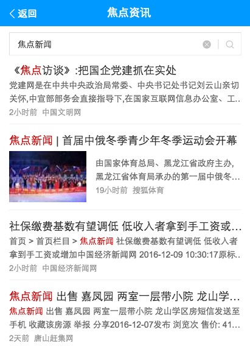

# 资讯月报

> 从 2016-11-07到2016-12-08


## 人员&&需求安排

```
- FE: 陈锐，玲娟，健驰
- PM：戚薇薇、卉子、黄龙、张慧、玉苗、子玉、苗苗、姚莹、杨康、念觉
- RD：国胜、王明、国臣、刘钦、付伟
```
	- 内容激发：陈锐
	- 资讯feed：玲娟
	- 时效性：健驰
	- 商业化：玲娟
	- 其他：@陈锐
		- sf2.0全量
		- mip与通用打平
		

## 资讯基础业务介绍

内容激发：http://wiki.baidu.com/pages/viewpage.action?pageId=212840228

资讯feed：http://gollum.baidu.com/Zhong-Tu-Dao-Kai-Fang-APIShou-Ce#1.-基本介绍

## 资讯本月跟进项目统计

* 内容激发
	* RS前置新样式小流量实验@陈锐 <b>11.23上线</b>
	* www_normal迁移@陈锐 <b>12.08上线</b>
	* 标题飘红小流量实验@陈锐 <b>规范问题未上线</b>
	* RS日志打平@陈锐 <b>12.02上线</b>
	
* 资讯feed
    * 泛阅读@玲娟@陈锐 
    * 频道页tag优化@玲娟 @12.8上线
    * 新闻评论@玲娟 @12.12上线
    * 无视频实验@健驰 11.28上线
    * 视频播放次数升级@健驰 11.28上线
    * 分享组件@玲娟
    
* 时效性
	* 焦点资讯结果页@玲娟
	* 时效性微博@玲娟
	* 官方微博@健驰
	* 焦点资讯情景页@健驰@玲娟@陈锐
	* 时效性运营大卡sigma@健驰
    
* 商业化
	* ctkey升级@玲娟
	* 唯一标识pvid@玲娟
	* 图文广告全量@玲娟

* 其他
	* 整体迁移 SF2.0@陈锐
	* 与通用mip打平@陈锐

##详细进展

#### 1、RS前置新样式小流量实验@陈锐 

* 背景：打平 RS 导流收益

* 进度：11.23上线小流量

* 效果图： 


#### 2、www_normal迁移@陈锐

* 背景： 解除不相关逻辑绑定，移除后端适配数据策略

* 进度：12.08上线小流量

* 收益： 降低维护成本，提高开发效率

* 效果图： 


#### 3、RS日志打平@陈锐

* 背景： 为了实验组和对照组数据不被RS干扰

* 进度：12.02上线

* 收益： 日志打平


#### 5、泛阅读@玲娟

* 背景： 针对结果页中带有新闻类搜索关键词的结果优化,总共分为三大类。在结果页的新闻入口里通过情景页的方式打通资讯feed流。
	* 寻址组合资讯（q=军事新闻）
	* 通用资讯（q=热点资讯)
	* tab聚合资讯（q=青岛新闻)。
	
* 进度：11.23上线小流量

* 收益： 小流量pv15万，全量30万。

* 效果图：
    
    * 寻址：
    
    * 地域：
    
    * 通用：
    
* 线上地址：[寻址新闻](https://m.baidu.com/s?word=%E7%A4%BE%E4%BC%9A%E6%96%B0%E9%97%BB&sid=112108)   [地域新闻](https://m.baidu.com/s?word=%E6%96%B0%E6%B5%AA%E5%A8%B1%E4%B9%90&sid=112134)  [通用](https://m.baidu.com/s?word=%E6%96%B0%E9%97%BB&sid=112136)

####  6、频道页tag优化@玲娟

* 背景：
	*  目前频道页tag仅在 从推荐频道进入详情页之后存在一级频道的入口。
	* 为了强化入口多次分发需要做频道页tag入口的策略迭代
		*  新增从一级频道进入详情页新增二级频道的入口
		* 新增从【相关推荐】进入到的一级tag的详情页
		* 新增一级从tag承接页进入到频道页然后进入到二级tag的详情页

* 进度：12.8上线

* 收益：小流量pv5万，跟随sf2.0全量

* 线上地址：
	* (实验组sid=110019)[https://m.baidu.com/s?word=%E4%B8%87%E5%B9%B4%E4%B8%80%E9%81%87%E4%B8%9C%E6%96%B9%E7%BE%8E%E4%BA%BA&sid=110020_111429]
	* (对照组sid=110020) [https://m.baidu.com/s?word=%E4%B8%87%E5%B9%B4%E4%B8%80%E9%81%87%E4%B8%9C%E6%96%B9%E7%BE%8E%E4%BA%BA&sid=110019_111429]

#### 7、新闻评论@玲娟
* 背景：在详情页添加评论的入口，用户可以添加评论。查看评论的列表
* 进度：截止12.9已全部测试完毕，预计12.12上线~~
* 收益：小流量pv100万，随sf2.0全量
* 线下预览地址：http://cp01-ala-fe-7.epc.baidu.com:8003/s?word=%E4%B8%87%E5%B9%B4%E4%B8%80%E9%81%87%E4%B8%9C%E6%96%B9%E7%BE%8E%E4%BA%BA&sid=111429

#### 8、无视频实验@健驰

* 背景： 获取无视频实验下feed流的收益

* 进度：11.28上线小流量

* 效果图：


* 
#### 9、视频播放次数@健驰

* 背景： 添加视频详情页的播放次数

* 进度：11.28上线小流量


* 效果图：


#### 10、分享组件@玲娟

* 背景： 接入到搜的分享组件，添加举报、收藏字号大小设置

* 进度：11.17上线0流量，bug跟进中


#### 11、焦点资讯结果页@玲娟

* 背景： 增强焦点资讯的样式

* 进度：全量

* 收益： 2000万

* 线上链接  https://m.baidu.com/s?word=%E6%9D%A8%E5%B9%82&ts=0065341&t_kt=0&ie=utf-8&rsv_iqid=12515269359972476031&rsv_t=efb3de58GKZzGn09ucE7pzgtXJwjJwMoMDTvpcKIGGj7ZRxJQtZZ&sa=is_1&rsv_pq=12515269359972476031&rsv_sug4=3117&ss=101&inputT=2211&rq=yan

#### 12、时效性微博@玲娟

* 背景： 时效性的微博，比如王宝强微博，进行样式优化

* 进度：12.7上线小流量

* 收益： 小流量pv15万


#### 13、官方微博@健驰

* 背景： 官方微博增加转发和转发图片

* 进度：11月24日已转全

* 收益： 50万

* 效果图：



#### 14、焦点资讯情景页@健驰@玲娟@陈锐

* 背景：在焦点资讯结果页中加上新闻的情景页

* 进度：11.12已转全

* 效果图：



#### 15、时效性运营大卡sigma@健驰

* 背景：

	* 深耕运营-典礼类用户需求，通过对多样需求的挖掘与满足，优化该类检索用户体验。

	* 暂时已诺贝尔奖为例；整体模块设计需考虑通用性，期望后期可通用在颁奖典礼、发布会、重要会议等事件中

	* 目前线上阿拉丁当多家资源方提交同一数据时，当多家资源方提交同一资源时，采用多tab展现。用户无法第一时间看到最优结果，只能切tab展现，通过策略优化，展现给用户最优结果。

* 进度：11月28日已转全

* 收益： 高峰期日40w，累计PV70w

* 效果图：


