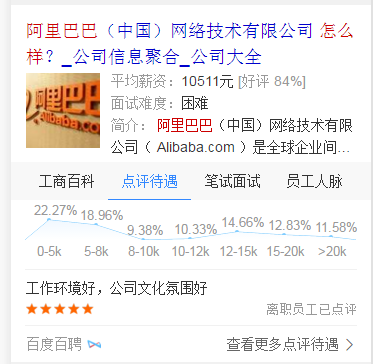

# 刘玲玲

> 从2016-12-05 到 2016-12-09

### 本周进展如下： 

###  阿拉丁卡片部分
* 1、招聘公司名大卡 
* 模板名： zhp_firm_name query=阿里巴巴待遇怎么样
* 修改点： 原接口调用的是第三方脉脉的接口，现该成自己的（openapi）的接口
* 目前进展：周二已上线|这周转全
* 效果 https://m.baidu.com/s?word=%E9%98%BF%E9%87%8C%E5%B7%B4%E5%B7%B4%E5%BE%85%E9%81%87%E6%80%8E%E4%B9%88%E6%A0%B7&sid=111123
*  
*  
* 2、招聘中间页 百聘视频 
* 背景：为满足用户的需要也为使用户更愿意来我们的站点，新增视频功能，为用户提供各种有价值的面试或技术等方面的视频教程
* 收益： 留住用户，或让用户在站点内停留时间更长（达到沉浸式目标）
* 目前进展：测试完成，今天上线
* 测试地址： http://cq01-w-ps-2011q3-ndi212.cq01.baidu.com:8888/m/shipin
* 
* 3、视频详情页 
* 背景： 因部分中间页（视频、职场、问答）的详情页是第三方开发的，招聘为使其变成自己的内容(以招聘自己域名zhaopin.baidu.com/m )为前缀，
* 伪造为视频情景页， iframe嵌套第三方页面的（目前只支持http的）
* 目前进展：测试完成，今天上线
* 测试地址： http://cq01-w-ps-2011q3-ndi212.cq01.baidu.com:8888/m/frame?title=%E8%A7%86%E9%A2%91%E8%AF%A6%E6%83%85&dlog=wise-shipindetail&wapurl=http%3A%2F%2Fm.chuanke.com%2F1894505-107106.html&t=%E7%94%B5%E8%B7%AF&img=http%3A%2F%2Fweb.img.chuanke.com%2Fdxt%2F.%2F1409173742_87926.jpeg
* 效果图 ：见测试地址 
*
* 4、招聘中间页 职场动态
* 背景：为方面用户了解目前职场的最新动态，也为使用户更愿意来我们的站点（我们提供对用户有价值的信息），新增职场动态功能，
* 收益：留住用户，或让用户在站点内停留时间更长（达到沉浸式目标）
* 目前进展： 数据已ready，加数据的过程中
* 测试地址： http://cq01-w-ps-2011q3-ndi212.cq01.baidu.com:8888/m/zc
* 效果： 见测试地址 
*  
* 5、生活缴费 
* 背景：在大搜接口页中有入口，为钱包中间页做导流
* 目前进展： 调用钱包线上的接口，数据不支持jsonp格式及跨域，同时同步数据没ready, 暂时hold (已与pm 钱包rd沟通,接口待升级)
*   

### 下周待开发需求如下：
* 1、招聘职位哥伦布迭代KG优化 （涉及rd 结构变动，pm 要求暂时hold） 
* 2、职场中间页 （渲染数据中）
* 3、排行榜卡片 （待开发）
* 4、生活服务方向 生活缴费——水电煤气费  （等数据、接口升级，暂时delay）

