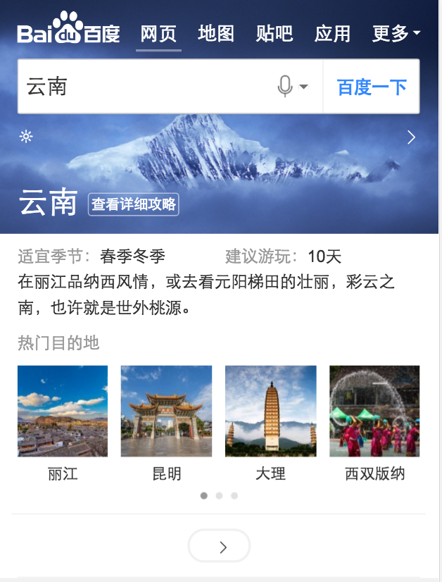

# 薛睿娇

> 2016-12-03 ~ 2016-12-09

#### 天宁岛之省

- 背景
在用户搜索省有关的旅游 Query 时,比如云南旅游,四川哪里好玩等词时,在 结果页上展示省旅游信息卡片,并根据 Query 对应的旅游强度,当前页面有无广告等 因素,判断以何种形式展现。

- 完成情况
	-  结果页卡片联调完成
	-  情景页联调完成 
	
- 本周进展
    由于部分卡片不可复用只能重新开发或版本太老需要升级才能使用原因导致联调时间推迟，预计本周五12-09联调完成。
- 效果
	- Query: 安徽，辽宁...
	 
  

	 
  

	 
  

	 
  

### 其他

##新人学习地图

- 本周进展
    * 项目Demo：细化sigma卡片开发流程文档的内容
    * 新人学习计划：本周暂无进展
 

 