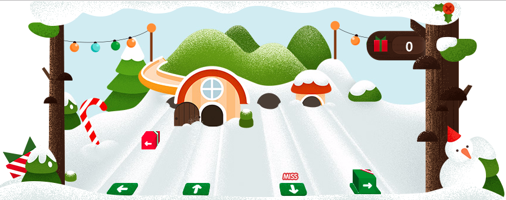

# 董仁广

> 从2016-12-19到2016-12-23

## 圣诞节Doodles互动小游戏

### 背景与目标

圣诞节时期要上线在首页的Doodles圣诞节互动趣味小游戏，以展示百度欢快的圣诞节。

### 完成情况

项目已经完成。等待上线。

### 效果截图

    

### 后续

上线。

## 2017鸡年春节首页皮影Doodles互动小游戏

### 背景与目标

春节之际展现在百度首页的互动Doodles小游戏。以中华传统皮影戏的风格展示新年（鸡年）欢快的节日气氛，以及百度对于传统节日、用户体验的重视。

### 完成情况

动画制作人员正在绘制中；已经与产品部的负责人接头，商量了游戏的细节；进行技术探索。

### 后续

后续深入进行。
