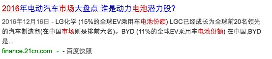
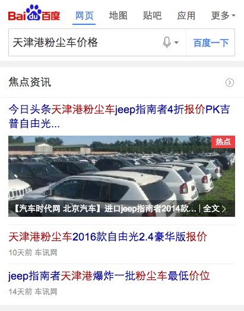
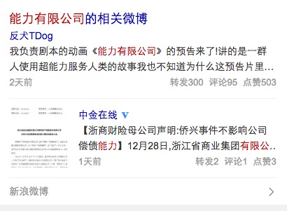

# 常健驰

> 从2016-12-26到2016-12-30

## 时效性运营阿拉丁_典礼优化

### 需求背景

运营卡默认首位：但存在以下情况需要弱化：

    a：首条结果前有广告。

    b：已过突发时间，但用户仍存在查看内容的需求。

1. 头部sigma样式弱化，为普通样式，有标题及左图右文。

2. tab样式及tab内结构与sigma卡一致。
新闻、视频仅展现2条子链；
历届奖项展现4个奖项；
评论展现3条；
各tab均采用点击“展开更多”查看其他结果，每次加载5条，至全部加载完毕。

### 完成情况

`12月29日`下午5点已评审，预计`1月3日`介入开发，`1月9日`联调完成

## pc时阿退化需求

### 需求

WISE时阿退化需求已全量上线。每天影响面1.7%左右，流量1800W每天。时间仅有1条子链的情况影响较大。因此希望能尽快优化PC样式。可采用与WISE一致的方案。

### 完成情况

模板开发完成，`12月30日`可以上线[点击预览](http://cp01-rd-bu-rd78.cp01.baidu.com:8012/s?word=2016%E9%94%82%E7%94%B5%E6%B1%A0%E5%B8%82%E5%9C%BA%E4%BB%BD%E9%A2%9Drea)

### 效果截图

### 其他

* 时效性自动出卡当有大图时，第一条数据标题改为2行截断[点击预览](https://wwwhttps.baidu.com/s?dev=1&dev_workspace=platform&dev_module=aladdin-wise&dev_tpl=realtime&dev_path=searchaladdin&dev_tpltype=default&sid=99999_113488&dev_online=1&wd=%E6%9E%97%E4%B8%B9&word=%E5%A4%A9%E6%B4%A5%E6%B8%AF%E7%B2%89%E5%B0%98%E8%BD%A6%E4%BB%B7%E6%A0%BC)

* sam_weibo模板预处理逻辑从模板转移到后端 - `12月28日`已上线 [点击预览](https://m.baidu.com/s?word=%E8%83%BD%E5%8A%9B%E6%9C%89%E9%99%90%E5%85%AC%E5%8F%B8&sid=110621)

* offical_weibo点击跳转地址修改，微博名 正文 转发分别修改为三个跳转地址，原来是跳到同一个地址的 - `12月30日`可以上线[点击预览](https://wwwhttps.baidu.com/s?dev=1&dev_workspace=platform&dev_module=aladdin-wise&dev_tpl=offical_weibo&dev_path=searchaladdin&dev_tpltype=default&sid=99999&dev_online=1&wd=%E7%8E%8B%E5%AE%9D%E5%BC%BA&word=%E7%8E%8B%E5%AE%9D%E5%BC%BA)

* feed流loading修改为旋转的，视频详情页2.0调整成1.0的样式 - 暂未修改

* 百家号新出对照组样式已完成，0流量测试中 - hold

