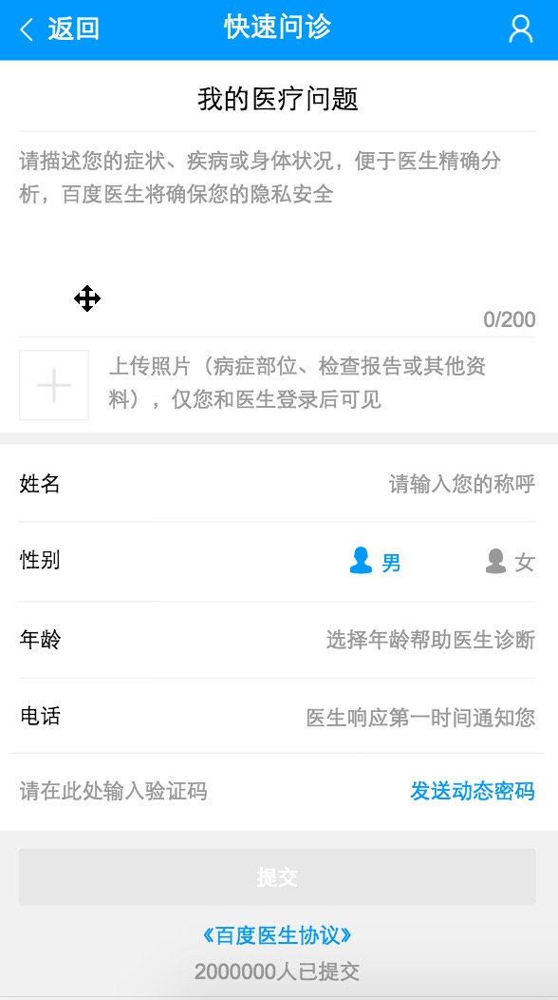
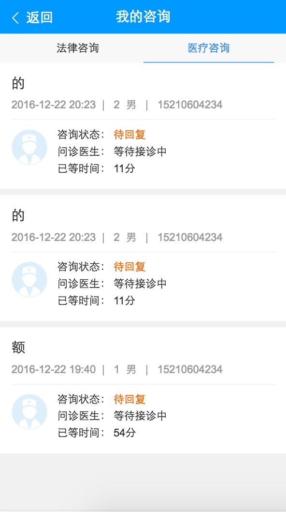
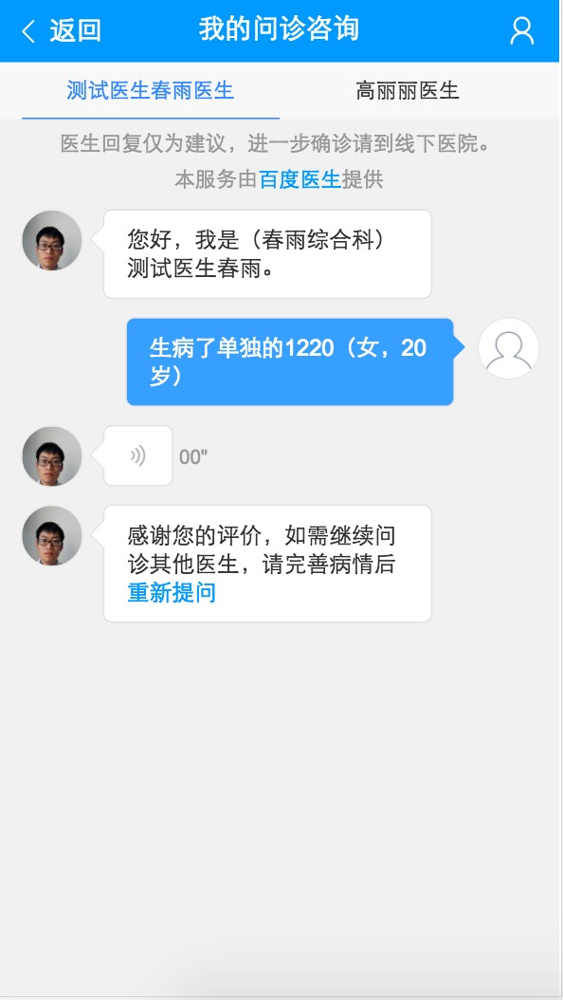
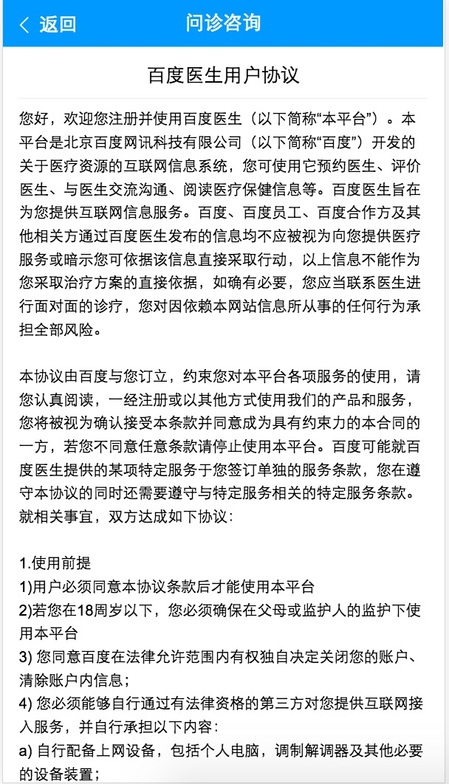

# 建站方向周报

> 2016.12.26 - 2016.12.30

### 【独立建站】技术方案

- 10%. 预计1月底前完成日志和栅格的统一, 年后逐步上线

- 学术pc + wise暂用jquery(zepto) + fis3开发需求及打包构建 （需要fork线上稳定版本pmd.css）

- 招聘pc + wise暂用jquery(zepto) + fis/fisp开发需求及打包构建 （需要fork线上稳定版本pmd.css）

- 专家沿用vue.js + webpack

- 统一wise的log统计, 组件复用

### 专家 - (胡晓卉、张屾)

#### 专家问答——医疗部分(小流量)

- 背景

医疗垂类的互联网存量资源无法深度解决用户个性化/刚需问题，为满足用户需求，引入专业医生为用户进行解答；同时沉淀医生解决方案，反哺搜索

- 完成情况（里程碑）

    - 11-25 介入开发

    - 12-18 整体提测

    - 12-22 上线模板

    - 12-27 过三级单，小流量

- 本周进展

    
跟测：上线模板之后发现网速慢情况下的一些bug，以及遗留bug修复

    
上线

- 效果

    - [预览](https://www.baidu.com/s?ie=UTF-8&wd=%E8%80%B3%E9%B8%A3%E6%98%AF%E4%BB%80%E4%B9%88%E5%8E%9F%E5%9B%A0%E5%BC%95%E8%B5%B7%E7%9A%84)

    <table>
        <tr>
            <td>
                
            </td>
            <td>
                
            </td>
            <td>
                
            </td>
            <td>
                
            </td>
            <td>
                
            </td>
        </tr>
    </table>

#### 专家问答——一期遗留需求及问题优化(进行中)

- 背景

在法律二期开发之前，完成专家平台一期遗留的需求，修复当时比较难解决的bug。

- 完成情况（里程碑）

    - 12-28 梳理问题，给出排期：把问题和需求按照优先级、页面、影响面进行分类。根据给出的时间，筛选出了一些需要高优解决的问题进行解决或调研。前端独立完成部分排期6.5天，需要后端共同讨论方案的部分，在rd休假之后给出。同时整体了其他影响较小的问题，看后续时间继续进行处理。

    - 12-29 介入开发

- 本周进展

    
细化问题页面，离开当前页面对填单内容进行保存（图片部分）

    
细化问题、对话页图片支持点击看大图

    
短信进入问答详情页时候，左上角去掉返回按钮，加『去提问』入口

    
优化滑动卡顿问题

#### 安卓下音频时长获取不准确

- 背景

特定格式如mp3浏览器在判断音频时长的时候会出现偏差，但我们的现象更奇怪，音频在加载完毕后时长永远是0.1s。
暂未确定原因。目前时长做向上取整为1s，后续继续调研，怀疑和页面代码的渲染有关，二次渲染能拿到正确的时间。

- 本周进展
    
0%

### 我的 - (张屾)

#### 我的 (padding)

- 背景

 1, 当前个人中心入口非常隐蔽，用户在搜索结果页完成订单、收藏等功能后，需要一个明确且便捷的入口进行访问。因此需要前置订单、收藏等常用工具入口，在搜索结果页形成使用闭环；
 
 2, 每天约有111万PV重复搜索同一query，通过“猜你喜欢”模块更好的满足用户重复搜索需求，降低用户搜索成本，因此在个人中心页面中增加“猜你喜欢”模块；

 3, 用户存在激发浏览的需求，结合用户浏览习惯及实事热点可提升用户使用黏性，满足浏览需求，因此在个人中心页面中增加新闻feed模块。

- 完成情况（里程碑）

    - 12.05 落地页提测
    - 12.08 入口提测
    - 12.12 bugfix一轮完成
    - 12.13 bugfix二轮完成
    - 12.14 三级单

- 本周进展

    
padding，待需求修改

- 计划

    - 无

### 学术 - (郭勇、程恩)

#### PPV个人(开发中,部分提测)

- 背景

PPV单篇付费除开放给图书馆用户外，仍然存在40%的用户不在高校内，这部分用户的下载需求无法得到满足，所以针对个人，也需要搭建单篇付费的通路，并且将此通路作为学术服务的一种，强化用户认知，培养用户习惯。

- 收益（总体目标）

完善学术服务，提升用户品牌认知，GMV

- 完成情况（里程碑）

    - 11月21日启动开发，预计开发3周，联调1周。由于临时项目插入预计delay2周

    - 12月21日个人支付部分开发完成，12月26日个人支付提测

- 本周进展

    
个人支付提测

    
接口调整引起的部分页面逻辑配合修改

    
除个人支付外其他功能尚未开始（ue未确定，实现方式未确定）

- 效果
    - [个人支付线下环境，需要登录线下账号](http://cq01-2012q2-kw1-newndi083.cq01.baidu.com:8009/u/ppv?tab=usercenter)

- 计划
    - 下周内完成剩余其他流程，完成联调，提测。
    - 预计2.5周时陆续提测，整体预计12.16上线，其他需求插入整体预计delay2周

#### 学术年度报告（已确认待上线）

- 背景

通过前期的用户调研和访谈发现，虽然知晓百度学术的用户认可度已逐渐提高，但仍有约50%左右的目标用户对品牌并不知晓，口口相传的速度比较慢，计划通过一些有趣&有价值的内容传播提高学术的产品知名度，提升更多的新增用户。

- 收益（总体目标）

通过微信，微博等传播形式提升学术新用户

- 完成情况（里程碑）

    - 12月12日开发完成

- 本周进展

    
PM，UE已确认，待上线

- 效果
    - [线下环境](http://cq01-2012q2-kw1-newndi083.cq01.baidu.com:8009/u/commonpage?cmd=report2016)

- 计划
    - 上线

#### 学术搜索结果页UI3.0（开发中）

- 背景

学术整体已经有过搜索上线的1.0版本和收藏订阅等服务的平台上线2.0版本两次视觉效果，随着产品的不断丰富，用户越来越多，对产品品牌认知加深，视觉交互上需要从逻辑、风格上做进一步的梳理和统一，打造一个强认知的学术范儿风格的产品。

- 收益（总体目标）

优化学术搜索交互体验，打造人工智能、语义搜索的学术搜索引擎。提升用户交互体验和产品品牌影响力。

- 完成情况（里程碑）

    - 12月26日介入开发

- 本周进展

左侧筛选功能开发中

- 效果
    - [线下环境](http://st01-spi-pubec1.st01.baidu.com:8012/s?wd=%E6%9C%BA%E5%99%A8%E5%AD%A6%E4%B9%A0&tn=SE_baiduxueshu_c1gjeupa&cl=3&rn=50&ie=utf-8&bs=paperuri%3A%282226686f009d7df75daee53447a54ba5%29&f=8&rsv_bp=1&rsv_sug2=0&sc_f_para=sc_tasktype%3D%7BfirstSimpleSearch%7D)

- 计划
    - 元旦后2周上线

#### 学术svn模块 迁移icode（进行中）

- 背景

svn 在今年底将寿终正寝，相关模板需要迁移icode。同时scholar-pae模块 还是用aglie/old ,预期迁移到aglie 2.0。midpage模块 雪冉已经统一迁移，需要验证上线正常。同时迁移经验知道招聘模块迁移。

- 收益（总体目标）

svn迁移icode 更好的开发体验。

- 完成情况（里程碑）

    - 12月21日icode 模块已创建，第一次提交svn基线代码

    - 12月28日 迁移完成，第一次icode 上线验证完成

- 本周进展

本周三（12.28）迁移完成，上线验证成功

- 效果
    - 无

- 计划
    - 招聘目前还是主干上线，架构已经申请半年延期，后续推动后端逐步迁移beehive方式上线和icode。

#### 学术专题-趣味报告

- 背景

    通过前期的用户调研和访谈发现，虽然知晓百度学术的用户认可度已逐渐提高，但仍有约50%左右的目标用户对品牌并不知晓，口口相传的速度比较慢，计划通过一些有趣&有价值的内容传播提高学术的产品知名度，提升更多的新增用户。

- 本周进展

    
今日(12.30)开发完成

    
- 效果
    
- [学术专题](http://st01-spi-pubec1.st01.baidu.com:8008/u/topic)
    
- 计划
    - 12-28 -- 12-30  学术专题今日完成开发，上线时间待定；后台学校图片未ok；
    
#### 学术-图书馆后台机构信息页面修改

- 背景

    图书馆后台机构信息目前分为了基础信息和嵌框信息两个部分，但两部分信息多有交叉，较为浪费图书馆员的配置精力，耽误机构合作进度。故将两个页面整合为一个简单大方的页面，以供图书馆管理员使用。

- 收益（总体目标）

    提升图书馆工作人员配置信息的效率，同时促进嵌框合作。

- 计划
    - 2017-1-03 -- 1-10 完成开发

### 招聘 - （冯斐帆、刘玲玲）

#### 斗米兼职接入百聘功能模块(上线中)

- 背景

这周开始斗米兼职接入百聘功能模块开发，并且进行了联调，周四测试完成，周五会完成上线。

- 收益（总体目标）

用户体验会变好，原本跳到第三方页才可以申请职位，现在可以在招聘中间页就可以申请。

- 完成情况（里程碑）

    - 周五上线完成。

- 本周进展

上线中，下班前预计上完

- 效果
    - [斗米兼职接入]http://cp01-zll-test02.epc.baidu.com:8989/m/jzzw?detailidx=18&query=%E6%96%97%E7%B1%B3%E5%85%BC%E8%81%8C&city=%E5%8C%97%E4%BA%AC&id=http%3A%2F%2Fwww.doumi.com%2Fbj%2Fjz_2204882.htm%3Fca_name%3Dbaidu%26ca_source%3Dpc%26ca_from%3Dlbpost

- 计划
    - 上线后评估，下周进行一版优化。
 

#### 简历功能迭代（上线中）

- 背景

简历页优化，将之前的一个页面进行拆分，新增两个简历的字段，这周进行的开发，测试回归已经完成，目前正在上线中。

- 收益（总体目标）

提升用户体验的效果；使得简历信息更加完整，为后续更多的企业接入百聘打下坚实基础。

- 完成情况（里程碑）

    - 这周五预计完成上线。

- 本周进展

本周五预计上线完成

- 效果
    - [需要登陆后才可以查看效果]http://cp01-zll-test02.epc.baidu.com:8989/m

- 计划
    - 样式交互逐步迭代

#### 中间页日志添加个性化标签（开发中）

- 背景

这周进行了项目启动，周三对了需求，具体是根据之前的个性化得到的tag进行日志打点，目的是为了能够给用户提供个性化信息和内容做积累。

- 收益（总体目标）

待确认

- 完成情况（里程碑）

    - 开发中，完成10%；进行了需求对接，这周前端没有实质性进展，后端预计周五会上线接口。

- 本周进展

开发中，下周进行联调

- 效果
    - 暂无

- 计划
    - 下周进行联调

#### 招聘兼职专题中间页 （周五上线）
- 背景

  - 因即将到来的寒假，为满足大学生寒假找兼职的需求，此处新增兼职专题页

- 收益（总体目标）

    -  暂无

- 完成情况（里程碑）

    - 开发测试完成，周五上线

- 本周进展

    - 开发测试完成，周五上线

- 效果
    
    - 测试地址：http://yq01-psdy-diaoyan1048.yq01.baidu.com:8989/m/jianzhizt

- 计划
    
    - 先上线我们自己确认下效果，若效果ok，在首页开入口

#### 招聘职播中间页 （开发中）

- 背景

  - 在为用户提供基础的职位信息查询的同时，增加职播、问答类内容，在用户求职过程中，因面试经验不足、一些问题不清楚等为其解难答惑，通过建设职播、问答类中间页引入优质内容为用户提供多维度的满足。（全方位一体化的招聘搜索引擎）
  
- 收益（总体目标）

    -  暂无

- 完成情况（里程碑）

    - 已完成50%，

- 本周进展

    - 昨天下午调用的数据接口ok, 今天渲染数据，预计今天下班前基本完成

- 效果

    - 测试地址： http://cq01-w-ps-2011q3-ndi212.cq01.baidu.com:8888/m/zhibo

- 计划

    - 预计周五开发基本完成，下周一测试，周二上线

### 生活服务 - (刘玲玲、程恩)

#### 生活缴费 （开发完成，待测试）

- 背景

  - 在大搜页中有入口，为钱包中间页做导流

- 收益（总体目标）

    -  暂无

- 完成情况（里程碑）

    - 开发完成，待测试

- 本周进展

    - 周二开发完成，现自测与钱包联调数据，但因https 环境下，调用钱包的接口需安装代理软件，若要测试，需每人均按照代理软件，配置到钱包线下测试机，不太方便，现在http 环境下测试

- 效果

    - 测试地址： http://cp01-ps-fe-9.epc.baidu.com:8003/s?word=%E5%8C%97%E4%BA%AC%E6%B0%B4%E8%B4%B9&sid=101466

- 计划

  -  周一qa 在http环境下测试

#### o2o方向-黄页信息版接入百姓网 （已提测）

- 背景
    
    搜索上70%的020服务需求来自三四线城市,此类地区绝大部分没有覆盖上门服务,因此引入黄页信息补充服务的缺失

- 本周进展

    
life_o2o,detail_detail 开发完成, 待百姓网及rd数据更新完，12.30提测

- 效果
    [o2o方向](http://cp01-ala-fe-col-1.epc.baidu.com:8003/s?word=%E5%8C%97%E4%BA%AC%E4%BF%9D%E6%B4%81%E6%B8%85%E6%B4%97&wiseus=10.103.62.33:3200)

    
####  百度生活节（迭代已上线）

    rota_move 、 rota_tp 、 wise_tuan 、 wise_tuan2 、 we_tuan (活动下线模板恢复) 修改后已上线

### 阿拉丁开发平台 - （张屾）

- 背景

    icode的迁移方案遗留一些未实现的接口。另外本周nginx更新导致大量开发者模板不能召回，且无法确认预览效果。

- 本周进展
    
    
50%对于log, diff已实现，差回滚。更新nginx8003脚本。
