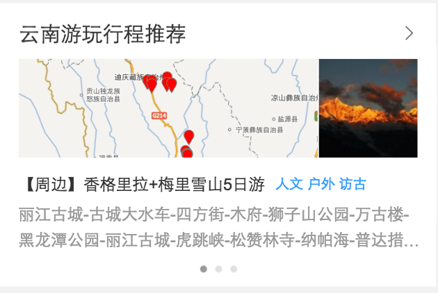
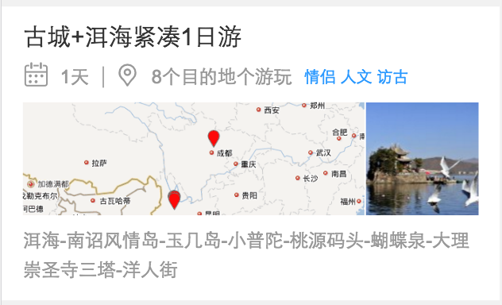
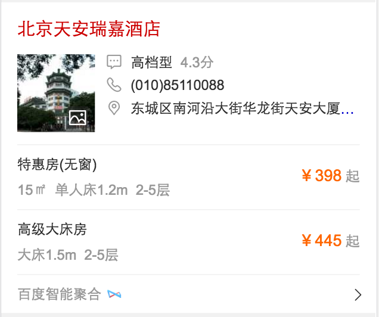

#### KG-旅游-省卡片(小流量上线)
- 项目背景
在用户搜索省有关的旅游Query时，比如云南旅游，四川哪里好玩等词时，在结果页上展示省旅游信息卡片，并根据Query对应的旅游强度，当前页面有无广告等因素，判断以何种形式展现。
#### 收益（总体目标）
省全量后30W.
- 完成情况（时间点达到的里程碑）
	* 10-23评审.
	* 10-27完成新卡片开发.
	* 12-13提测
	* 12-20上线，30%小流量，PV9W
    
- 本周进展
	- 省路线规划卡与规划列表页12-28上线，已召回。
    
- 效果预览 
	线上链接：[云南](https://m.baidu.com/s?word=%E4%BA%91%E5%8D%97%E6%97%85%E6%B8%B8&sid=113983)
    

    

- 计划
	无

 
### 旅游-酒店
#### 国内酒店阿拉丁及情景页(小流量-迭代中)
- 项目背景
针对连锁品牌名（例如，锦江之星，7天，汉庭，格林豪泰等）或某一地区的酒店（例如，北京酒店预订，上海酒店预订等），对酒店的分布信息突出展现，并优化整体预订流程的体验。
- 收益
待补充
- 完成情况（时间点达到的里程碑）
	单点：
	* 11-28提测
	* 11-29测试完毕
	* 12-06走单
	* 12-12小流量上线
- 本周进展
	效果优化。
	
- 效果预览 
	单点酒店线上召回：[盘古七星酒店](https://m.baidu.com/ssid=ecafd1eeb2a9b7c6353138bb06/s?word=%E7%9B%98%E5%8F%A4%E4%B8%83%E6%98%9F%E9%85%92%E5%BA%97&sid=112142)
	方案一：

	方案二：

- 计划
	* 周边酒店卡片糯米数据请求超时严重不召回，与PM确认暂无排期。
 
### 旅游-我的旅程 - (开发中)
- 项目背景
在用户进行旅游相关搜索时，实质是想了解一段旅程的部分或全部环节;选择想去的目的地，预订机票/火车票，酒店是旅程开始前的关键步骤。我的旅程项目将用户想去的目的地与用户通过百度预订的酒店或大交通行为相合，方便用户查阅旅程相关信息。同时结合用户想去的景点，为用户推荐景点周边的美食酒店，从而形成旅行信息和服务的有机连接。 	
- 收益
在用户进行旅游相关搜索时，实质是想了解一段旅程的部分和全部环节，我的旅程项目将用户想去的目的地与用户通过百度预定的酒店或大交通行为相结合，方便用户查阅旅程相关信息。同时结合用户想去的景点，为用户推荐景点周边的美食酒店，从而形成旅行信息和服务的有机链接。
- 完成情况（时间点达到的里程碑） 
	* 11-25第二轮评审.
    * 11-28FE介入.
	* 12-07暂停，12-15介入
- 本周进展

	住宿&餐饮筛选及列表开发联调完毕，开始地图筛选卡片开发。
 
- 效果预览
	* [北京](http://cp01-ala-fe-plat-1.epc.baidu.com:8003/sf?openapi=1&dspName=iphone&from_sf=1&pd=city&resource_id=4336&ms=1&word=%E5%8C%97%E4%BA%AC&hide=1&apitn=tangram&top=%7B%22sfhs%22%3A2%7D&ext=%7B%22sf_tab_name%22%3A%22%E6%99%AF%E7%82%B9%22%7D&frsrcid=32228&frorder=2)
	
	
	
	
	[详见ICAFE](http://newicafe.baidu.com/issue/1496992-5/show?from=page)

- 计划
	- 01-03总体ready，部分调整，01-04~06测试，上线时间待定。
 
