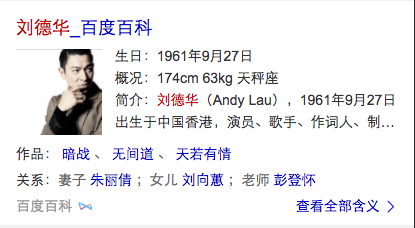

# 朱雷

> 从2016-12-19到2016-12-23

## 富交互效果落地

### 项目背景

在NBA卡片上尝试了类似于Google的富交互打开情景页效果，得到多方认可，现在尝试在具体case上落地，包括正在迁移情景页的百科 & 图片 & 知道和KG项目。

### 收益

预期能够提升用户体验，对pv和收入有正向的影响。

### 完成情况

- 确认了superframe框架通用service下的动画方案：superframe提供enterAnimation和exitAnimation接口，模板定义接口的执行过程
- 知道调起sf的过渡效果已上线5%小流量，url:[https://m.baidu.com/s?word=%E5%8C%97%E4%BA%AC%E5%88%B0%E4%B8%8A%E6%B5%B7%E9%AB%98%E9%93%81&sid=113947](https://m.baidu.com/s?word=%E5%8C%97%E4%BA%AC%E5%88%B0%E4%B8%8A%E6%B5%B7%E9%AB%98%E9%93%81&sid=113947)
- 百科调起sf的过渡效果已上线0流量，url:[https://m.baidu.com/s?word=%E6%83%8A%E5%A4%A9%E7%A0%B4&sid=111992](https://m.baidu.com/s?word=%E6%83%8A%E5%A4%A9%E7%A0%B4&sid=111992)
- 图片调起sf的过渡效果已上线1%小流量：[https://m.baidu.com/s?word=%E9%B2%9C%E8%8A%B1&sid=114010](https://m.baidu.com/s?word=%E9%B2%9C%E8%8A%B1&sid=114010)
- KG通用进退场动画的方案已产出，并与@李林、@山莉 沟通确认，目前@山莉 先跟进开发

### 效果

[www_zhidao_normal模板, 点击title](https://m.baidu.com/s?word=%E5%8C%97%E4%BA%AC%E5%88%B0%E4%B8%8A%E6%B5%B7%E9%AB%98%E9%93%81&sid=113947)

[bk_polysemy模板，点击任意链接](https://m.baidu.com/s?word=%E6%83%8A%E5%A4%A9%E7%A0%B4&sid=111992)

[image模板，点击小图](http://cp01-image-test230.epc.baidu.com:8003/s?word=%E8%8C%83%E5%86%B0%E5%86%B0&sa=thr_2&ts=3376813&t_kt=0&ie=utf-8&rsv_t=51e7%252FPkC0ufhCg8OJqENXWtowO%252BAaODoZ0%252BJpgCaPpdSQlCbJywG&rsv_pq=15693056946346808384&ss=101&rqlang=zh&rsv_sug4=4177&inputT=3870&oq=%E9%B9%BF%E6%99%97)

## 交互动画库统一

### 背景

目前大搜存在2套不同的交互动画框架，一套是我这边开发的Naboo，另一套是MIP开发的animation.js，与@袁伟、@大仙、@清乾等人沟通后，打算统一为一套交互框架。

### 完成情况

- 12.19跟@沈洲、@袁炜、@齐建、@吴鹏 评审确定方案，对Naboo进行模块拆分，并增加单元测试
- Naboo模块拆分完成
- 单元测试完成，测试覆盖率95%
- 已经写好真实的测试用例并提测给QA
- 已经完善了api文档，地址[http://gitlab.baidu.com/psfe/naboo](http://gitlab.baidu.com/psfe/naboo)
- 已经交付给MIP项目@齐健、@吴鹏，MIP也会编写对应的测试用例并提测

## PMD-icon替换

### 背景

目前PMD中的icon由很多UE参与设计，风格不统一，@许诺 安排UE@杨琳琳 重新绘制了大部分icon，统一风格

### 完成情况

已经完成了替换，并push到代码仓库，元旦后在www-wise和sfapp模块上线

### 问题

替换过程中，发现部分icon转成字体文件后与原来的svg图形不一致，与UE一起进行了多次尝试，发现用AI绘制的icon不存在这种问题，原来有问题的icon是用PS绘制的。

## Fusion组件（已上线）

### 项目背景

目前结果页卡片开发使用的组件还是景点的js ui组件，使用起来成本较高，开发思维也是常规的指定式开发。我们希望能够吸收目前业内流行的框架思路，改变原有的组件开发和使用方式，让组件开发思路更明朗，组件性能更高。

### 收益

引入组件生命周期，让组件更可控，简化了组件使用者的使用方式，提升开发效率。

### 完成情况

一共有的11个组件

11个组件分别是：

- b-tabs: 标签页组件
- b-lightbox: 图片预览组件
- b-imgfall: 图片瀑布流组件
- b-dialog: 对话框组件
- b-toast: 提示框组件
- b-scroll: 横向滑动组件
- b-popup: 浮层组件
- b-filter: 筛选框组件
- b-share: 分享组件
- b-infinitescroll: 无限下拉组件
- b-city: 城市选择组件

### 本周进度

- b-share修改点击日志数据层级适配最新的日志规范
- b-lightbox支持向前取数据（李阳阳开发），已开发测试完成并上线
- b-lightbox支持可选的图片索引（糯米FE 周飞 开发中）
- b-scroll代码修改内部使用iscroll的配置，保证在chrome55开启event pointer的情况下不出问题

### 效果&预览

[http://sfe.baidu.com:8123/doc/](http://sfe.baidu.com:8123/doc/)

### 计划

1. 优化fusion官网
1. 监控组件覆盖模板、pv等数据
1. 持续集成机制探索（Travis CI or Jenkins）

## 百度专家平台（无更新）

### 项目背景

百度专家是独立建站方向最早的一个项目，预期能建立一个覆盖医疗、法律和房产等领域专家的提问平台。

### 收益

吸引流量，建立搜索生态闭环。

### 完成情况

本周我参与了专家平台日志方案的制定，确定使用tc日志，另外引入百度统计用于uv停留时长的统计。tc日志规范由RD@卢田 给到@晓卉

## KG-体育NBA（无更新）

### 项目背景

在体育垂类上尝试创新的交互效果，预期能够提升pv、点击等指标。

### 收益

影响pv 10w，在交互体验上对标谷歌

### 完成情况

- 11月11日 match、team开发完成
- 11月16日 match_news、match_video开发完成
- 11月22日 完成新闻情景页、比赛情景页渐入效果开发
- 11月24日 完成视频模块的结果页到情景页切换、比赛情景页到球队情景页切换效果
- 11月29日 修复了结果页到情景页切换时的闪动问题
- 11月30日 参照material design思想将showcase页面的卡片优化，增加层级感

### 本周进展

本周引入了superframe2.5框架，用于修复结果页到情景页切换时的闪动问题，参照material design思想将showcase页面的卡片优化，增加层级感

### 效果

页面地址：[http://cp01-ps-fe-4.epc.baidu.com:8003/s?word=nba](http://cp01-ps-fe-4.epc.baidu.com:8003/s?word=nba)

- tab上滑效果请点击 
- 比赛情景页入场请点击 
- 球队情景页入场请在比赛情景页点击 
- 新闻情景页入场请点击新闻tab下任意条目 
- 视频情景页入场请点击视频tab下任意条目 
- 卡片风格参考material design设计原则优化，增加了卡片的层次感，可以对比该页面的每张卡片与线上效果的差异

### 计划

- 优化情景页入场时间：去除loading等待效果
- 情景页卡片同样按照material design原则优化，增加层次感
- 优化新闻和视频的展开效果