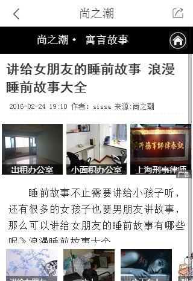

# Ala-激发+资讯+运营=月报

> 从 2016-01-03到2016-01-06

## 人员&&需求安排

```
- FE: 陈锐，玲娟，健驰
- PM：戚薇薇、卉子、黄龙、张慧、玉苗、子玉、苗苗、姚莹、杨康、念觉
- RD：国胜、王明、国臣、刘钦、付伟
```
	- 内容激发：陈锐
	- 资讯feed：玲娟
	- 时效性：健驰
	- 商业化：玲娟
	- 运营：仁广
		
## 资讯基础业务介绍

内容激发：
        
        * http://wiki.baidu.com/pages/viewpage.action?pageId=212840228
        * http://agroup.baidu.com/alanews/view/office/214156

资讯feed：

		http://gollum.baidu.com/Zhong-Tu-Dao-Kai-Fang-APIShou-Ce#1.-基本介绍

## 资讯本月跟进项目统计

|类目|内容 |进度 | pv/天 | 
|---|---|---|---|
|激发|rs从激发区剥离小流量@玲娟|1.5已上线|50万|
|激发|激发区模板迁移@陈锐|12.19已上线|——|
|激发|添加推荐理由|1.5已上线|——|
|激发|通用激发方案|无更新|——|
|资讯|资讯评论全量@玲娟| 1.6已上线 | 500万 |
|资讯|泛阅读全量@玲娟|12.26已上线|54万|
|资讯|资讯分享全量@玲娟|12.28已上线|6万|
|资讯|资讯2.0整体样式升级@玲娟|12.26已上线|500~600万|
|资讯|资讯C页面日志统一接入方案@玲娟|12.23已完成日志接入标准|——|
|商业化|图文广告全量@玲娟 | 12.12已上线 | 5万rmb收入 |
|商业化|商业化详情页停留时间升级@玲娟|12.27左右上线|——|
|运营|圣诞节Doodles互动小游戏@仁广|12.25已上线|互动人数达50万|
|运营|2017鸡年春节首页皮影Doodles互动小游戏@仁广|跟进中，春节前上线|——|
|时效性|时效性自动出卡@健驰|12月13日|小流量6万|
|时效性|pc时阿退化需求@健驰|12.30已上线|100万|
|时效性|运营阿拉丁_典礼优化@健驰|跟进中||
|时效性|sam_weibo模板预处理逻辑推后端迁移|12月28日已上线||
|其他|svn迁移icode@玲娟 | 12.15已迁移完成 | —— | 
|其他|headline编译上线迁移到agile@玲娟 | 12.16已验证ok| —— | 
|其他|模板管理平台删除模板无法立刻新建问题跟进@玲娟|12.16已产出结论|——|

##详细进展

## 内容激发

### 背景
- 在不影响用户需求满足的前提下，向用户展示少量且优质的补充信息
- 扩展的内容是基于当前搜索意图，区别于满足区，是对其有价值的补充或延展
- 如果用户有意愿，可以查看更多感兴趣的内容
- 通常展现是10条搜索结果 + 5条激发结果

### 完成情况

#### 激发区模板迁移（@陈锐）

本周进度：本周四（1/5）上线激发区mip策略，本周五（1/6）www_normal全量切换insp_normal

- 迁移内容：通用模板样式，适配页url策略，转码策略，闭环统计参数，通用mip跳转逻辑
- 基本模板；c_base_insp（通用逻辑处理），insp_normal，insp_normal_fd
- 预览地址：http://gzhxy-sefe-webb024.gzhxy.baidu.com:8003/s?word=%E7%9D%A1%E5%89%8D%E6%81%90%E6%80%96%E5%B0%8F%E6%95%85%E4%BA%8B&sid=113940

- 截图示例




#### 添加推荐理由（@陈锐）

本周进度：本周五（1/6）insp_normal 模板中下线推荐理由

- 预览地址：http://hnb.m.baidu.com/s?word=%E4%B8%87%E7%A7%91%E8%91%A3%E4%BA%8B&sid=113930

#### 通用激发方案（@陈锐）

本周进度：无更新

- （RS不变+激发内容自然结果样式）http://hnb.m.baidu.com/s?word=%E8%BE%BD%E5%AE%81%E5%8F%B7&sid=110694
- （RS不变+激发内容类Feed样式）  http://hnb.m.baidu.com/s?word=%E8%BE%BD%E5%AE%81%E5%8F%B7&sid=110695
- （RS前置+激发内容自然结果样式）http://hnb.m.baidu.com/s?word=%E8%BE%BD%E5%AE%81%E5%8F%B7&sid=110696
- （RS前置+激发内容类Feed样式）  http://hnb.m.baidu.com/s?word=%E8%BE%BD%E5%AE%81%E5%8F%B7&sid=110697

## 【资讯评论全量】

### 背景

* 评论小流量收益为正，可转全。

* 评论功能全量前需要迭代几个点：

    * 不需登录也能点赞

    * feed流中显示评论数，刺激点击

    * 评论样式整体升级

### 进度

1.6已上线。

### [线下地址](http://cp01-ala-fe-7.epc.baidu.com:8003/s?word=%E7%99%BE%E5%BA%A6%E7%83%AD%E7%82%B9#|base=feed)

### 预览效果

* 图文详情页：

* 评论列表页：

* 评论详情页：


## 【泛阅读全量】

### 背景

* 泛阅读分为三种，1、寻址组合资讯（q=军事新闻）2、通用资讯（q=热点资讯）3、tab聚合资讯（q=青岛新闻)。经重新讨论，这三类样式类似，可以在同一个模板里面进行开发。
 
* 全量之前需要优化动态tag的样式，同时升级titile的跳转逻辑，升级之后title跳转到的频道页随着tab切换而变。

### 进度
 
 12.26已上线。全量pv54万。
 
### [线上地址](https://m.baidu.com/ssid=e70eb3ccd0a1b3ccb0a2c0adb6a16758/s?word=%E6%96%B0%E9%97%BB&ts=3043405&t_kt=0&ie=utf-8&rsv_iqid=10735723035648742106&rsv_t=2fabTMqYFNDKb7BjTRr78HbMKIpDPvTOx4gKu%252FhPLP%252FV%252FDo75K9L&sa=is_1&rsv_pq=10735723035648742106&rsv_sug4=2461&ss=101&inputT=2144&rq=xinwen)

### 效果预览


## 【分享组件全量】

### 背景

* 目前线上的分享组件分享功能单一（没有功能性需求）且分享的途径有限，分享面板应保持交互和视觉一致。

* 在大搜已有的分享组件面板中，扩展字号大小设置，收藏功能，以及举报功能。丰富功能，保持良好的体验。

### 进度

12.28已上线，全量pv6万。

### [线上地址](https://m.baidu.com/#|src_%E7%99%BE%E5%BA%A6%E7%83%AD%E7%82%B9|sa_is_1= 400)

### 效果预览

扩展的分享面板：

字号大小设置：

举报页面：

【我的收藏】页面：


## 【图文广告全量】

### 背景

对哥伦布资讯垂类详情页中间位置插入网盟图文广告，经过UBS评估增加加正文下方图文广告之后详情页，用户体验持平，结论依据为媒体时长持平、feed页和详情页总的点击没有降低。全量组合型的图文广告。

### 进度

12.12已上线全量

### 线上效果


## 【feed2.0整体样式升级全量】

### 背景

资讯2.0全量以后，样式细节需要全面修改优化，保证视觉效果的完善

需要优化的样式包括，feed页、详情页、正在加载icon、字号面板、视频、全部评论页面、个人评论主页、评论详情页、图集推荐

### 进度

12.26已上线。

### 效果预览

。。。

## 【svn迁移icode】

### 背景

* svn迁移到icode
* headline上线的方式迁移，由原来的gitlab开发，svn版本管理，jenkins平台编译构建到appengin平台发布上线。改为`icode开发和版本管理，agile平台变异构建，appengin上线`。

### 进度

* icode已迁移完毕，地址http://icode.baidu.com/repo/baidu%2Fps-se-fe-tpl%2Fheadline-wise/files/master/tree/

## 【模板管理平台删除模板无法立刻新建问题跟进】

12.16已解决。背景和解决方案参考wiki：http://newicafe.baidu.com/issue/CASEALADDIN-5693/show?from=page

## 【资讯垂类的C页面日志标准】

### 背景

资讯垂类的C页面日志ubs反馈不符合2.0规范。

### 跟进分析之后发现

1、**关于为什么不符合2.0的规范**。由于资讯详情页是iframe的，脱离文档流，获取不到2.0的规范日志。这点已和@佳隆确认技术上实现不了。

2、**关于要不要打跟2.0一致的日志**。详情页中按照2.0的规范日志来单独去发一套单独的日志，从fe角度不合理。因为框架是会迁移，后续2.0也可能迁移到3.0，详情页不应该单独再去迁移一次符合3.0规范的日志。

### 进度

费冬12.23已跟刘悦确认，详情页日志允许单独发日志，不跟2.0的规范一致。目前的资讯详情页的日志是可以保证统计的正确性的。

### 产出日志接入标准文档

http://agroup.baidu.com/alanews/md/article/200086

## 【headline编译上线迁移到agile】

### 背景

* headline上线的方式迁移，由原来的gitlab开发，svn版本管理，jenkins平台编译构建到appengin平台发布上线。改为`icode开发和版本管理，agile平台变异构建，appengin上线`。

### 进度

* 重构编译部署代码，上线流程12.21已跑通，确认ok。

### 产出文档：[headline上线迁移](http://agroup.baidu.com/alanews/md/article/197756)

## 圣诞节Doodles互动小游戏

### 背景与目标

圣诞节时期要上线在首页的Doodles圣诞节互动趣味小游戏，以展示百度欢快的圣诞节。

### 进度

12.25在pc全量

### 效果截图

<div>
    
</div>


## 时效性自动出卡

### 需求

目前wise端时效性大卡均为运营卡，对此类需要出大卡的query覆盖面不够，从而影响了这部分的需求满足；其次运营卡的人工维护成本及时间成本（指从需求产生到卡片上线生效有一定的延迟）较大；因此，自动大卡从这两个角度带来明显的收益。

### 完成情况

`12月13日`模板上线 [天津港粉尘车价格](https://m.baidu.com/s?word=%E5%A4%A9%E6%B4%A5%E6%B8%AF%E7%B2%89%E5%B0%98%E8%BD%A6%E4%BB%B7%E6%A0%BC&sid=113488)

### 效果截图 


## 时效性运营阿拉丁_典礼优化

### 需求背景

运营卡默认首位：但存在以下情况需要弱化：

    a：首条结果前有广告。

    b：已过突发时间，但用户仍存在查看内容的需求。

1. 头部sigma样式弱化，为普通样式，有标题及左图右文。

2. tab样式及tab内结构与sigma卡一致。
新闻、视频仅展现2条子链；
历届奖项展现4个奖项；
评论展现3条；
各tab均采用点击“展开更多”查看其他结果，每次加载5条，至全部加载完毕。

### 完成情况

`12月29日`下午5点已评审，预计`1月3日`介入开发，`1月9日`联调完成

## pc时阿退化需求

### 需求

WISE时阿退化需求已全量上线。每天影响面1.7%左右，流量1800W每天。时间仅有1条子链的情况影响较大。因此希望能尽快优化PC样式。可采用与WISE一致的方案。

### 完成情况

模板开发完成，`12月30日`可以上线[点击预览](http://cp01-rd-bu-rd78.cp01.baidu.com:8012/s?word=2016%E9%94%82%E7%94%B5%E6%B1%A0%E5%B8%82%E5%9C%BA%E4%BB%BD%E9%A2%9Drea)

### 效果截图


## feed流情景页模板升级

### 背景

和手百、好看等新闻类产品保持样式的统一，有助于新闻类产品体验的一致性

### 完成情况

模板升级完成，确认可以上线[三秒笑](https://wwwhttps.baidu.com/sf?pd=midway&lid=9025625680072213393&word=%E7%99%BE%E5%BA%A6%E7%83%AD%E7%82%B9&actname=act_video&title=%E4%B8%89%E7%A7%92%E7%AC%91&top=%7B%22sfhs%22%3A4%2C%22_hold%22%3A2%7D&ext=%7B%22videoUrl%22%3A%22http%3A%2F%2Fwww.internal.video.baidu.com%2F0c66c62639f65c706e7b1060862214c7.html%22%2C%22tag%22%3A%22%22%2C%22from%22%3A%22video%22%2C%22app_from%22%3A%22midway%22%7D)

### 效果截图


## sam_weibo模板预处理逻辑推后端迁移

### 背景

近期开发时效性微博模板weibo的时候发现，模板中做了大量的数据预处理工作，非常不符合目前的规范，不利于后续的模板升级和维护。需要数据在过odp时做对应的处理工作，确保传到前端的数据是模板可直接使用的。

3个需要数据优化的点：

* 1、微博摘要处理逻辑。模板中通过将普通文本，和其他富文本，拼接形成微博的摘要。而需求根本不需要区分普通文本和富文本。所以需要把所有的微博摘要只拼成一个字段传给前端。
具体的，把WeiBoContent普通文本字段分割成数组，循环判断是否插入富文本的内容

* 2、时间处理逻辑。具体的，根据这个字段$tplData.resdispdata.Result. WeiBoPubTime传过来的时间戳，把它处理成‘10分钟前‘，’1天前‘，’20小时前‘，‘10月2日’。

* 3、模板中有写死的数据。把title中“的相关微博”加在原有title中传给前端。把url的数据加个字段传过来。

### 进度

 `12月28日`已上线 

### 线上地址：[点击预览](https://m.baidu.com/s?word=%E8%83%BD%E5%8A%9B%E6%9C%89%E9%99%90%E5%85%AC%E5%8F%B8&sid=110621)

## 官微模板升级 

### 效果截图


## case总结

* mip_iframe详情页在手百下点击查看原文跳到第三方页面的时候手机无法退出全屏。12月13日已修复上线

* 焦点资讯模板情景页返回后scroll方法冲突。

* 分享组件在情景页退场时未销毁。1月6日修复上线。

<style>
    .markdown-body img {
        width: 375px;
        border: 1px solid #ccc;
        box-shadow: 5px 5px 5px #ccc;
        margin-left: 30px;
    }
</style>
