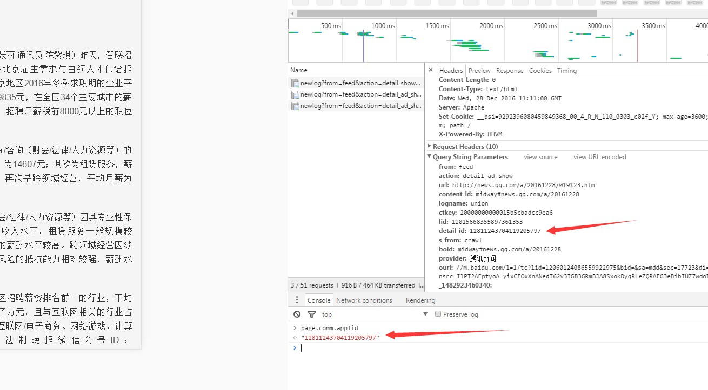
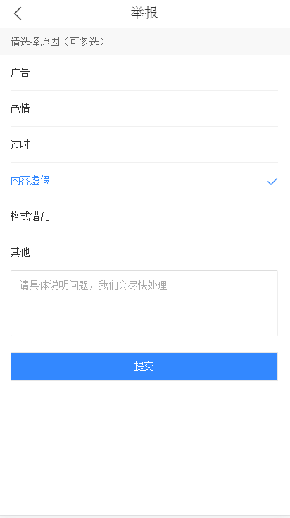
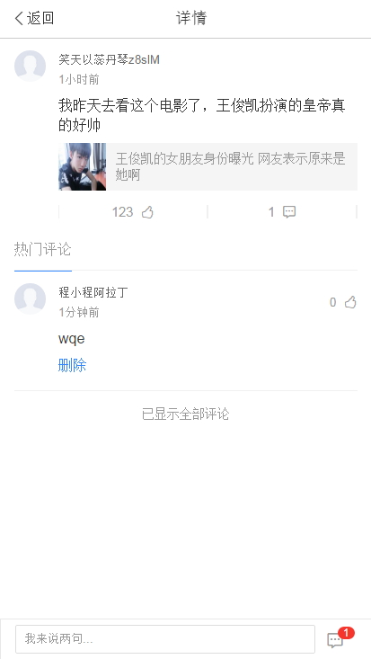

# 谢玲娟

> 从12.26-12.30

## 本周跟进
玲娟：

|内容 |功能点|进度 | pv/天 | 
|---|---|---|---|
|泛阅读全量|动态tag样式优化|12.26已上线|54万|
|泛阅读全量|title跳转频道页逻辑升级|12.26已上线|54万|
|商业化|停留时间日志升级| 12.28已上线| —— |
|分享全量|图集/视频/图文详情页调起分享面板|12.28已上线|6万|
|评论全量|评论详情页/列表页/图文详情页样式优化|12.28已开发完并提测，节后上线|500万|
|评论全量|不登陆也可点赞|图文详情页的评论12.28已上线，其余节后上|500万|
|评论全量|feed流新增评论数量|12.28已开发完并提测，节后上线|500万|
|图文详情页|样式优化UE需求，统一样式|12.28已开发完并提测，节后上线|600万|

        
## 【泛阅读全量】

### 背景

* 泛阅读分为三种，1、寻址组合资讯（q=军事新闻）2、通用资讯（q=热点资讯）3、tab聚合资讯（q=青岛新闻)。经重新讨论，这三类样式类似，可以在同一个模板里面进行开发。
 
* 全量之前需要优化动态tag的样式，同时升级titile的跳转逻辑，升级之后title跳转到的频道页随着tab切换而变。

### 进度
 
 12.26已上线。全量pv54万。
 
### [线上地址](https://m.baidu.com/ssid=e70eb3ccd0a1b3ccb0a2c0adb6a16758/s?word=%E6%96%B0%E9%97%BB&ts=3043405&t_kt=0&ie=utf-8&rsv_iqid=10735723035648742106&rsv_t=2fabTMqYFNDKb7BjTRr78HbMKIpDPvTOx4gKu%252FhPLP%252FV%252FDo75K9L&sa=is_1&rsv_pq=10735723035648742106&rsv_sug4=2461&ss=101&inputT=2144&rq=xinwen)

### 效果预览

【停留时间日志升级】

### 背景

后端需要产出分润的报表，报表里面有一项页面停留时间的数据。2.0全量之后，需要前端支持传给后端唯一标明一次pv的字段applid。

### 进度

12.28已上线。

### 效果预览

## 【分享组件】

### 背景

* 目前线上的分享组件分享功能单一（没有功能性需求）且分享的途径有限，分享面板应保持交互和视觉一致。

* 在大搜已有的分享组件面板中，扩展字号大小设置，收藏功能，以及举报功能。丰富功能，保持良好的体验。

### 进度

12.28已上线，全量pv6万。

### [线上地址](https://m.baidu.com/#|src_%E7%99%BE%E5%BA%A6%E7%83%AD%E7%82%B9|sa_is_1= 400)

### 效果预览

扩展的分享面板：

字号大小设置：

举报页面：

【我的收藏】页面：

## 【评论全量】

### 背景

* 评论小流量收益为正，可转全。

* 评论功能全量前需要迭代几个点：

	* 不需登录也能点赞

	* feed流中显示评论数，刺激点击

	* 评论样式整体升级

### 进度

12.28已提测，节后来了上线。

### [线下地址](http://cp01-ala-fe-7.epc.baidu.com:8003/s?word=%E6%88%90%E9%BE%99%E6%80%92%E6%96%A5%E6%9F%90%E6%BC%94%E5%91%98&sid=111429#|base=feed)

### 预览效果

* 图文详情页：

* 评论列表页：

* 评论详情页：

