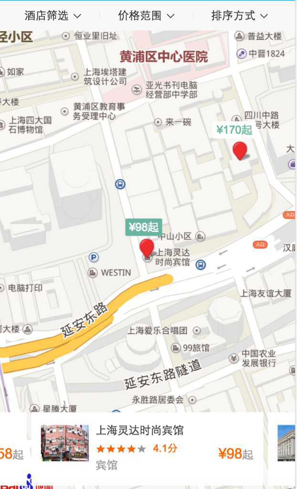
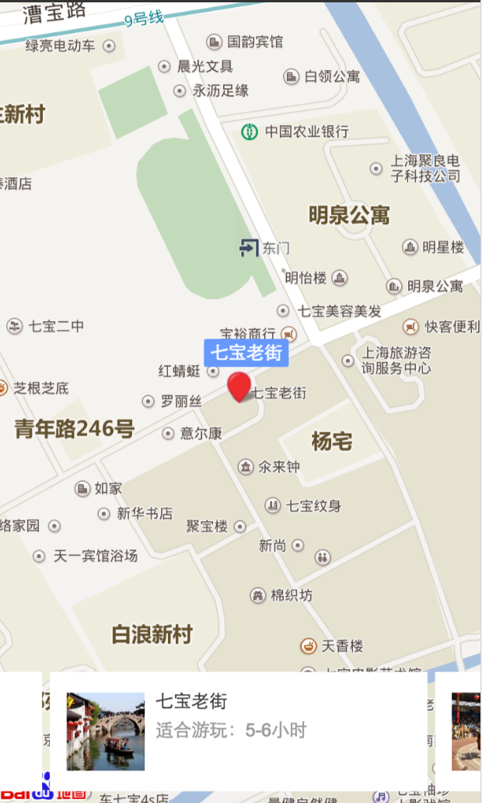

# 薛睿娇

> 从2017-01-03到2017-01-06

### 旅游-我的旅程 - (开发中)
- 项目背景
在用户进行旅游相关搜索时，实质是想了解一段旅程的部分或全部环节;选择想去的目的地，预订机票/火车票，酒店是旅程开始前的关键步骤。我的旅程项目将用户想去的目的地与用户通过百度预订的酒店或大交通行为相合，方便用户查阅旅程相关信息。同时结合用户想去的景点，为用户推荐景点周边的美食酒店，从而形成旅行信息和服务的有机连接。 	
- 收益
在用户进行旅游相关搜索时，实质是想了解一段旅程的部分和全部环节，我的旅程项目将用户想去的目的地与用户通过百度预定的酒店或大交通行为相结合，方便用户查阅旅程相关信息。同时结合用户想去的景点，为用户推荐景点周边的美食酒店，从而形成旅行信息和服务的有机链接。
- 完成情况（时间点达到的里程碑） 
	* 11-25第二轮评审.
    * 11-28FE介入.
	* 12-07暂停，12-15介入
- 本周进展
    地图样式推荐和景点收藏列表开发完成，联调完成。
	总体ready。
 
- 效果预览
	* [上海](http://cq01-ala-fe-4.epc.baidu.com:8003/sf?openapi=1&dspName=iphone&from_sf=1&pd=city&resource_id=4418&cardid=4426%2C4418&word=%E4%B8%8A%E6%B5%B7&circle=13523353.878%2C3641438.15515&ext=%7B%22cate%22%3A%22stay%22%2C%22from%22%3A%221%22%7D&title=%E4%B8%8A%E6%B5%B7&lid=&referlid=2817150645850173240&ms=1)
	
	
	
	
	[详见ICAFE](http://newicafe.baidu.com/issue/1496992-5/show?from=page)

- 计划
	- 01-04总体提测，部分调整，01-05~06QA测试，上线时间待定。

