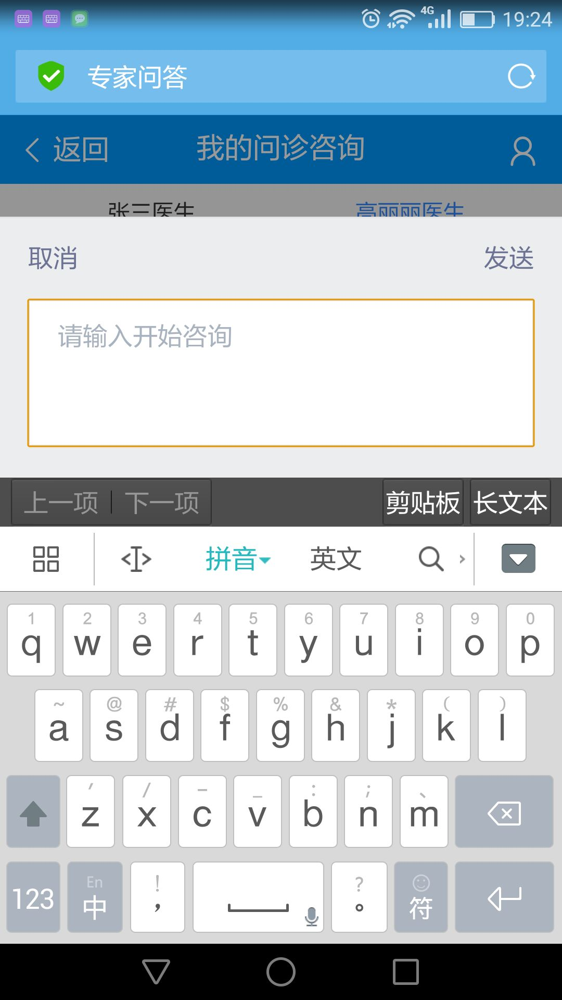

# 建站方向周报

> 2017.01.09 - 2017.01.13

### 【独立建站】技术方案

- 10%. 预计1月底前完成日志和栅格的统一, 年后逐步上线

- 学术pc + wise暂用jquery(zepto) + fis3开发需求及打包构建 （需要fork线上稳定版本pmd.css）

- 招聘pc + wise暂用jquery(zepto) + fis/fisp开发需求及打包构建 （需要fork线上稳定版本pmd.css）

- 专家沿用vue.js + webpack

- 统一wise的log统计, 组件复用

### 专家 - (胡晓卉、张屾)

#### 专家问答——一期遗留需求及问题优化(进行中)

- 背景

    在法律二期开发之前，完成专家平台一期遗留的需求，修复当时影响面小、费时的bug。

- 完成情况（里程碑）

    - 12-28 梳理问题，给出排期：把问题和需求按照优先级、页面、影响面进行分类。根据给出的时间，筛选出了一些需要高优解决的问题进行解决或调研。前端独立完成部分排期6.5天，需要后端共同讨论方案的部分，在rd休假之后给出。同时整体了其他影响较小的问题，看后续时间继续进行处理。

    - 12-29 介入开发

- 本周进展

    - 
修复iphone下输入框定位在页面底部，弹起输入法后输入框部分被遮挡，页面可上下滑动的问题：调整样式，当输入框弹出时替换为另一个输入区域，减小对页面的影响。

    - 
（进行中）修复iphone下竖屏拍照被转换为横屏问题：本周与hiphoto调通接口，获取到了图片的orientation信息。因为使用canvus将图片转换为base64编码时损失了图片的exif信息，将转换方式变为FileReader，并对兼容性进行测试。

    附：短线方案：hiphoto  http上传图片接口返回图片的元数据EXIF中Orientation信息，大搜通过Orientation信息，访问图片时带相关旋转参数。
    长线方案：hiphoto上传图片后，存储图片的元数据信息，大搜访问时带相关参数，hiphoto判断图片方向，自动旋转。

    - 
分享组件调研：分享组件对其他结果页代码有依赖，不能直接引入，对组件进行迁移。

    - 
修复日志功能：有关跳转的日志打印的url和tn参数不准，打印内容为跳转之后的页面信息。

    - 
监听页面的显示隐藏，切换页面及应用时停止刷新，回到页面继续刷新问题，减小服务器压力。

- 效果

    <table>
        <tr>
            <td>
                输入区域样式：
                
            </td>
        </tr>
    </table>

### 我的 - (张屾)

#### 我的 (pending)

- 背景

 1, 当前个人中心入口非常隐蔽，用户在搜索结果页完成订单、收藏等功能后，需要一个明确且便捷的入口进行访问。因此需要前置订单、收藏等常用工具入口，在搜索结果页形成使用闭环；
 
 2, 每天约有111万PV重复搜索同一query，通过“猜你喜欢”模块更好的满足用户重复搜索需求，降低用户搜索成本，因此在个人中心页面中增加“猜你喜欢”模块；

 3, 用户存在激发浏览的需求，结合用户浏览习惯及实事热点可提升用户使用黏性，满足浏览需求，因此在个人中心页面中增加新闻feed模块。

- 完成情况（里程碑）

    - 12.05 落地页提测
    - 12.08 入口提测
    - 12.12 bugfix一轮完成
    - 12.13 bugfix二轮完成
    - 12.14 三级单

- 本周进展

    
pending

- 计划

    - 无

### 学术 - (郭勇、程恩)

#### PPV个人(开发中,部分提测)

- 背景

PPV单篇付费除开放给图书馆用户外，仍然存在40%的用户不在高校内，这部分用户的下载需求无法得到满足，所以针对个人，也需要搭建单篇付费的通路，并且将此通路作为学术服务的一种，强化用户认知，培养用户习惯。

- 收益（总体目标）

完善学术服务，提升用户品牌认知，GMV

- 完成情况（里程碑）

    - 11月21日启动开发。

    - 12月21日个人支付部分开发完成，12月26日个人支付提测

- 本周进展

首页开发中，本周内开发联调完成

产品介绍页开发中，本周内开发联调完成

下周一,整体达到可上线状态

- 效果
    - [个人支付线下环境，需要登录线下账号](http://cq01-2012q2-kw1-newndi083.cq01.baidu.com:8009/u/ppv?tab=usercenter)

- 计划
    - 下周内上线

#### 学术搜索结果页UI3.0（开发中）

- 背景

学术整体已经有过搜索上线的1.0版本和收藏订阅等服务的平台上线2.0版本两次视觉效果，随着产品的不断丰富，用户越来越多，对产品品牌认知加深，视觉交互上需要从逻辑、风格上做进一步的梳理和统一，打造一个强认知的学术范儿风格的产品。

- 收益（总体目标）

优化学术搜索交互体验，打造人工智能、语义搜索的学术搜索引擎。提升用户交互体验和产品品牌影响力。

- 完成情况（里程碑）

    - 12月26日介入开发

    - 1月11日整体提测

- 本周进展

首页，结果页，单篇详情页，及相关阿拉丁开发联调完成。

本周三提测，目前debug中，下周一达到上线状态

- 效果
    - [线下环境](http://st01-spi-pubec1.st01.baidu.com:8012/s?wd=%E6%9C%BA%E5%99%A8%E5%AD%A6%E4%B9%A0&tn=SE_baiduxueshu_c1gjeupa&cl=3&rn=50&ie=utf-8&bs=paperuri%3A%282226686f009d7df75daee53447a54ba5%29&f=8&rsv_bp=1&rsv_sug2=0&sc_f_para=sc_tasktype%3D%7BfirstSimpleSearch%7D)

- 计划
    - 下周内上线

#### 学术专题-科研报告（已上线）

- 背景
    - 为了提升百度学术在潜在用户中的知名度，提升新增用户数，同时增强老用户的粘性，提升学术的行业影响力，学术计划在线上开展以图文/报告为形式承载的内容运营活动，引发用户传播，提升正向口碑宣传

- 收益（总体目标）
    -  暂无
    
- 完成情况（里程碑）
    - 1月9号介入，1月10号完成开发并上线 
    
- 本周进展
    - 已上线
    
- 效果
    - [科研报告](xueshu.baidu.com/u/commonpage?cmd=science)    
    
#### 学术-图书馆后台页面修改（进行中）

- 背景
    - 图书馆后台机构信息目前分为了基础信息和嵌框信息两个部分，但两部分信息多有交叉，较为浪费图书馆员的配置精力，耽误机构合作进度。故将两个页面整合为一个简单大方的页面，以供图书馆管理员使用。

- 收益（总体目标）
    - 提升图书馆工作人员配置信息的效率，同时促进嵌框合作。
    
- 完成情况（里程碑）
    - 电子页面修改 ：2017-01-11介入，01-13 完成开发并上线

- 效果
    -暂无
    
- 计划
    - 机构信息页面 ：2017-01-16介入，01-20 完成开发

### 招聘 - （冯斐帆、刘玲玲）

#### 招聘中间页-pc页面(开发中)

- 背景

这周开始进行招聘中间页pc端页面开发，主要包括架构方面和全职招聘类目。

- 收益（总体目标）

增加pc端pv。

- 完成情况（里程碑）

    - 下周开发完成。

- 本周进展

目前完成30%

- 效果
    - 暂无
- 计划
    - 下周继续一周开发。
 

#### SEO（完成，周五上线）

- 背景

随百聘页面增加，SEO优化也进行了排期，主要涉及一些关键词的调整以及伪静态处理，方便收录。

- 收益（总体目标）

提升百聘知名度。

- 完成情况（里程碑）

    - 已经完成，待上线。

- 本周进展

完成度100%

- 效果
    - [暂无]

- 计划
    - 结束。

#### 中间页个性化标签添加（预计周五完成上线）

- 背景

这周进行了联调。

- 收益（总体目标）

待确认

- 完成情况（里程碑）

    - 周五上线。

- 本周进展

周五上线

- 效果
    - http://cp01-zll-test02.epc.baidu.com:8989/wise

- 计划
    - 暂无

#### 地区、职位、公司KG优化 （暂时hold ）
- 背景
  - 响应KG优化，同时为使用后体验更爽，对线上已有的招聘地区、职场、职位哥伦布进行KG 优化。
- 收益（总体目标）
    - 暂无
- 完成情况（里程碑）
    - 因后端结构变动较大，暂时hold
- 本周进展
    - 暂无
- 效果
    - 暂无
- 计划
    - 暂无

#### 招聘企业端 （因rd 人力不足，暂定春节后介入）

- 背景
  -  公司整体的大客户整体提出了要求发布职位的需求，我们是接受需求的一方，只服务百度合作的企业，给职位一个展示的空间。
- 收益（总体目标）
    - 暂无
- 完成情况（里程碑）
    - 暂无
- 本周进展
    - 暂无
- 效果
    - 暂无
- 计划
    - 因rd 人力不足，暂定春节后介入

### 生活服务 - (刘玲玲、程恩)

#### o2o方向-黄页信息版（接入百姓网）

- 背景
  - 搜索上70%的020服务需求来自三四线城市,此类地区绝大部分没有覆盖上门服务,因此引入黄页信息补充服务的缺失
  
- 收益（总体目标）
    -  暂无
    
- 完成情况（里程碑）
    - 开发完成，测试中
    
- 本周进展
    - bug修复，基本完成 ，待ue最后确认 
      
- 效果
    - [o2o方向](http://cp01-ala-fe-col-1.epc.baidu.com:8003/s?word=%E5%8C%97%E4%BA%AC%E4%BF%9D%E6%B4%81%E6%B8%85%E6%B4%97&wiseus=10.103.62.33:3200)
    
- 计划
  -  具体上线时间待及pm确定 

#### 糯米TP中间页优化 （开发完成，待ue样式走查及qa测试）
- 背景
  - 线上现有卡片，点title调用的是糯米的中间页，因调用糯米的中间页的数据与卡片数据关联系不高（很多都是推荐的数据），所以，要单独开发个card 模板，
- 收益（总体目标）
    -  暂无
- 完成情况（里程碑）
    - 开发完成，待ue样式走查及qa测试
- 本周进展
    - 模板开发完成，
    - 测试地址：http://yq01-psdy-diaoyan1086.yq01.baidu.com:8003/sf?pd=zhengwu&openapi=1&dspName=iphone&from_sf=1&resource_id=8244&word=%E8%A5%BF%E5%AE%89%E5%AE%B6%E7%94%B5%E6%B8%85%E6%B4%97
    
- 效果
    - 
- 计划
  -  下周一介入开发

#### 生活缴费 （开发完成，待测试）
- 背景
  - 在大搜页中有入口，为钱包中间页做导流
- 收益（总体目标）
    -  暂无
- 完成情况（里程碑）
    - 开发完成， ue 走查中，待测试, 
- 本周进展
    - 周二开发完成，现自测与钱包联调数据，但因https 环境下，调用钱包的接口需安装代理软件，若要测试，需每人均按照代理软件，配置到钱包线下测试机，
      不太方便，现在http 环境下测试
- 效果
    - 测试地址： http://cp01-ps-fe-9.epc.baidu.com:8003/s?word=%E5%8C%97%E4%BA%AC%E6%B0%B4%E8%B4%B9&sid=101466
- 计划
  -  钱包数据上线待定，暂时hold 

### 阿拉丁开发平台 - （张屾）

- 背景

    icode的迁移方案遗留一些未实现的接口。另外本周nginx更新导致大量开发者模板不能召回，且无法确认预览效果。

- 本周进展
    
    
平台一休功能完善

    
增加值周人信息

    

