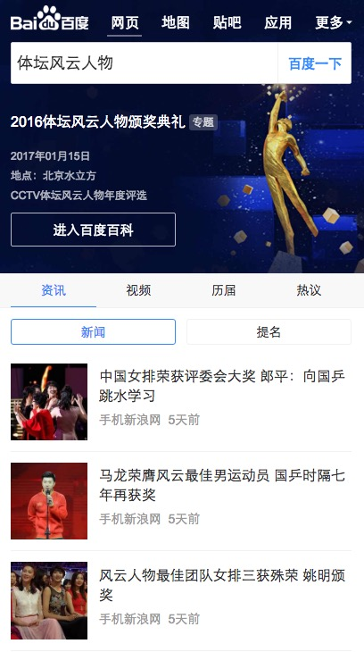
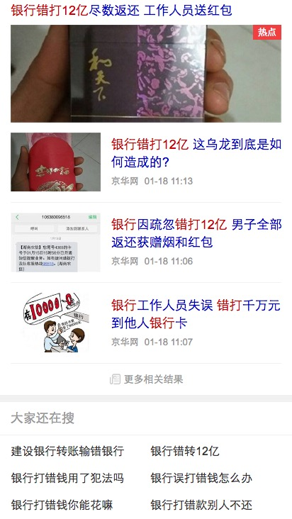

# 常健驰

> 从2017-1-16到2017-1-20

## 时效性运营阿拉丁_典礼优化

### 需求背景

运营卡默认首位：但存在以下情况需要弱化：

    a：首条结果前有广告。

    b：已过突发时间，但用户仍存在查看内容的需求。

1. 头部sigma样式弱化，为普通样式，有标题及左图右文。

2. tab样式及tab内结构与sigma卡一致。
   新闻、视频仅展现2条子链；
   历届奖项展现4个奖项；
   评论展现3条；
   各tab均采用点击“展开更多”查看其他结果，每次加载5条，至全部加载完毕。

### 完成情况

已hold，目前只优化了sigma卡的细节问题,`1月16日`模板已上线[点击预览](https://m.baidu.com/#|src_%E4%BD%93%E5%9D%9B%E9%A3%8E%E4%BA%91%E4%BA%BA%E7%89%A9|sa_ib)

## RS样式调整后，实验组和对照组的点击率上下浮动较大

### 完成情况

可能是由于两个实验组的模板没有同步成最新的对照组代码，目前已跟对照组模板同步，`1月19日`模板已上线[实验组一](https://m.baidu.com/s?word=%E9%93%B6%E8%A1%8C%E9%94%99%E6%89%9312%E4%BA%BF&sid=112175) [实验组二](https://m.baidu.com/s?word=%E9%93%B6%E8%A1%8C%E9%94%99%E6%89%9312%E4%BA%BF&sid=112176)

### 其他

* feed流loading修改为旋转的，视频详情页2.0调整成1.0的样式 - 修改完成，`1月16日`模板已上线[点击预览](https://m.baidu.com/sf?pd=midway&lid=13191498693719353908&word=%E7%99%BE%E5%BA%A6%E7%83%AD%E7%82%B9&actname=act_video&title=%E5%85%B3%E7%88%B1%E5%85%AB%E5%8D%A6&top=%7B%22sfhs%22%3A4%2C%22_hold%22%3A2%7D&ext=%7B%22videoUrl%22%3A%22http%3A%2F%2Fwww.internal.video.baidu.com%2F6b6d03e0ba6e57aab010eb0d1df5d340.html%22%2C%22tag%22%3A%22%22%2C%22from%22%3A%22video%22%2C%22app_from%22%3A%22midway%22%7D)

* 时阿样式优化

* 百家号新出对照组样式已完成，0流量测试中 - hold

