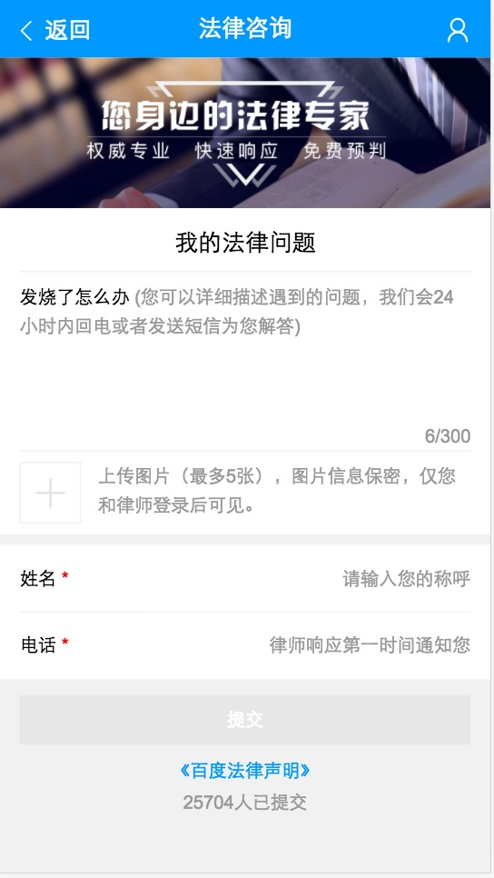

# 胡晓卉

> 从2016-01-16到2016-01-20

#### 专家问答——法律二期(进行中)

- 背景

    平台一期实现了最小功能闭环上线后，二期进行功能优化，包括优化细化问题页面的用户体验、支付功能等。

- 完成情况（里程碑）

    - 01-13 确定排期，介入开发。

    - 01-17 banner、节日公告上线。

    - 其他部分由于没有终稿ue图hold。

- 本周进展

    - 
（已上线）法律增加banner。

    - 
（已上线）春节节日期间公告。

   
    - 
（测试中）带query的情况增加placeholder。

- 效果

    <table>
        <tr>
            <td>
                
            </td>
        </tr>
    </table>

#### 专家问答——一期遗留需求及问题优化(进行中)

- 背景

    在法律二期开发之前，完成专家平台一期遗留的需求，修复当时影响面小、费时的bug。

- 完成情况（里程碑）

    - 12-28 梳理问题，给出排期：把问题和需求按照优先级、页面、影响面进行分类。根据给出的时间，筛选出了一些需要高优解决的问题进行解决或调研。前端独立完成部分排期6.5天，需要后端共同讨论方案的部分，在rd休假之后给出。同时整体了其他影响较小的问题，看后续时间继续进行处理。

    - 12-29 介入开发

    - 01-17 上线已修复部分。

- 本周进展

    - 
周二上线已修复问题。

    - 
（测试中）修复iphone下竖屏拍照被转换为横屏问题：hiphoto接口返回图片的orientation信息已上线。本周马田提供了带旋转参数的方向的接口和访问地址，前端修改对应部分。由于后端做旋转之后，不同机型的iphone显示仍不统一，因此使用压缩的方式将图像的exif信息完全删除，效果待qa全面验证。

    附：短线方案：hiphoto  http上传图片接口返回图片的元数据EXIF中Orientation信息，大搜通过Orientation信息，访问图片时带相关旋转参数。
    长线方案：hiphoto上传图片后，存储图片的元数据信息，大搜访问时带相关参数，hiphoto判断图片方向，自动旋转。