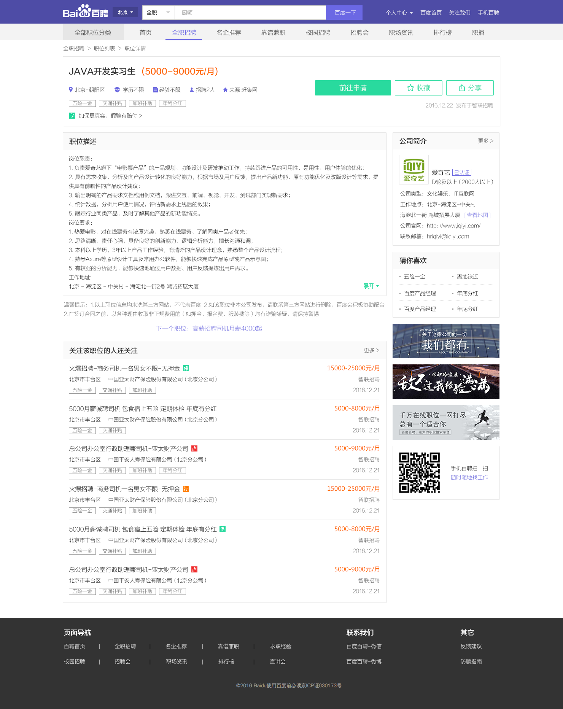

# 刘玲玲

> 从2017-01-16 到 2017-01-20

### 本周进展如下： 

#### 糯米TP中间页优化 （2017-01-18日周三上线完成）
- 背景
  - 线上现有卡片，点title调用的是糯米的中间页，因调用糯米的中间页的数据与卡片数据关联系不高（很多都是推荐的数据），所以，要单独开发个card 模板，
- 收益（总体目标）
    -  暂无
- 完成情况（里程碑）
	- 周三上线完成
- 本周进展
    - 周三上线完成
- 效果
	- 
- 计划
  -  暂无

#### 生活缴费 （开发完成，因钱包接口上线过程中遇到问题，测试暂时hold）
- 背景
  - 在大搜页中有入口，为钱包中间页做导流
- 收益（总体目标）
    -  暂无
- 完成情况（里程碑）
	- 开发完成， ue 走查中，待测试, 
- 本周进展
    - 周二开发完成，现自测与钱包联调数据，但因https 环境下，调用钱包的接口需安装代理软件，若要测试，需每人均按照代理软件，配置到钱包线下测试机，
      不太方便，现在http 环境下测试
- 效果
	- 测试地址： http://cp01-ps-fe-9.epc.baidu.com:8003/s?word=%E5%8C%97%E4%BA%AC%E6%B0%B4%E8%B4%B9&sid=101466
- 计划
  -  钱包数据上线待定，暂时hold 

#### 招聘pc 社招详情页 （开发中）
- 背景
  - 2017年，把2016年wise上做的所有内容在pc端完善
- 收益（总体目标）
    - 暂无
- 完成情况（里程碑）
	- 开发中
- 本周进展
    - 开发中
- 效果
	- 
- 计划
    - 开发
    
#### 招聘企业端 （因rd 人力不足，暂定春节后介入）
- 背景
  -  公司整体的大客户整体提出了要求发布职位的需求，我们是接受需求的一方，只服务百度合作的企业，给职位一个展示的空间。
- 收益（总体目标）
    - 暂无
- 完成情况（里程碑）
	- 暂无
- 本周进展
    - 暂无
- 效果
	- 暂无
- 计划
    - 因rd 人力不足，暂定春节后介入

