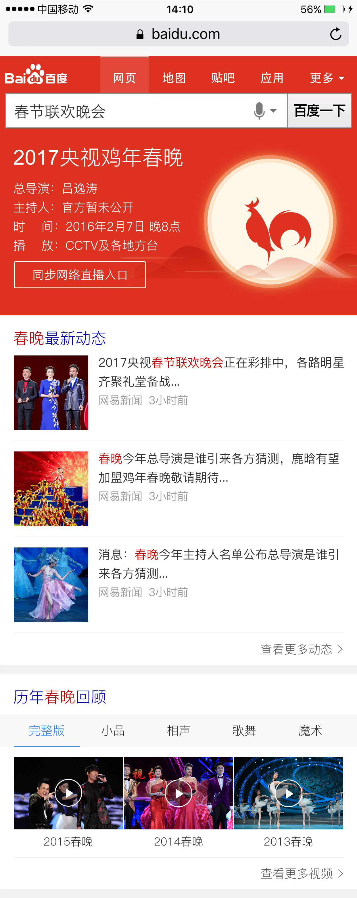
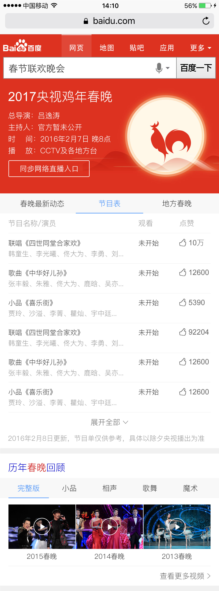
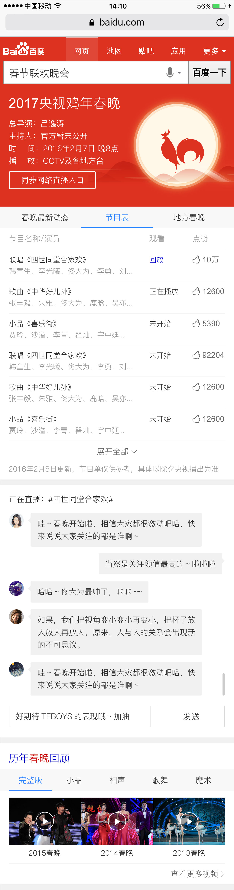
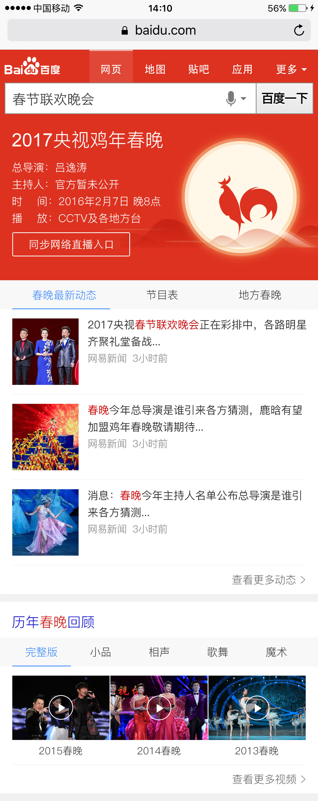
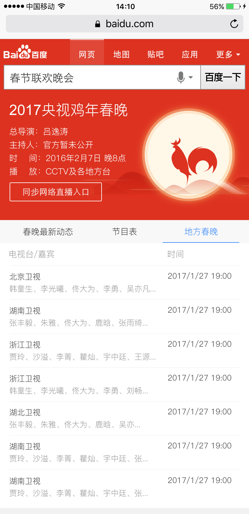
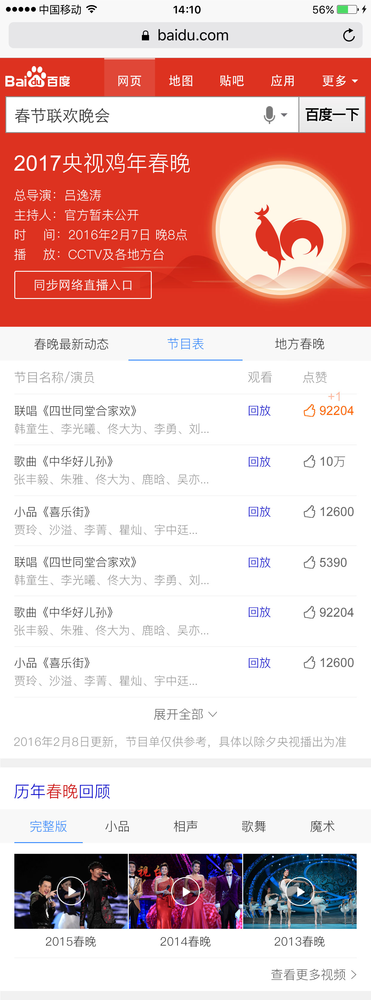

# 祁鹏远

> 2017年1月22日~2017年1月26日

#### Wise2017春晚sigma大卡 （项目状态：全量中） @ 鹏远 
- 背景：春晚为中国最受关注晚会之一，临近春晚时，春晚资讯、节目表相关需求愈强，为了更好的满足春晚相关query的搜索体验且为百度用户增添一份年气，故进行春晚sigma卡片的设计开发。
- **完成情况**
	调试春晚样式及修复bug，现已全量上线。
- 计划	
    1月25已上线
	1月11介入开发
    预计1月17日上线
	
- 本周进展
	调试春晚样式及修复bug，现已全量上线。
- 效果图
	

    

    

    

    

    

    

 
#### Wise2017春节习俗 （项目状态：全量中） @ 鹏远 
- 背景：春晚为中国最受关注晚会之一，临近春晚时，习俗相关需求愈强，为了更好的满足春晚相关query的搜索体验且为百度用户增添一份年气，故进行春节习俗卡片的设计开发。
- **完成情况**
	卡片已全量上线
- 计划	
	1月18介入开发
    1月20日上线
	
- 本周进展
	卡片已全量上线
- 效果图
	
   

