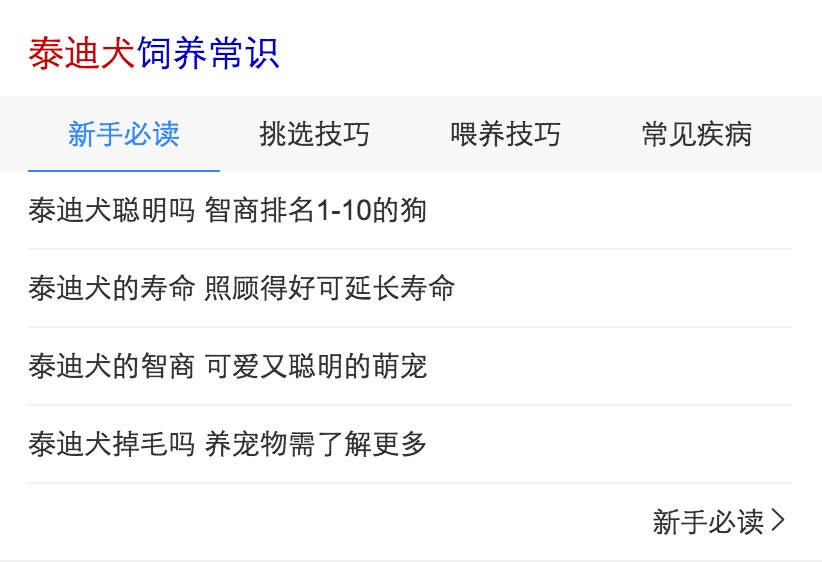
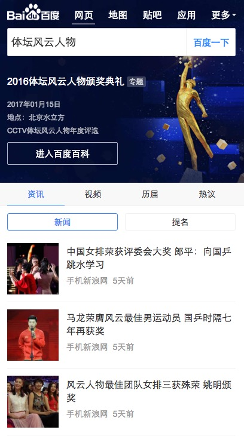

# 常健驰

> 从2017-2-6到2017-2-10

## 宠物常识情景页2.0升级

### 需求背景

以后情景页1.0不再维护，所以现在要升级成2.0样式

###完成情况

正在迁移中，预计`2月10日`完成迁移[点击预览](http://cp01-ala-fe-6.epc.baidu.com:8003/s?word=%E6%B3%B0%E8%BF%AA%E7%8A%AC&ts=1447507&t_kt=0&rsv_iqid=2464366561391743649&sa=ihr_1&rsv_sug4=679&ss=001)

## 时效性运营阿拉丁_典礼优化

### 需求背景

运营卡默认首位：但存在以下情况需要弱化：

    a：首条结果前有广告。

    b：已过突发时间，但用户仍存在查看内容的需求。

1. 头部sigma样式弱化，为普通样式，有标题及左图右文。

2. tab样式及tab内结构与sigma卡一致。
   新闻、视频仅展现2条子链；
   历届奖项展现4个奖项；
   评论展现3条；
   各tab均采用点击“展开更多”查看其他结果，每次加载5条，至全部加载完毕。

### 完成情况

已hold，目前只优化了sigma卡的细节问题,`1月16日`模板已上线[点击预览](https://m.baidu.com/#|src_%E4%BD%93%E5%9D%9B%E9%A3%8E%E4%BA%91%E4%BA%BA%E7%89%A9|sa_ib)

### 其他

* 商品情景页2.0升级

* 百家号新出对照组样式已完成，0流量测试中 - hold

