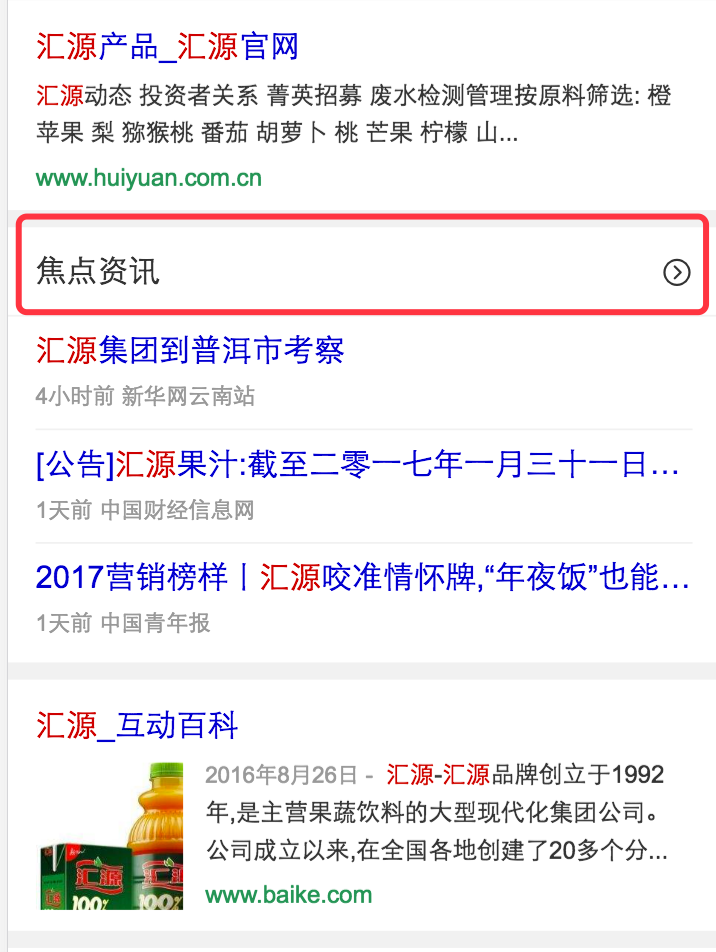

# 谢玲娟

> 从1.16-1.20

## 本周跟进

|内容 |类型|进度 | pv/天 | 
|---|---|---|---|
|激发区-激发列表情景页|新增|2.10已提测，预计2.15上线|暂无|
|时效性-图搜下时效性新闻模板跳转到旧链接|线上case|已定位原因，rd跟进修复|——|
|时效性-时效性新闻新增样式实验模板转码失败|线下case|已解决|——|

## 【激发区-激发列表情景页】

### 背景

* 激发列表insp_list阿拉丁卡片尝试以阿拉丁的形式做搜索内容激发产品。

* title需要改造成跳转到情景页，丰富激发内容，更好的满足用户

ue效果图：

### 进度

2.10已提测，预计2.15上线

### 线下链接

http://cp01-sf-rd-2016q4-3.epc.baidu.com:8003/sf?pd=inspire&word=%E5%8D%8E%E4%B8%BAp6&ext=%7B%22type%22%3A1%2C%22rn%22%3A10%7D

## 【时效性-图搜下时效性新闻模板跳转到旧链接case】

### 背景

手百上，使用图片搜索【汇源】，点击相关图片搜索，然后点击【汇源相关信息】，出带【焦点资讯】卡的结果页。点击焦点资讯的title，跳转到老的新闻页，而非普通搜索下的情景页，跟实际预期不符。

### case原因

模板中判断了有sfUrl字段才跳转到情景页，没有sfUrl则跳到老的新闻页。
加sfUrl这个字段的逻辑由rd加在了odp的策略中。
图搜中使用的是uiapi来获取模板和数据，uiapi不走odp的策略。
因此模板获取不到sfUrl字段，也就只能跳转到老的新闻页。

### 解决方案

1、@轶婵和odp的同学一起看下长期方案，是否可以让uiapi支持在odp加的策略。
2、rd@张伊和图搜的@玉坤同学一起看下，方案是: 在uiapi的php代码中再添加一份+sfUrl字段的逻辑，保证uiapi获取回来的数据中有这个字段。
3、fe在模板中写死跳转的sfUrl，这个不推荐。后续url的拼接策略会迭代，放到模板中做不合理。

### 目前进度

时效性rd张伊跟进中，具体排期待定。

## 【时效性-时效性新闻新增样式实验模板转码失败case】

### 背景

杨露做时效性新闻的模板，新增了一个样式实验模板realtime2，转码的逻辑参照了realtime模板。

线下测试发现，转码的逻辑跟realtime一致没有问题，但是转码失败。

### case原因

转码逻辑参考了realtime，而realtime是有预处理文件的，realtime的预处理文件中将需要转码的url都处理程toutiao.baidu.com，和news.baidu.com。然后模板中直接判断url，域名是这俩者开头的话就走转码，否则不转吗。

而新增的模板realtime2没有预处理文件，没有做转域名的处理。因此在模板中无法根据那俩域名判断url是否走转码。

同时，在数据处理中realtime2判断了是的否已经有适配的wap_url，有的话不需要转码，没有的话需要转码。但是最后赋值给了realList，而模板中循环的是listData，因此模板中这个逻辑也没有走通。

### 解决方案

有问题代码：

	 
    
        
        
    

    
    

修复之后：

    
    
        
        
    
        
        
    
    
    
    
    

### 目前进度

2.10下午已解决并由杨露上线。

