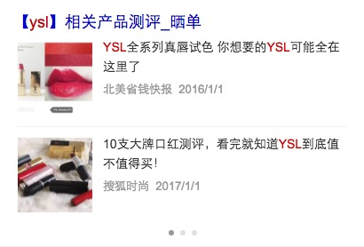
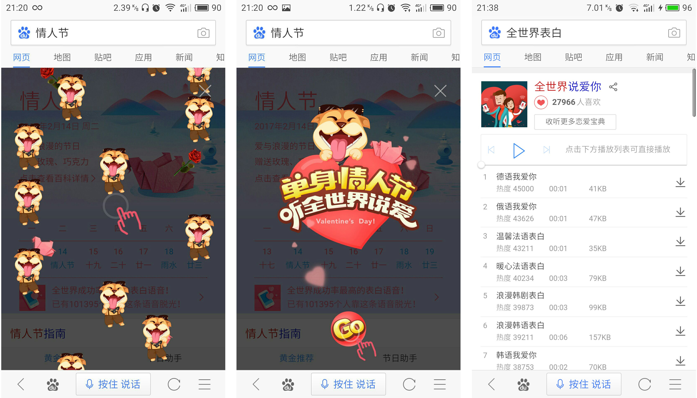
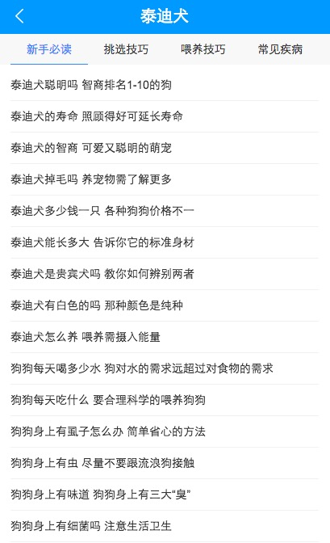

# Ala-激发+资讯+运营=月报

> 从 2016-02-13到2016-02-17

## 人员&&需求安排

```
- FE: 陈锐，玲娟，健驰，董仁广，杨露
- PM: 戚薇薇、卉子、黄龙、张慧、玉苗、子玉、苗苗、姚莹、杨康、念觉
- RD: 国胜、王明、张伊、刘钦、付伟
```
	- 商品：陈锐/杨露
	- 内容激发/资讯feed：玲娟
	- 时效性：健驰
	- 运营：仁广
		
## 资讯基础业务介绍

内容激发：
        
        * http://wiki.baidu.com/pages/viewpage.action?pageId=212840228
        * http://agroup.baidu.com/alanews/view/office/214156

资讯feed：

		http://gollum.baidu.com/Zhong-Tu-Dao-Kai-Fang-APIShou-Ce#1.-基本介绍

## 资讯本月跟进项目统计

|类目|内容 |进度 | pv/天 | 
|---|---|---|---|
|激发|展开更多之后的第一个模板上边距无线(case)@玲娟|1.19已上线|小流量pv100万|
|激发|无视频图片时候展现无图片样式(case原因)@玲娟|1.19已上线|--|
|激发|中文来源替换成英文的站点@玲捐|1.19已上线|--|
|激发|激发列表情景页|2.16已上线，2.17开流量|小流量pv100万/日|
|商品|通用商品详情列表卡片 - 美妆卡片|1.20已上线|--|
|时效性|RS样式升级@健驰|2.16全量上线|--|
|时效性|时效性运营阿拉丁_典礼优化@健驰|1.16已上线|--|
|时效性|时效性运营阿拉丁——典礼新增需求@健驰|跟进中|--|
|时效性|图搜下时效性新闻模板跳转到旧链接(case)@玲捐|已定位原因，rd跟进修复|--|
|时效性|时阿卡片样式升级@杨露|2.16已全量上线|--|
|运营|元宵节Logo上线@仁广|2.11已上线，现已下线|--|
|运营|情人节Logo@仁广|2.14已上线，现已下线|--|
|运营|情人节彩蛋（wise端）@仁广|2.13已上线，现已下线|--|
|运营|失重彩蛋（wise端）@仁广|已提测|--|
|其他|feed流视频详情页样式升级@健驰|1.16已上线|--|
|其他|商品、宠物模板情景页2.0迁移@健驰|已提测|--|

##详细进展

## 内容激发

### 背景
- 在不影响用户需求满足的前提下，向用户展示少量且优质的补充信息
- 扩展的内容是基于当前搜索意图，区别于满足区，是对其有价值的补充或延展
- 如果用户有意愿，可以查看更多感兴趣的内容
- 通常展现是10条搜索结果 + 5条激发结果


## 【激发区-激发列表情景页】

### 背景

1，为了满足用户的潜在需求和提高信息触达的效率，采用阿拉丁在结果页展现需求激发范畴的内容；
2，阿拉丁初始插入第10位，后端根据千岛湖折叠位置计算结果，动态调整阿拉丁卡片位置；
3，阿拉丁展示5条优质内容（初始折起展示2条），通过配图和推荐理由等辅助信息激发用户的点击，通过title跳转情景页引导用户持续浏览，从而带来分发和时长的收益；

### 动态环境地址

http://cp01-sys-rath4-c32-qa270.cp01.baidu.com:8003/s?dev=1&dev_workspace=platform&dev_module=aladdin-wise&dev_tpl=insp_list&dev_path=searchaladdin&dev_tpltype=default&sid=99999_114408&dev_online=1&wd=%E5%8D%8E%E4%B8%BA&word=%E5%8D%8E%E4%B8%BA

### 实验设计

对照组：线上，10%流量

实验组1：内容激发阿拉丁（人工数据），10%流量

实验组2：内容激发阿拉丁（策略数据），10%流量

实验组3：通用激发（策略数据），10%流量

### 预期收益

1、满足用户潜在需求，用户体验感知收益提升；

2、整体点击率、有点比例、媒体时长提升；

详细数据：生效query：113个，日均PV：约332w，`小流量影响面：约100w`

### 效果图：


### 进度

2.16已上线模板。2.17开流量。

## 【激发区-展开更多之后的第一个模板上边距无线case】

### 背景

case描述：激发区的3条结果之后，点展现更多，出更多的结果。。点展开更多之后，第一个模板无上线距。


case原因分析：展开更多配置是在后端，当时在线下验证的时候没有发现这个细节。

case总结：

* 后端的配置，需要在后端上线之前fe也一起确认效果。有的样式细节后端可能会忽略~~

* 簇模板把展开之后第一个模板的上边距隐藏，这个逻辑之前千岛湖也没有碰到过，所以没出现过问题~~

### 进度
 
 1.19已上线。

### [线上地址](https://m.baidu.com/s?word=%E9%BB%84%E7%A3%8A%E8%80%81%E5%A9%86&sid=114445)

### 效果预览


## 【激发区-无视频图片时候展现无图片样式case】

### 背景

case描述：没有视频图片的时候，线上图片区展现异常。


case原因分析：模板中只作了判断是否展现视频样式，没有考虑到有视频但是无图片时候的样式..

case总结：对可能没有的数据作兼容，要考虑的全面一些。。

### 进度
 
 1.19已上线。

### [线上地址](https://m.baidu.com/s?word=%E9%BB%84%E7%A3%8A%E8%80%81%E5%A9%86&sid=114445)

### 效果预览


## 【激发区-中文来源替换成英文的站点】

### 背景

insp_normal_fd模板，中文的来源数据上不是很全，导致少了一条信息，整体看起来不是很齐全。因此把中文的来源替换成英文的站点名，站点名是都有的~


### 进度
 
 1.19已上线。

### [线上地址](https://m.baidu.com/s?word=%E9%BB%84%E7%A3%8A%E8%80%81%E5%A9%86&sid=114445)

### 效果预览


## 美妆卡片商品商品

### 需求背景

### 进度

1.20已上线[ysl](http://m.baidu.com/s?word=ysl&ts=6048589&t_kt=0&ie=utf-8&rsv_iqid=8498197739130894428&rsv_t=1297iFsMy8a6KaIAtBFneI1KVHzDjlWn1Auqh6Z8%252Fm6%252FuvIxvA6w&sa=ib&rsv_pq=8498197739130894428&rsv_sug4=1256&ss=001)

### 效果预览




## 【时效性-图搜下时效性新闻模板跳转到旧链接case】

### 背景

手百上，使用图片搜索【汇源】，点击相关图片搜索，然后点击【汇源相关信息】，出带【焦点资讯】卡的结果页。点击焦点资讯的title，跳转到老的新闻页，而非普通搜索下的情景页，跟实际预期不符。


### case原因

模板中判断了有sfUrl字段才跳转到情景页，没有sfUrl则跳到老的新闻页。
加sfUrl这个字段的逻辑由rd加在了odp的策略中。
图搜中使用的是uiapi来获取模板和数据，uiapi不走odp的策略。
因此模板获取不到sfUrl字段，也就只能跳转到老的新闻页。

### 解决方案

1、@轶婵和odp的同学一起看下长期方案，是否可以让uiapi支持在odp加的策略。
2、rd@张伊和图搜的@玉坤同学一起看下，方案是: 在uiapi的php代码中再添加一份+sfUrl字段的逻辑，保证uiapi获取回来的数据中有这个字段。
3、fe在模板中写死跳转的sfUrl，这个不推荐。后续url的拼接策略会迭代，放到模板中做不合理。

### 目前进度

时效性rd张伊跟进中，具体排期待定。

## 时阿卡片

### 需求背景

针对泛时效性需求，新建焦点新闻需求，弱化title，突出新闻内容，优化用户体验

### 完成情况： 

02.16日完成全量上线[刘德华](https://m.baidu.com/s?word=%E5%88%98%E5%BE%B7%E5%8D%8E&sa=tb&ts=8421157&t_kt=0&ie=utf-8&rsv_t=ca25jeIM6WH9Vr%252FLVDNr79ZHVDBVNTlq8rwSGFz5NUQMQ1SfTMvC&rsv_pq=13371609994202342572&ss=101&rqlang=zh&rsv_sug4=6711&inputT=4574&oq=%E6%9D%A8%E5%B9%82&sid=114507)


## 情人节Logo

### 背景与目标

情人节当天（2017.2.14），展示在[百度首页](https://www.baidu.com/)搜索框上方的情人节定制Logo。体现出百度对于情人节的庆祝，以及对于用户体验的重视。

### 完成情况

于情人节当天顺利上线，现已下线。

### 效果截图


## 情人节彩蛋（wise端）上线

### 背景与目标

情人节前一天以及当天（2017.2.13 - 2017.2.14），当用户在手百或wise端搜索"情人节"、"单身狗"等相关词条时，展现在结果页的特效彩蛋。目的是给用户以惊喜，增加百度移动端搜索的趣味性，提高用户体验；提高百度移动端搜索的自传播性，和用户黏性。

### 完成情况

于情人节前一天顺利上线，现已下线。

### 效果截图



## 失重彩蛋（wise端）

### 背景与目标

当用户在wise（或手百）端搜索"失重"时，在界面上展示出文字失重状态特效。目的是给用户以惊喜，增加百度移动端搜索的趣味性，提高用户体验；提高百度移动端搜索的自传播性，和用户黏性。

### 完成情况

已完成开发与测试，等三级单ing...。

### 效果截图


* [预览地址](http://cp01-ps-fe-11.epc.baidu.com:8003/s?word=%E5%A4%B1%E9%87%8D&sa=tb&ts=8834996&t_kt=0&ie=utf-8&rsv_t=8e8e4tSw77MC1x7IbUv7h3aOt4chzW2G4x1Naf2%252BzUMp4Oga13eh&rsv_pq=1237512895720755114&ss=101&t_it=1&rqlang=zh&rsv_sug4=8173&inputT=7262&oq=%E9%AB%B9%E8%80%8B%E7%BF%A5)

## 宠物常识情景页2.0升级

### 需求背景

以后情景页1.0不再维护，所以现在要升级成2.0样式

###完成情况

模板测试完成，预计`2月16日`上线[点击预览](http://cp01-ala-fe-6.epc.baidu.com:8003/s?word=%E6%B3%B0%E8%BF%AA%E7%8A%AC&ts=1447507&t_kt=0&rsv_iqid=2464366561391743649&sa=ihr_1&rsv_sug4=679&ss=001)




## 商品模板情景页2.0升级

### 需求背景

以后情景页1.0不再维护，所以现在要升级成2.0样式

### 完成情况

模板迁移完成，正在测试，[点击预览](http://cp01-ala-fe-6.epc.baidu.com:8003/s?word=%E4%BA%AC%E4%B8%9C&ts=9232185&t_kt=103&rsv_iqid=7225077591904613182&sa=ihr_1&rsv_sug4=1596&ss=001)

### 效果预览


<style>
    .markdown-body img {
        width: 375px;
        border: 1px solid #ccc;
        box-shadow: 5px 5px 5px #ccc;
        margin-left: 30px;
    }
</style>
