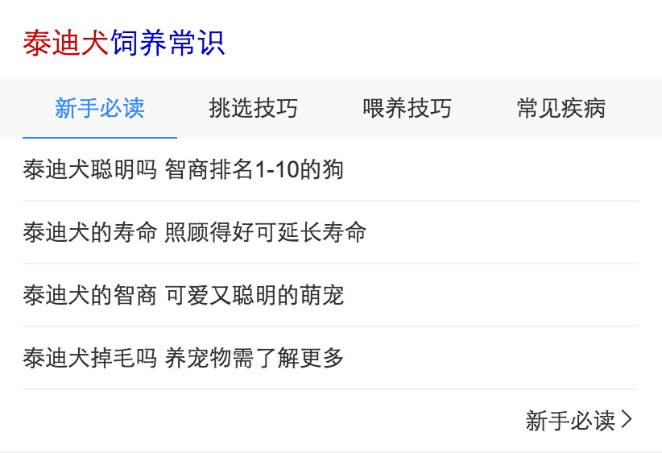

# 常健驰

> 从2017-2-13到2017-2-17

## 宠物常识情景页2.0升级

### 需求背景

以后情景页1.0不再维护，所以现在要升级成2.0样式

###完成情况

模板测试完成，预计`2月16日`上线[点击预览](http://cp01-ala-fe-6.epc.baidu.com:8003/s?word=%E6%B3%B0%E8%BF%AA%E7%8A%AC&ts=1447507&t_kt=0&rsv_iqid=2464366561391743649&sa=ihr_1&rsv_sug4=679&ss=001)

## 商品模板情景页2.0升级

### 需求背景

以后情景页1.0不再维护，所以现在要升级成2.0样式

### 完成情况

模板迁移完成，正在测试，[点击预览](http://cp01-ala-fe-6.epc.baidu.com:8003/s?word=%E4%BA%AC%E4%B8%9C&ts=9232185&t_kt=103&rsv_iqid=7225077591904613182&sa=ihr_1&rsv_sug4=1596&ss=001)

### 效果预览

### 其他

* 时效性典礼卡片新增需求

    * `2月17日`跟pm确认需求

* 百家号新出对照组样式已完成，0流量测试中 - hold

