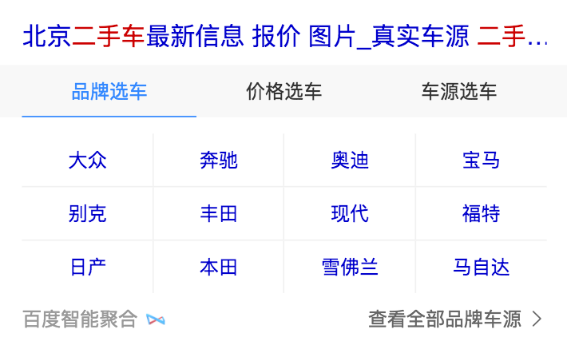
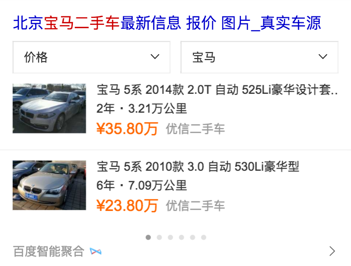
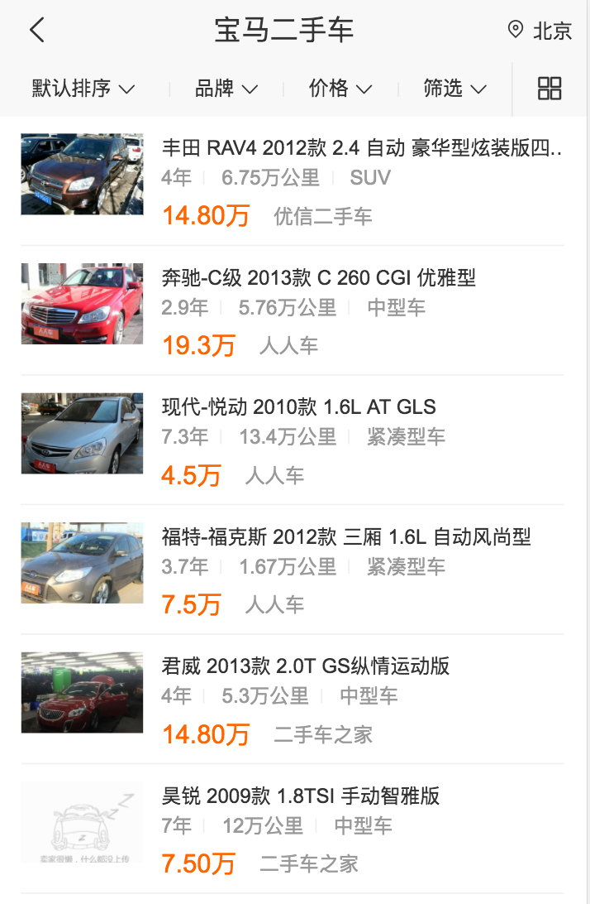

# 汽车&学术（郭勇，程恩，杨奇）

> 从 2016-02-20到2016-02-24

## 人员&&需求安排

```
- FE: 郭勇、杨奇、程恩

```
    - 汽车: 郭勇、杨奇
    - 学术：郭勇、程恩
        
### 汽车KG （开发中）

- 背景

本项目是满足搜索上新车部分的需求，重点满足用户选车的需求。  影响选车的决策因素很多，主要有：配置、报价、口碑、评测（文章、视频）等。从query分析可看出，选车需求的用户的TOP QUERY为车系词、品牌词以及泛需求词。

本项目在车系词下建设车系阿拉丁，引导用户进入车系频道页后，满足用户选车需求。后续会建设品牌阿拉丁、泛需求阿拉丁，并丰富频道页，全面满足选车需求。


- 收益（总体目标）

待定

- 完成情况（里程碑）

    - 2月8日需求评审。

    - 2月20介入开发

- 本周进展

<p style="color:#c00">本周UE提供了概览页面UE，参数&图片页面UE</p>

<p style="color:#c00">本周内RD需要提供所有的数据schema（目前RD还没发提供UIscheam），需要FE根据数据schema先提前开发</p>

<p style="color:#c00">本周五RD应该可以提供联调环境</p>

<p style="color:#c00">本周指导@杨奇完成概览页面综述卡片，二手车卡片进行中</p>

<p style="color:#c00">本周明确整体技术方案，目前C类详情页面技术方案待定</p>

<p style="color:#c00">本周明确具体排期</p>

<p style="color:#c00">下周启动车型筛选组件评审，下周内改组件上线</p>

<p style="color:#c00">下周开始参数卡片开发</p>

<p style="color:#c00">下周指导@杨奇完成概览页面二手车和车型卡片开发</p>

- 效果
    - 暂无

- 计划
    - 参数卡片开发
    - 筛选组件开发
    - 指导杨奇完成部分卡片

    - 整体排期：
    [详见wiki](http://wiki.baidu.com/pages/viewpage.action?pageId=292265098)


#### 修改二手车页面-(项目状态：已上线)

- 项目背景
    针对二手车，用户有买车和卖车两方面的需求。而各商家的车源分散，中小型城市的车源不足，且市场上暂无巨头出现，目前呈现三足鼎立之势（优信、人人、瓜子）。百度可通过聚合车源、搭建入口、提供额外优惠等方式，进一步满足用户需求，稳住二手车的流量入口。

- 收益 
    影响PV 60w

-工作量评估
    * 需求量：1个结果页 1个情景页 wise-aladdin: brands card: brands
    * 开发风险：暂无

- 完成情况
    * 02-22 删除wise-brands的定位功能,完成card-brands老组件变新组件的更新。      
    * 02-23 已上线

- 本周进展
 
    <font color=#f00>预计02-23上线</font>
 
- 效果预览
 
    * [泛需求页面](https://m.baidu.com/ssid=4fc34d696e696f6e735f5951d7a6/s?word=%E4%BA%8C%E6%89%8B%E8%BD%A6&ts=6027077&t_kt=0&ie=utf-8&rsv_iqid=2197353369&rsv_t=49d2KDA4X6BymStQdkSoi5PuGHM8Wu%252FBe7LcSXvu6o85PShSh7SV&sa=ihr_1&rsv_pq=2197353369&rsv_sug4=3864&ss=001)
    * [精确需求页面](https://m.baidu.com/ssid=4fc34d696e696f6e735f5951d7a6/s?word=%E5%AE%9D%E9%A9%AC%E4%BA%8C%E6%89%8B%E8%BD%A6&sa=tb&ts=6046937&t_kt=0&ie=utf-8&rsv_t=b6197bYgSuBIYN%252BeoNIj2%252BYNeEkC0ymbI54yshumty%252Ff9n1hzZ6d&rsv_pq=12219078180345089861&ss=100&rqlang=zh&rsv_sug4=3901&inputT=2990&oq=%E4%BA%8C%E6%89%8B%E8%BD%A6)
    * [情景页](https://m.baidu.com/sf?openapi=1&dspName=iphone&from_sf=1&pd=usedcar&resource_id=4341&city=%E5%8C%97%E4%BA%AC&pagetype=0&word=%E5%AE%9D%E9%A9%AC%E4%BA%8C%E6%89%8B%E8%BD%A6&title=%E5%AE%9D%E9%A9%AC%E4%BA%8C%E6%89%8B%E8%BD%A6&lid=12746647430224723981&ms=1&frsrcid=4341&frorder=4)
    <p></p>
    <p></p>
    <p></p>
    
#### 汽车概述和二手车页面-(项目状态：开发中)

- 项目背景
    本项目是满足搜索上新车部分的需求，重点满足用户选车的需求。  影响选车的决策因素很多，主要有：配置、报价、口碑、评测（文章、视频）等。从query分析可看出，选车需求的用户的TOP QUERY为车系词、品牌词以及泛需求词。

- 收益 
    影响PV 970w

-工作量评估
    * 需求量：12个情景页 card: car_summarize car-usedcar
    * 开发风险：暂无

- 完成情况
    * 02-21 和rd沟通并确定schema
    * 02-22 完成页面car_summarize的开发    
    * 02-23 定制完schema并开始开发car-usedcar页面 

- 本周进展
 
    <font color=#f00>预计02-24开发完成</font>
 
- 效果预览

    * [概述页面](https://wwwhttps.baidu.com/sf?pd=jingdian_detail&dev_workspace=platform&dev_module=card&dev_tpl=car_summarize&dev_path=card&dev_tpltype=default&sid=99999&dev_online=0&dev_file=default.xml&dev_fileformat=xml&dev_pos=asResult&wd=%E6%B1%BD%E8%BD%A6&word=%E6%B1%BD%E8%BD%A6)
    <p></p>
    
 
### 学术

#### 论文助手(已上线，迭代待上线中)

- 背景

论文助手平台更多数据提供方希望接入，本周介入paperfree。同时新增三种优惠免费模式，以支持后续其他数据方接入。三种优惠免费模式是：1.不免费；2.限单量免费；3.首单免费限字数。

- 收益（总体目标）

完善学术服务，提升用户品牌认知，GMV

- 完成情况（里程碑）

    - 2016年3月1日论文助手1.0版本上线，接入笔杆。

    - 2016年10月26日论文助手2.0版本上线，接入paperPass、goCheck、笔杆、格子达（限单量免费）

    - 2016年12月9日新增接入PaperRight（支持小语种）

    - 2017年2月24日新增接入PaperFree（支持小语种，首单免费）

- 本周进展

<p style="color:#c00">本周接入paperFree（首单免费）本周四已上线</p>

<p style="color:#c00">下周 WriteCheck 接入，@程恩负责</p>

<p style="color:#c00">下周 评论和分享优化，@程恩负责</p>


- 效果
    - [个人支付线上环境，部分功能需要登录](http://xueshu.baidu.com/u/ppv)

- 计划

    - WriteCheck 准备接入。

    - 评论和分享优化。


#### 学术-图书馆后台超级管理员页面修改 

- 背景
    - 图书馆后台机构信息目前分为了基础信息和嵌框信息两个部分，但两部分信息多有交叉，较为浪费图书馆员的配置精力，耽误机构合作进度。故将两个页面整合为一个简单大方的页面，以供图书馆管理员使用。

- 收益（总体目标）
    - 提升图书馆工作人员配置信息的效率，同时促进嵌框合作。
    
- 完成情况（里程碑）
    - 已上线 

- 本周进展
    - 02-20 
        - 学术超级管理员页面bug修复（插件问题）
    
    - 02-21    
        - （机构页面及超级页面）修复头像问题及提高用户输入相关信息的体验等优化，
        -  修复光标显示的兼容性问题

- 效果
    - [超级管理员机构信息页面修改](http://st01-spi-pubec1.st01.baidu.com:8008/lib?cmd=admin_school)

#### 学术-论文查重页面优化需求  


- 需求背景
    - 论文查重系统需要新接入两家查重系统，均采用首单免费的营销方式，故需要开发首单免费的机制；同时，论文查重评论页面需增加用户真实反馈，需要进行优化。增加用户的主动评论，提升详情页评论模块对用户的帮助。增加分享的趣味性，拉动用户分享。

- 预期收益
    - 促进论文查重系统订单转化；每天为平台增加评论至少50条，丰富查重系统评论。吸引新用户来平台查看评论，从而进行查重下单
    
- 详情   
    - 分享途径包含：微信（二维码）、QQ、QQ空间、新浪微博。
    - 点击微信icon，弹出二维码，微信扫描二维码，跳转至H5页面：
    
- 效果
    - [预览](http://cq01-2012q2-kw1-newndi083.cq01.baidu.com:8009/u/biyewise?cmd=share)   
  
- 本周进展

    - 02-22-02-23 
        - 学术关于论文查重页面的了解，
        - 超级管理页面首页样式问题修改，
        - wiseH5页面（待UE最后奖杯样式图及rd数据 ）
                  
    - 02-24  
        - wiseH5页面样式完成
        - 论文查重新增一个检测平台 --- WriteCheck论文检测系统

#### 学术合作步骤详情页面

- 背景
  -  百度学术知识发现是一个基于海量文献信息构建而成的知识对象发现平台，它将图书馆已购和自建数据库信息与百度学术海量元数据对接，为机构用户提供了一个统一的文献检索入口，方便用户检索的同时优化了图书馆资源的利用。现因学术页面多处合并与改动 ，百度学术知识发现系统的合作方式需重新调整，重设一个新的页面 
  
- 收益（总体目标）
    - 暂无
    
- 效果
    - 暂无
    
- 计划
    - 后续开展    
   