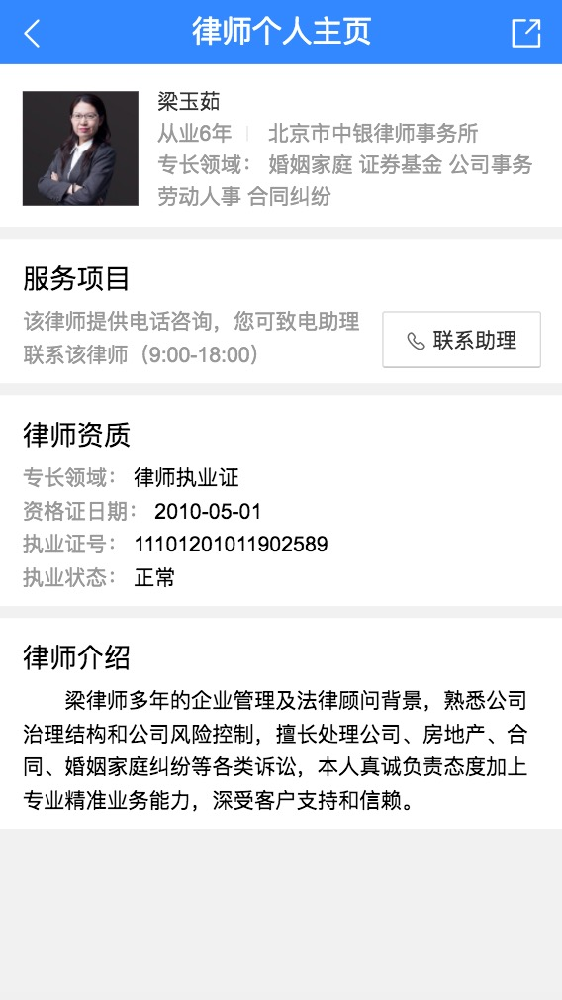
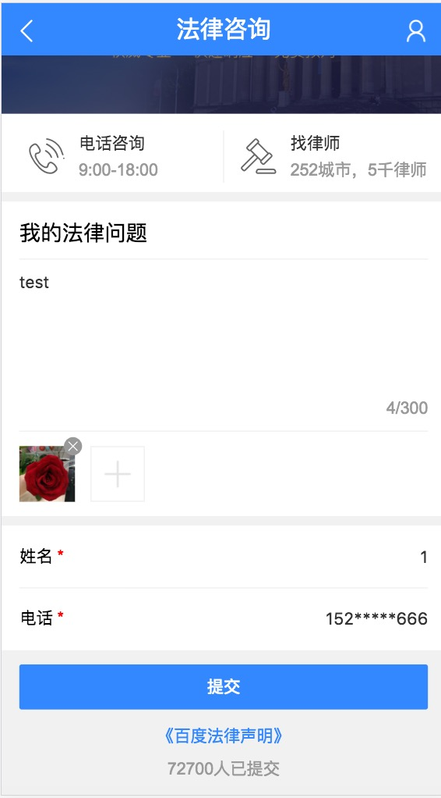
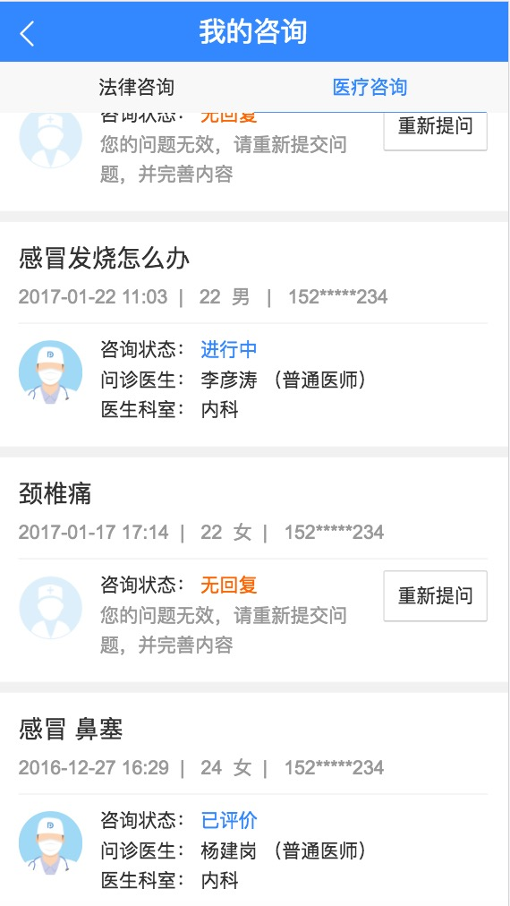

# 胡晓卉

> 从2016-02-20到2016-02-24

#### 专家问答——法律二期(上线)

- 背景

    平台一期实现了最小功能闭环上线后，二期进行功能优化，包括优化细化问题页面的用户体验、支付功能等。

- 完成情况（里程碑）

    - 01-13 确定排期，介入开发。

    - 01-17 banner、春节节日公告上线。

    - 01-22 提交页带query的情况增加placeholder上线（根据ubs评估反馈调整页面，进行扩招）

    - 01-22 UE交付终稿，进入页面开发正常排期。

	- 02-08 联调。
    
    - 02-10 提测。

    - 02-16 以小流量方式上线二期模板，暂未开流量
    
    - 02-20 上线分享功能、用户信息安全相关处理、功能优化
    
    - 02-22 开小流量
    

- 本周进展
   
    - 
完成分享功能

    - 
用户信息安全相关处理

    - 
功能优化：切换页面记住筛选项、接口返回速度慢的提示等

    - 
支付功能评审

    
- 效果

  [预览](https://m.baidu.com/zhuanjia/question#/submit?vn=law&ref=aladdin1)

    <table>
        <tr>
            <td>
                
            </td>
            <td>
                
            </td>
            <td>
                
            </td>
        </tr>
    </table>
    
#### 专家问答——315运营活动

- 背景

    百度搜索16年年底自建法律平台页面，引入行业专家，为用户提供除网络现有免费资源外更专业的服务。为提升产品影响力和知名度，在2017年3月15日-16日通过时效性大卡固定Tab位+feed流的形式，在搜索结果页、百家号及wise结果页底部浮层、微博等渠道展开宣传运营活动，解决用户在315期间维权搜索上的时效性刚需&个性化问题解答。

- 完成情况（里程碑）

    - 02-23 评审
    